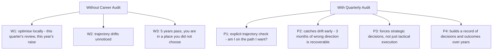
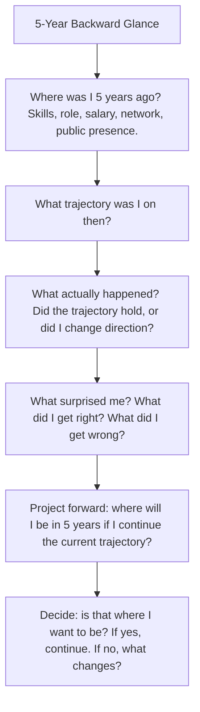
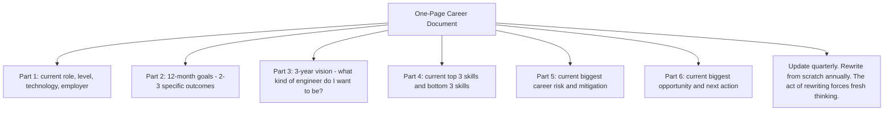

# 13.3. Career Audit and Quarterly Review Protocol

## 1. Background and Why It Matters

A career audit is a structured periodic review of your career trajectory: where you are, where you are going, and whether the path you are on is the path you want. Most engineers never do this. They drift from one performance review to the next, optimising locally (this quarter's bonus, this year's raise) without ever asking whether the trajectory itself is right.

For software engineers, the quarterly career audit is the meta-skill that ensures the daily practices (Chapter 13.1) are pointed in the right direction. Deliberate practice on the wrong skills still compounds, but in the wrong direction. The quarterly audit catches this early.



---

## 2. The Quarterly Audit Structure

Every quarter (4 times per year), block 90 minutes and run this structured review:

```mermaid
graph TD
    Audit[Quarterly Career Audit - 90 min]
    Audit --> Section1[Section 1: Trajectory (15 min) - where am I headed? Is this still the right direction?]
    Audit --> Section2[Section 2: Skills (20 min) - what skills did I build this quarter? What skills do I need next quarter?]
    Audit --> Section3[Section 3: Network (10 min) - who did I help? Who helped me? Who should I meet next quarter?]
    Audit --> Section4[Section 4: Public Artifact (10 min) - what did I publish/contribute? What will I publish next quarter?]
    Audit --> Section5[Section 5: Financial (10 min) - savings, investments, runway. Am I increasing optionality?]
    Audit --> Section6[Section 6: Energy (10 min) - am I sustainably engaged, or burning out? Adjust load if needed.]
    Audit --> Section7[Section 7: Decisions (15 min) - what 1-3 decisions will I make for next quarter based on the above?]
```

Section 7 is the only section that produces actions. The other sections produce the inputs for those actions. Most audits fail because they generate 20 vague "improvements" instead of 1-3 concrete decisions. Force yourself to 1-3.

---

## 3. Practical Application: The Five-Year Backward Glance

Once a year (often as part of the Q4 audit), extend the review to a 5-year backward glance:



The 5-year glance is uncomfortable because it forces honesty about prediction accuracy. Most engineers discover that their 5-year predictions were substantially wrong — which is itself the lesson. The future is unpredictable; the audit is about adjusting trajectory, not predicting outcomes.

---

## 4. Concrete Exercise: The One-Page Career Document

Maintain a single one-page document (not 10 pages — one page) that captures your current career state:



The one-page constraint forces prioritisation. If you cannot fit your career state on one page, you do not know what matters. The act of fitting it forces clarity.

---

## 5. Common Pitfalls and Student Misunderstandings

* **Treating the audit as performance review.** Performance reviews are backward-looking and company-driven. Career audits are forward-looking and self-driven. Do not confuse them.
* **Generating 20 vague improvements.** Force 1-3 concrete decisions. Vague improvements are noise; decisions are signal.
* **Skipping the audit when busy.** The audit is most valuable when you are busiest, because busy is when trajectory drift happens fastest. Protect the 90 minutes.
* **Only reviewing when unhappy.** The audit is most valuable when things are going well, because that is when you can most afford to make strategic changes. Do not wait for crisis.
* **Not writing it down.** Mental audits are forgotten within a week. Written audits compound across years.

---

## 6. Essential Reminders

* Quarterly 90-minute career audit. Force 1-3 concrete decisions per audit.
* Annual 5-year backward glance. Honest about prediction accuracy.
* One-page career document. Update quarterly, rewrite annually.
* Audit most valuable when busy or when things are going well.
* Write it down. Mental audits are forgotten within a week.
* "The unexamined life is not worth living." — Socrates
