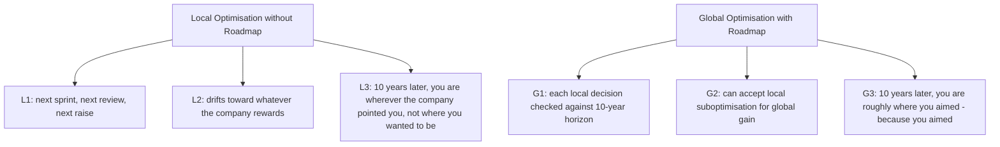
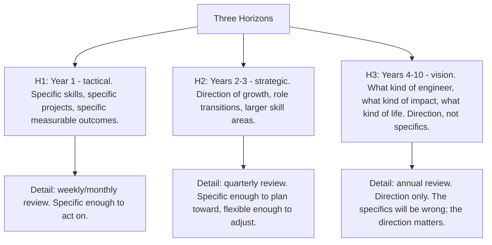
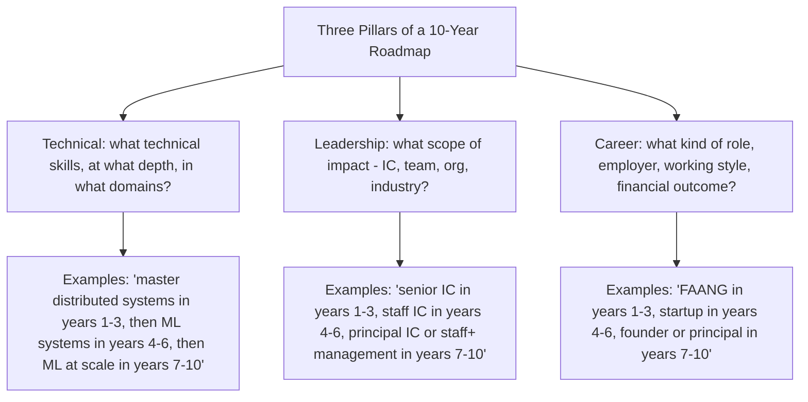

# 13.4. Building a 10-Year Learning Roadmap

## 1. Background and Why It Matters

A 10-year learning roadmap is a strategic plan for what you intend to learn and become over the next decade. It is not a prediction — 10-year predictions are always wrong — but a forcing function for thinking about trajectory. The act of writing the roadmap forces you to confront questions you would otherwise avoid: what kind of engineer do I want to be in 10 years? What skills does that require? What path gets me there?

For software engineers, the 10-year roadmap is the ultimate antidote to local optimisation. Without it, you optimise for the next sprint, the next promotion, the next raise. With it, each local decision is evaluated against a longer horizon, and you can make decisions that look suboptimal locally but are clearly right globally.



---

## 2. The Three Horizons

A 10-year roadmap operates on three horizons, each requiring different planning:



The most common mistake is over-specifying the long horizon. "In year 7, I will become a Principal Engineer at Google working on distributed systems" is fantasy, not planning. "In years 4-10, I want to move toward technical leadership on large-scale systems" is direction.

---

## 3. Practical Application: The Three Pillars of a 10-Year Roadmap

A 10-year roadmap should cover three pillars:



The pillars interact. A 10-year plan that develops deep technical skill but ignores leadership plateaus at senior IC. A plan that develops leadership but ignores technical depth plateaus at manager-of-juniors. The plan must develop both, with the third pillar (career shape) following from the first two.

---

## 4. Concrete Exercise: The 10-Year Roadmap Draft

Block 2 hours. Write the first draft of your 10-year roadmap:

```mermaid
graph TD
    Draft[10-Year Roadmap Draft - 2 hours]
    Draft --> Step1[Step 1 (30 min): vision. What kind of engineer do I want to be in 10 years? Write 1 paragraph.]
    Draft --> Step2[Step 2 (30 min): pillars. For each pillar (technical, leadership, career), what is the year-10 state? What is the year-3 state? What is the year-1 state?]
    Draft --> Step3[Step 3 (30 min): gaps. What is the biggest gap between current state and year-1 state? What is the action to close it?]
    Draft --> Step4[Step 4 (30 min): review. Read the whole thing. Is this really what I want? What would I change?]
    Draft --> Outcome[Outcome: a draft roadmap, 2-3 pages. Not final. Will be revised annually. The act of writing it changes how you make decisions tomorrow.]
```

The roadmap will be wrong in specifics. That is fine — it is a direction, not a prediction. The value is in the act of writing, which forces you to make explicit the trajectory you would otherwise drift through unconsciously.

---

## 5. Common Pitfalls and Student Misunderstandings

* **Over-specifying the long horizon.** Year 7 specifics will be wrong. Use direction, not specifics, for years 4-10.
* **Under-specifying the short horizon.** Year 1 must be specific enough to act on. "Get better at distributed systems" is not a year-1 plan. "Implement Raft from scratch, read Designing Data-Intensive Applications, complete 3 production design reviews" is.
* **Not aligning the pillars.** Technical plan develops IC depth; leadership plan develops management; the two are in conflict. Pick one direction (at least for the next 3 years) and align both pillars to it.
* **Treating the roadmap as fixed.** The roadmap is a draft. Revise annually. The act of revision is part of the value.
* **Never writing it down.** A mental roadmap is forgotten within a month. Written roadmaps compound across years.

---

## 6. Essential Reminders

* A 10-year roadmap is a forcing function, not a prediction.
* Three horizons: year 1 tactical, years 2-3 strategic, years 4-10 vision.
* Three pillars: technical, leadership, career. All three must develop.
* Year 1 must be specific enough to act on. Years 4-10 are direction only.
* Revise annually. The roadmap is a draft, not a contract.
* "The best time to plant a tree was 20 years ago. The second best time is now." — Proverb
