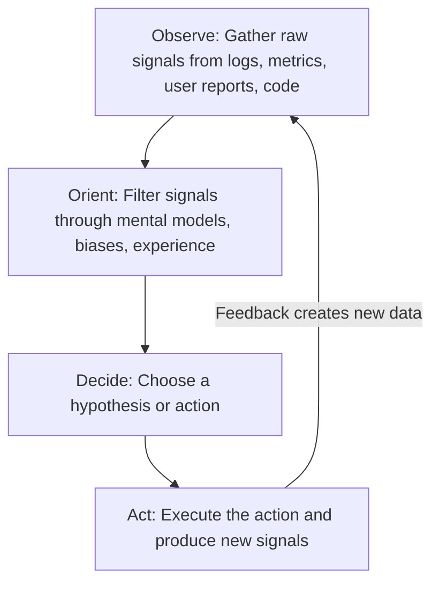
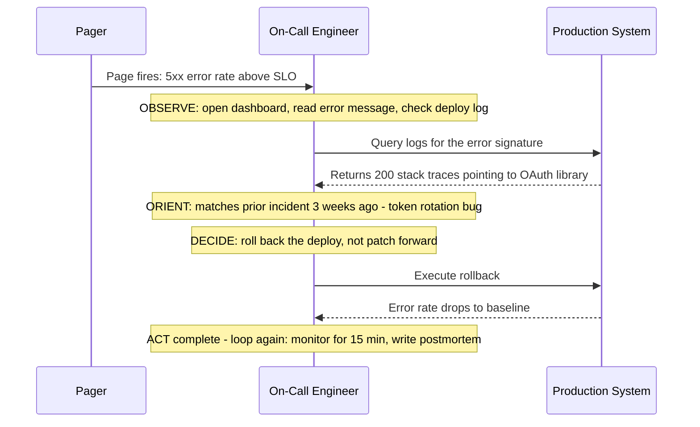
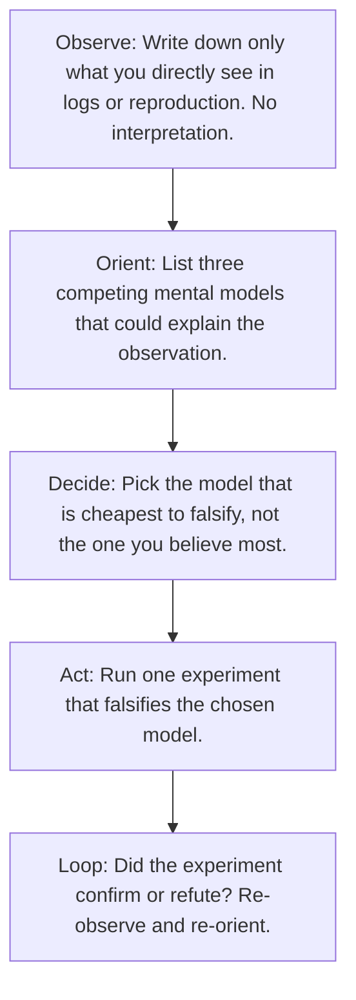

# 7.1. The OODA Loop Applied to Software Engineering

## 1. Background and Origin

The OODA Loop (Observe, Orient, Decide, Act) was developed by Colonel John Boyd, a United States Air Force fighter pilot and military strategist, as a model for decision-making under uncertainty and rapid change. Boyd's central insight was that victory in combat does not go to the side with the most firepower, but to the side that can cycle through observation, orientation, decision, and action faster than its opponent while still maintaining accuracy. The pilot who can re-orient to new information quicker wins, regardless of who fired first.

For software engineers, the OODA Loop translates almost directly into the cycle of debugging, incident response, system design under ambiguity, and architectural evolution. The technical landscape changes faster than any individual can plan, so the engineer who can re-orient quickly to new constraints (a failing dependency, an unexpected load pattern, a shifting product requirement) wins over the engineer who clings to a beautiful plan that no longer matches reality.

---

## 2. The Four Stages in Detail

### 2.1. Observe
Observation is the raw ingestion of data without interpretation. The trap most engineers fall into is filtering too early: they only see the metrics they expected to see. Elite observation means actively scanning for anomalies, even (especially) ones that contradict the current hypothesis.

In practice, this means you should have dashboards that you look at *without* a question in mind, error budgets that you treat as ground truth even when they are inconvenient, and a habit of reading production logs directly rather than only through sanitised alerts.

### 2.2. Orient
Orientation is the most underrated and most personal stage. It is the application of mental models, prior experience, cultural assumptions, and current emotional state to the raw observations. Two engineers with identical data will orient differently because their models differ.

Boyd considered orientation the most important stage because it controls what you even notice. If your mental model says "this is a network problem," you will not notice the database connection pool leak that is the actual cause. Orientation is also where cognitive biases live — confirmation bias, anchoring, availability — and where deliberate de-biasing must occur (see Chapter 2.3).

### 2.3. Decide
Decision is the commitment to a specific hypothesis or action. A common failure mode is decision paralysis: spending so long in Observe and Orient that you never commit, and the system makes the decision for you by getting worse. The OODA Loop rewards *reversible* decisions made quickly over *perfect* decisions made slowly.

### 2.4. Act
Action produces new signals, which feed the next Observe. Acting is not just deploying code — it is also writing a test, sending a clarifying email, adding a log line, or asking a teammate to reproduce. The goal of every action is to generate information that lets you re-orient faster on the next loop.

---

## 3. Practical Application: OODA During a Production Incident

---

## 4. Concrete Exercise: OODA Drill for Debugging

Run this drill the next time you face a non-trivial bug. Force yourself to label each step out loud (or in writing) so you can audit your own loop:

The discipline here is *cheapest to falsify*, not *most likely to be true*. A model that is 70% likely but takes 4 hours to verify is worse than a model that is 40% likely but takes 5 minutes to disprove, because the disproval generates information that re-orients you.

---

## 5. Common Pitfalls and Student Misunderstandings

* **Skipping Orient and jumping from Observe to Decide.** This is the "gut instinct" failure mode: you see an error, recognise it superficially, and immediately apply a fix without considering alternative explanations. The fix sometimes works, which reinforces the bad habit, but you have not actually understood the system.
* **Refusing to Act until certainty is reached.** In fast-moving incidents, you will rarely have certainty. Act on the best reversible hypothesis, then re-observe. A 5-minute rollback beats a 30-minute root cause analysis while customers are seeing errors.
* **Orienting only with one mental model.** If you only ever think of problems as "network issues" or "database issues," you will miss class of bugs that live elsewhere. Cultivate multiple competing mental models deliberately (see Chapter 8 on mental models).
* **Treating OODA as linear instead of cyclical.** The point is not to finish the loop, it is to loop faster and more accurately than the problem can evolve.

---

## 6. Essential Reminders

* OODA is not a checklist; it is a tempo. The winner is whoever cycles faster.
* Write down your orientation explicitly. You cannot audit what you have not externalised.
* Reversible decisions should be made in minutes, not hours.
* Every action should be designed to generate information, not just to "fix" the problem.
* John Boyd's famous quote captures the spirit: "People, ideas, hardware — in that order."
