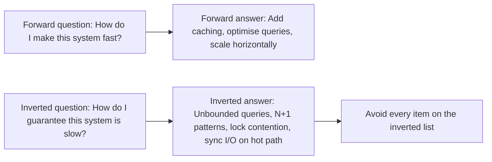
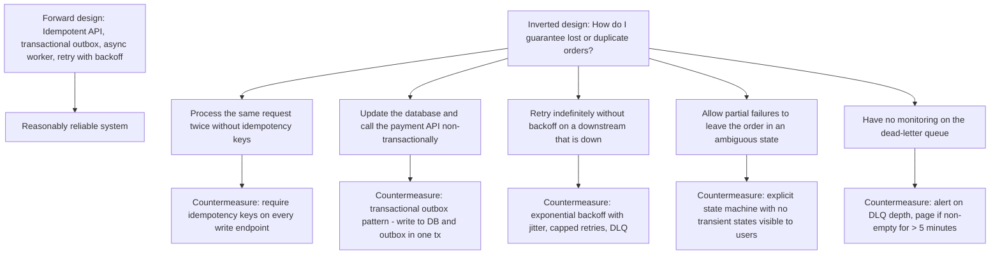
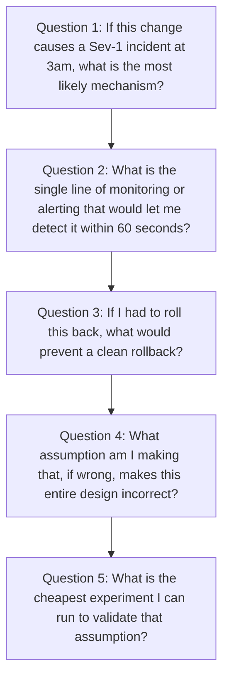

# 7.2. Inversion: Solving Problems Backwards

## 1. Background and Origin

Inversion is a mental model popularised by the mathematician Carl Gustav Jacob Jacobi, who famously told his students: "Invert, always invert." The Stoic philosophers (Seneca, Marcus Aurelius, Epictetus) practised *premeditatio malorum* — the deliberate visualisation of what could go wrong — as a way of both reducing fear of the future and preparing to handle it. Charlie Munger, Warren Buffett's long-time business partner, made inversion a cornerstone of his decision-making framework: instead of asking how to achieve success, ask how to guarantee failure, then avoid those things.

For software engineers, inversion is unusually powerful because most engineering problems have asymmetric failure modes. The cost of a security breach, a data-loss incident, or a cascading outage is far higher than the cost of being a little slower to ship a feature. Inverting the question forces you to design for the failures that matter, rather than only the success cases you can imagine.

---

## 2. The Two Forms of Inversion

### 2.1. Subtractive Inversion
Instead of asking "what should I add to make this better," ask "what should I remove to stop making it worse." Most failing systems are not failing because of a missing feature; they are failing because of accumulated cruft, contradictory constraints, or a misalignment between what was built and what is now needed.

### 2.2. Failure-Mode Inversion
Instead of asking "how do I succeed," ask "how would I guarantee failure." List every concrete action that would lead to catastrophic failure, then design explicit countermeasures for each. This is the foundation of chaos engineering, pre-mortem analysis (see 7.3), and security threat modeling.

---

## 3. Practical Application: Inverting System Design Questions

Consider the question: "How do I design a reliable order-processing system?"

Notice that the inverted list produces countermeasures that the forward design did not explicitly mention. That is the value of inversion: it surfaces failure modes you would not otherwise consider.

---

## 4. Concrete Exercise: The Inversion Audit

Before shipping any non-trivial change, run this 10-minute inversion audit with your team:

Each question is a form of inversion. Question 1 inverts "will this work" into "how will this break." Question 3 inverts "how do I deploy" into "what blocks undeploy." Question 4 inverts "what do I know" into "what must be true for what I know to hold."

---

## 5. Common Pitfalls and Student Misunderstandings

* **Treating inversion as pessimism.** Inversion is not about expecting the worst; it is about explicitly enumerating failure modes so they can be designed against. A team that uses inversion well is more optimistic, not less, because they have removed the fear of unnamed risks.
* **Inverting only once.** The deepest insights come from inverting the inverted question. "How do I fail" produces one list; "how do I guarantee that my failure-prevention itself fails" produces a deeper one (e.g., "my alerting is so noisy that the DLQ alert gets ignored").
* **Forgetting that inversion is subtractive as well as additive.** Most engineers only use inversion to add countermeasures. Equally valuable is using inversion to remove features: "What can I delete from this product to make it more reliable?"
* **Confusing inversion with risk-aversion.** Inversion does not say "do not ship risky things." It says "ship risky things with eyes open, having enumerated the failure modes and accepted them deliberately."

---

## 6. Essential Reminders

* "Invert, always invert." — Jacobi, via Munger.
* The forward question produces the obvious design. The inverted question produces the robust design.
* Run inversion on every non-trivial design before you write code, not after.
* Inversion surfaces what forward thinking misses because forward thinking is biased by your preferred solution.
* Subtractive inversion ("what should I delete") is often more powerful than additive inversion ("what should I add").
