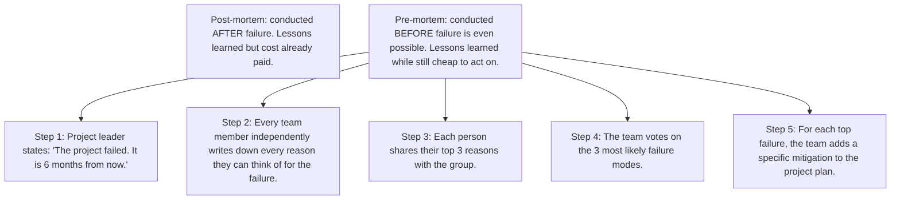
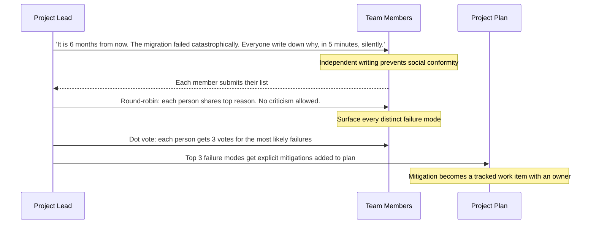
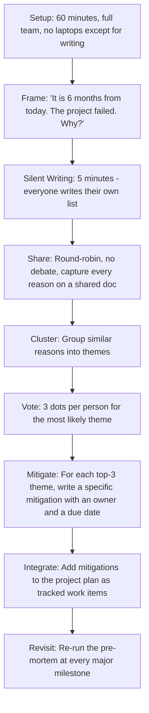

# 7.3. Pre-mortem Analysis for Software Projects

## 1. Background and Origin

Pre-mortem analysis was formalised by psychologist Gary Klein in 2007 as a forward-looking counterpart to the post-mortem. Instead of asking "what went wrong" after a project fails, a pre-mortem asks: "Assume this project has failed six months from now. What is the most likely story of how it failed?" The technique exploits a cognitive bias called *prospective hindsight* — people generate more complete and accurate causal explanations when they assume an event has already happened than when they reason about it as a future possibility.

For software projects specifically, pre-mortems address the chronic optimism bias that infects planning. Engineers, by disposition, are problem-solvers. When asked "will this project succeed," they reflexively construct a success narrative. When asked "this project failed, tell me why," they generate a richer and more honest set of risks because the framing removes the social pressure to be a team player.

---

## 2. Why Pre-mortems Work Better Than Risk Workshops

Standard risk workshops fail for predictable reasons:

* **Social conformity.** The most senior person speaks first and the room aligns to their view.
* **Optimism bias.** Engineers want the project to succeed, so they self-censor risks that feel like pessimism.
* **Vague risks.** A risk like "the integration might be hard" is unactionable.
* **No commitment to mitigate.** Risks get listed on a slide and then forgotten.

A pre-mortem defeats each of these by (a) requiring independent written reasoning before any group discussion, (b) framing the failure as already-happened so the social pressure to be optimistic is removed, (c) forcing specific narratives rather than vague worries, and (d) requiring concrete mitigations in the project plan for the top failure modes.

---

## 3. Practical Application: Running a Pre-mortem for a Migration Project

Imagine your team is about to migrate a monolith to a microservices architecture. Run the pre-mortem as follows:

Typical failure narratives for a monolith-to-microservices migration might include:

* "We split the service boundary wrong and ended up with chatty inter-service calls that made p99 latency 10x worse."
* "The data migration job had a subtle bug that silently corrupted 2% of records, and we only discovered it three weeks after cutover when customer complaints spiked."
* "We underestimated the operational burden of running 15 services instead of 1, and the on-call rotation collapsed within two months."
* "The team that built the new services moved on to other projects before the migration was complete, and no one was left who understood the new architecture."

Each of these generates a concrete mitigation: latency testing under realistic load before cutover, a data-reconciliation job that runs in parallel for 30 days after cutover, a documented on-call expansion plan signed off by SRE before approval, and a knowledge-transfer plan that requires pair programming for the final two sprints.

---

## 4. Concrete Exercise: Pre-mortem Template

Use this template verbatim for your next project kickoff. Run it after the design is sketched but before any code is written:

---

## 5. Common Pitfalls and Student Misunderstandings

* **Running the pre-mortem too late.** If you run it after code is already written, the team will self-censor to avoid implying that already-built code was a mistake. Run it during the design phase when changes are cheap.
* **Allowing group discussion during the silent writing phase.** Even one comment can anchor the entire room. Enforce silence strictly during the writing phase.
* **Generating vague failure narratives.** "Communication issues" is not a failure narrative. "The frontend team and backend team disagreed on the API contract and the deadline was missed by 6 weeks" is a failure narrative. Push for specificity.
* **Not following up on mitigations.** A pre-mortem whose mitigations are not tracked as work items is a ritual, not a practice. Assign owners and due dates at the meeting, not afterwards.
* **Only running it once.** Risks evolve as the project progresses. Re-run the pre-mortem at major milestones (design review complete, MVP shipped, GA launch).

---

## 6. Essential Reminders

* Pre-mortems exploit prospective hindsight: people generate richer causal explanations when the outcome is assumed.
* Run them before code is written, not after.
* Silent individual writing first, group discussion second.
* Every top-3 failure mode must produce a tracked mitigation with an owner.
* Re-run at major milestones.
