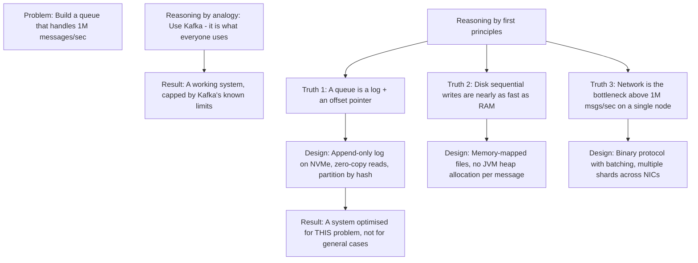
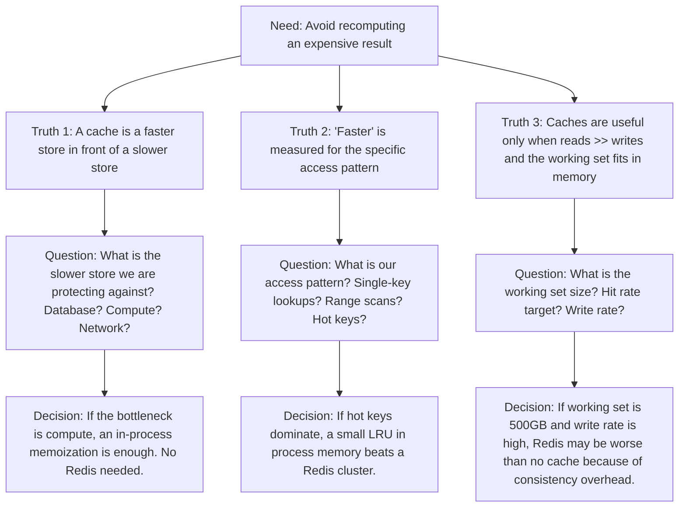
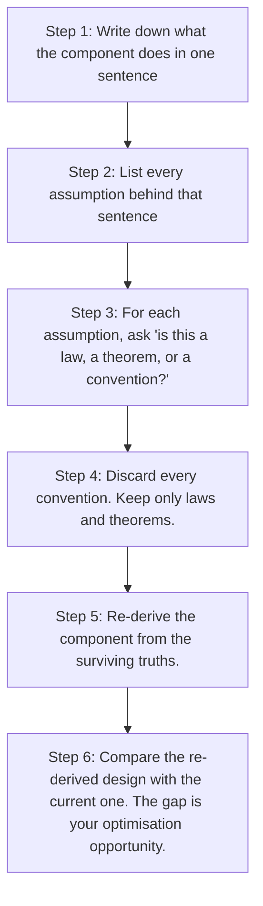

# 7.4. First Principles Thinking in System Design

## 1. Background and Origin

First principles thinking is the practice of breaking a problem down into the most fundamental truths that cannot be deduced any further, and then reasoning upward from those truths rather than downward from analogies. The term comes from physics and was famously adopted as a core decision-making tool by Elon Musk, but the underlying method traces back to Aristotle and was central to Richard Feynman's approach to physics (see Chapter 11.11).

The opposite of first principles thinking is *reasoning by analogy* — solving a problem by reference to how similar problems have been solved before. Reasoning by analogy is fast and usually correct in mature fields, but it produces only incremental improvements and completely misses paradigm-shifting solutions. First principles thinking is slower and more cognitively expensive, but it is the only mode that can produce genuinely novel architectures or break out of local optima.

---

## 2. The Three-Step First Principles Process

### 2.1. Identify and Question Every Assumption
Write down every assumption baked into the current approach. For each, ask: "Is this true, or is it just what I have always done?" Most engineering assumptions are inherited from prior context that no longer applies.

### 2.2. Break Down to Fundamental Truths
For each assumption that survives questioning, keep asking "why" until you reach a statement that is either a law of physics, a mathematical theorem, or a verifiable constraint of your specific situation. These are your first principles.

### 2.3. Build Up From the Truths
Construct your solution using only the first principles as inputs. Anything that does not follow from the truths is a candidate for removal or replacement. This is the most creative step — and the most uncomfortable, because it usually produces solutions that look strange compared to industry norms.

---

## 3. Practical Application: First Principles for "We Need a Cache"

A typical engineering discussion goes: "We need a cache. Let's add Redis." This is reasoning by analogy — Redis is the default cache, so we use Redis. A first-principles approach instead asks what a cache actually is and what we need from one.

Often the first-principles answer is *not* "add Redis." Sometimes the answer is "add a memoization decorator on the function that computes the expensive result." Sometimes the answer is "restructure the data so the expensive computation is no longer needed." The first-principles process surfaces these alternatives.

---

## 4. Concrete Exercise: First Principles Decomposition

Pick any system you currently work on. For each major component, run this decomposition:

This exercise is uncomfortable because most of what feels like an engineering constraint is actually a convention. "We use Postgres" is a convention, not a law. "We need ACID transactions for this financial ledger" is closer to a law. Distinguishing the two is the skill.

---

## 5. Common Pitfalls and Student Misunderstandings

* **Stopping too early in the decomposition.** "We need a database" is not a first principle. "We need to durably store records that can be queried by primary key" is closer. Keep asking why until you hit either physics or a business requirement.
* **Treating first principles as license to ignore prior art.** First principles thinking does not mean reinventing everything from scratch. It means you should *understand* why prior art exists before adopting it, and consciously choose to adopt it (because its assumptions hold for you) or reject it (because they do not).
* **Refusing to use off-the-shelf components.** The goal is not to build everything yourself; the goal is to make a deliberate, principled choice about what to build and what to buy. Often the first-principles analysis confirms that an off-the-shelf component is correct.
* **Confusing first principles with NIH syndrome.** "Not Invented Here" is a pathology, not a principle. First principles thinking is the opposite: it is the discipline of not importing assumptions you have not examined.
* **Only using first principles for big decisions.** First principles thinking is most valuable when used routinely on small decisions, because that is where accumulated conventional cruft lives.

---

## 6. Essential Reminders

* "I don't know what's the matter with people: they don't learn by understanding; they learn by some other way—by rote, or something. Their knowledge is so fragile!" — Richard Feynman
* First principles is slow. Use it for design decisions that will be expensive to reverse.
* Most engineering assumptions are conventions disguised as laws. Question them.
* Reasoning by analogy is fine for 90% of decisions. Use first principles for the 10% that matter.
* The output of first principles thinking often looks strange. That is a feature, not a bug.
