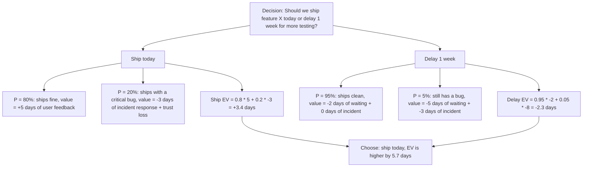
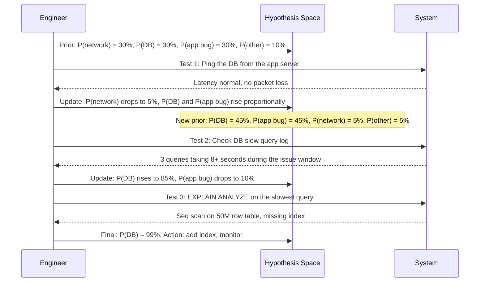
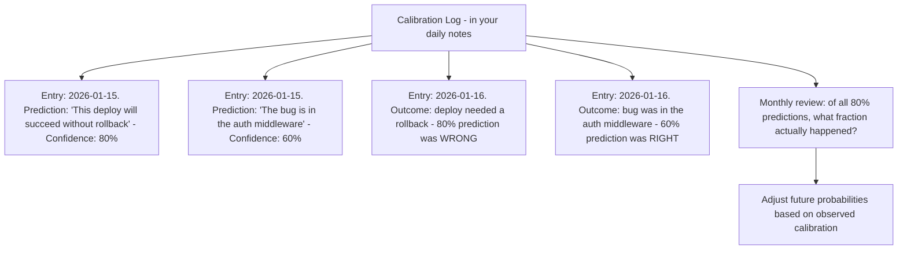

# 7.5. Probabilistic Reasoning and Expected Value

## 1. Background and Origin

Probabilistic reasoning is the discipline of thinking in likelihoods rather than certainties. It is grounded in Bayes' theorem, formulated by Reverend Thomas Bayes in the 18th century and later championed by Pierre-Simon Laplace. The core idea: every belief has a prior probability, and every new piece of evidence updates that probability. You never reach certainty; you only move your beliefs up or down in proportion to the strength of the evidence.

For software engineers, probabilistic reasoning matters because almost every meaningful engineering decision is made under uncertainty. Will this design hold at 10x traffic? Will this dependency still be maintained in 3 years? Will this hire work out? Will this feature actually be used? Treating these as binary yes/no questions produces brittle decisions. Treating them as probability distributions produces decisions that gracefully incorporate new information.

```mermaid
graph TD
    Prior[Prior belief: P(database is the bottleneck) = 30%]
    Prior --> Evidence[New evidence: CPU on DB server hits 95% during slow periods]
    Evidence --> Update[Bayesian update: P(DB bottleneck | high DB CPU) is now ~85%]
    Update --> Action[Action: investigate DB queries first, but keep alternative hypotheses alive at 15%]
    Action --> NewEvidence[New evidence: slow queries all hit the same missing index]
    NewEvidence --> FinalUpdate[Final update: P(DB bottleneck | missing index) = 99%]
```

---

## 2. The Expected Value Framework

Expected value (EV) is the workhorse of probabilistic reasoning. For any decision with discrete outcomes:

$$EV = \sum_i P(outcome_i) \times Value(outcome_i)$$

The engineer's job is to (a) enumerate the realistic outcomes, (b) estimate probabilities honestly, (c) estimate values honestly, and (d) choose the action with the highest EV. None of these steps require precise numbers — even rough estimates rigorously applied produce better decisions than gut instinct.



---

## 3. Practical Application: Bayesian Updates During Debugging

Debugging is fundamentally a Bayesian process. You start with a prior over possible causes, gather evidence, and update. Most engineers do this implicitly and badly — they fix on the first plausible hypothesis and refuse to update even as contradicting evidence accumulates.



The discipline is in the explicit update step. After every experiment, you must re-balance the probability distribution. If you do not, you will fix on the first hypothesis and ignore disconfirming evidence — which is the cognitive bias known as anchoring (see Chapter 2.3).

---

## 4. Concrete Exercise: The Calibration Log

Probabilistic reasoning only works if your probabilities are calibrated — if events you say are 80% likely actually happen about 80% of the time. Most engineers are massively overconfident: events they rate as 90% likely happen only about 60% of the time.

Build a calibration log to track and improve this:



After 3-6 months of consistent logging, you will discover your personal overconfidence bias and learn to either (a) widen your confidence intervals or (b) work harder before assigning high confidence. Either way, your decisions will improve.

---

## 5. Common Pitfalls and Student Misunderstandings

* **Treating probabilities as binary.** "I'm 80% sure" is not the same as "I'm sure." An 80% confidence means you expect to be wrong 1 time in 5. Plan for that 1 time.
* **Refusing to update on new evidence.** If new evidence comes in and your probability does not change, you are not doing Bayesian reasoning, you are doing ideology. Force yourself to write down what evidence would change your mind, and if that evidence appears, update.
* **Base-rate neglect.** When estimating P(event), most engineers anchor on the specific case and ignore the base rate. "This deploy will probably succeed because I tested it" ignores that historically 15% of deploys cause incidents. Start from the base rate, then adjust for the specific case.
* **Single-hypothesis bias.** Do not commit to one hypothesis. Maintain a distribution over multiple hypotheses and update all of them based on each new piece of evidence.
* **Confusing expected value with most-likely outcome.** The most likely outcome of buying a lottery ticket is losing the ticket price, but the EV is negative even when the jackpot is huge because the probability of winning is so low. EV is what matters for repeated decisions; most-likely outcome is what matters for one-off irreversible decisions. Know which you are making.

---

## 6. Essential Reminders

* Every engineering decision is a probability, not a certainty. Write probabilities down.
* Bayes' theorem: posterior is proportional to prior times likelihood. Update incrementally.
* Track your calibration. Most engineers are overconfident by 20-30 percentage points.
* Maintain multiple competing hypotheses, not one favourite.
* Use EV for repeated decisions; use most-likely outcome for one-off irreversible decisions.
* "The idea that the future is unpredictable is undermined every day by the ease with which the past is explained." — Daniel Kahneman
