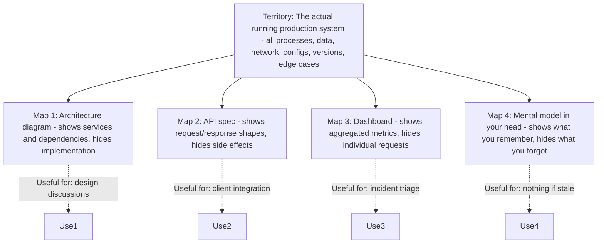
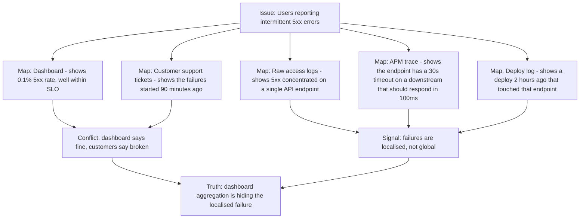
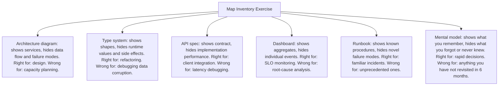

# 8.1. The Map Is Not the Territory

## 1. Background and Origin

"The map is not the territory" is a maxim coined by the Polish-American scholar Alfred Korzybski in his 1933 work *Science and Sanity*. The phrase captures a fundamental epistemological truth: any representation of reality is necessarily an abstraction, and abstractions omit details by design. A map of London shows the Underground lines but not the colour of every front door on every street. The map is useful precisely because it leaves things out. But the moment you confuse the map for the city, you start making decisions that the real world will contradict.

For software engineers, the maps we use are everywhere: architecture diagrams, type systems, UML models, API specs, database schemas, runbooks, dashboards, mental models of how the system works. Every one of these is a simplification. Every simplification is correct for some purposes and misleading for others. The discipline is to know which map you are using, what it omits, and when to switch to a different map or to ground truth.

---

## 2. Why Engineers Confuse the Map for the Territory

Engineers are unusually vulnerable to this confusion because the abstractions we work with are unusually precise. A type system, a schema, and an API contract are *designed* abstractions, and they often feel more real than the messy reality they describe. The trap is to assume that because the type system says `User.email: string`, every User object in production has a non-null email that is syntactically valid. Neither assumption is necessarily true.

The classic failure mode is the incident where the dashboard says everything is green but customers are reporting failures. The dashboard is a map; the customer reports are closer to territory. Engineers who trust the dashboard over the customers are confusing the map for the territory.

---

## 3. Practical Application: Multi-Map Diagnosis

When debugging a complex issue, deliberately consult multiple maps and look for the disagreements:

Each map reveals something the others hide. The dashboard aggregates across all endpoints, so a localised failure looks small. The raw logs reveal the localisation. The APM trace reveals the mechanism. The deploy log reveals the cause. The customer tickets reveal the user-visible blast radius. None of these maps alone gives you the truth — only consulting several together does.

---

## 4. Concrete Exercise: Map Inventory

For your current project, list every map you rely on, and for each, write down (a) what it shows, (b) what it omits, (c) when it is the right map to use, and (d) when it would mislead you.

After completing this exercise, you will notice two things. First, you have more maps than you realised. Second, for several maps you cannot articulate what they omit — which is exactly where you are vulnerable to confusing the map for the territory.

---

## 5. Common Pitfalls and Student Misunderstandings

* **Trusting the most familiar map.** The map you use most often is the one you stop seeing as a map. Code review diffs, dashboards, and mental models of "how the system works" all become invisible assumptions over time. Periodically re-audit them.
* **Using a single map for diagnosis.** Any single map will mislead you in some cases. Always triangulate with at least two independent maps (e.g., dashboard + raw logs, or API spec + actual traffic capture).
* **Refusing to look at the territory.** The territory is messier than any map, so engineers avoid it. But the territory is the source of truth. When maps disagree, the territory decides. This means actually sshing into a box, actually reading the binary log, actually reproducing the user's request — not just looking at sanitised views.
* **Updating the map instead of the territory.** When a dashboard disagrees with reality, engineers sometimes "fix" the dashboard. This is backwards. The map is wrong because the territory changed; update the map to reflect the new territory, but investigate the territory change first.
* **Treating model accuracy as binary.** Maps are not "correct" or "incorrect"; they are "useful for purpose X" or "not useful for purpose X." A 5-year-old architecture diagram is not wrong; it is just useful only for understanding historical decisions, not current behaviour.

---

## 6. Essential Reminders

* Every diagram, schema, spec, dashboard, and mental model is a map. Maps omit by design.
* Triangulate. Never diagnose from a single map.
* When maps disagree, the territory decides. Look at the actual system.
* The map you use most is the map you forget is a map. Audit it periodically.
* "A map is not the territory it represents, but, if correct, it has a similar structure to the territory, which accounts for its usefulness." — Alfred Korzybski
