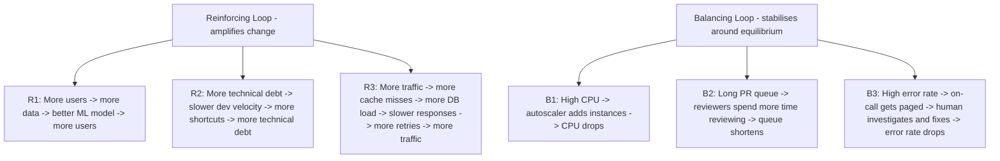
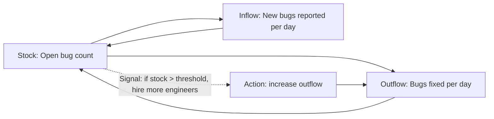
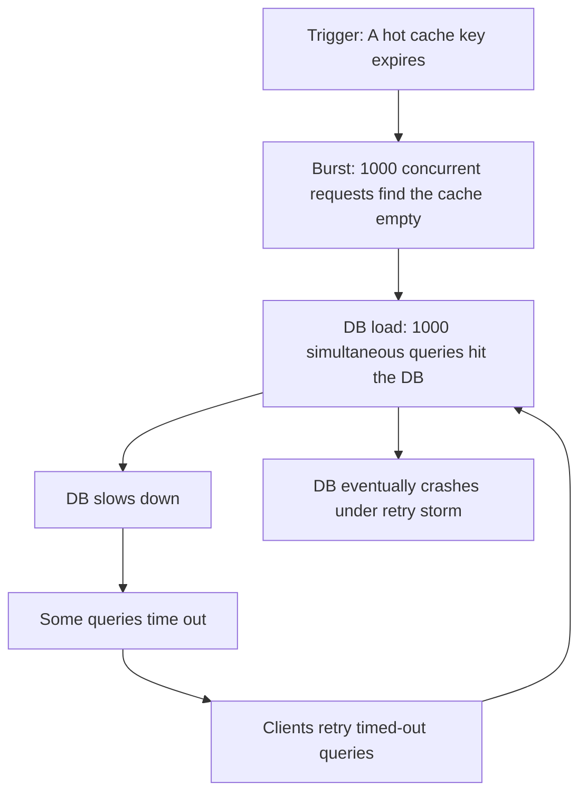
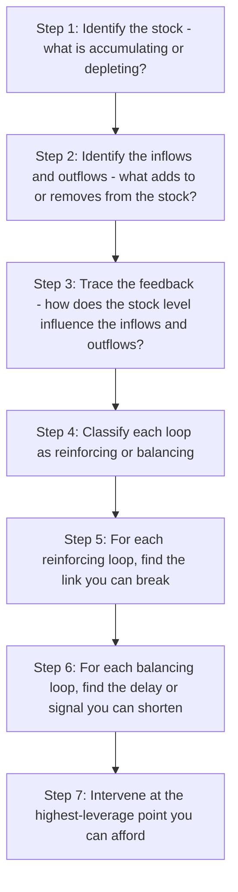

# 8.2. Feedback Loops and System Dynamics

## 1. Background and Origin

Feedback loops are a core concept from systems theory, formalised by MIT professor Jay Forrester in the 1950s and popularised by Donella Meadows in her book *Thinking in Systems*. A feedback loop exists when the output of a system influences its own input. Loops come in two flavours: *reinforcing* (positive feedback), where output amplifies input and the system grows or collapses exponentially, and *balancing* (negative feedback), where output suppresses input and the system stabilises around an equilibrium.

For software engineers, feedback loops are the fundamental unit of system behaviour. Every interesting phenomenon in software — cascading failures, viral growth, autoscaling, cache stampedes, codebase decay, team burnout — is driven by feedback loops. Engineers who do not see the loops will treat symptoms; engineers who do see them can intervene at the leverage points that actually change system behaviour.

---

## 2. The Three Components of a Loop

Every feedback loop has three components: a *stock* (the accumulated quantity), a *flow* (the rate of change of the stock), and an *information signal* (the feedback that links output back to input). To intervene in a loop, you must intervene at one of these three points.

The leverage points, in order of increasing effectiveness:

1. **Change the numbers** (parameters): tweak thresholds, add capacity, increase headcount. Easy, low-impact, usually insufficient.
2. **Change the inflow or outflow rate**: prevent bugs at source (type systems, fuzzing), or fix bugs faster (better tooling).
3. **Change the feedback signal**: make the loop *see itself* faster. Shorter feedback cycles beat larger feedback cycles almost every time.
4. **Change the loop structure**: replace a reinforcing loop with a balancing loop, or break a destructive reinforcing loop entirely.

---

## 3. Practical Application: The Cache Stampede

A cache stampede is a classic reinforcing loop that destroys production systems. Understanding it as a loop tells you exactly where to intervene.

Without seeing the loop, an engineer might try to intervene at the parameter level: increase cache TTL, add more DB capacity. These help but do not break the loop. The structural fix is to break the reinforcing link from "cache miss" to "DB query" — using request coalescing (only one request computes the value, the rest wait) or jittered TTLs (so all keys do not expire simultaneously). That intervention changes the loop structure, not the parameters, and it is far more effective.

---

## 4. Concrete Exercise: Loop Mapping for Your System

Pick a recurring problem in your system (slow deploys, frequent incidents, declining code quality, on-call burnout). Map the loops driving it:

For example, on-call burnout: stock = "team energy." Inflows = sleep, recovery time, wins. Outflows = pages, stressful incidents, context switches. Reinforcing loop: more burnout -> slower response -> longer incidents -> more burnout. Balancing loop: high burnout -> people leave -> fewer people -> more load on remaining -> even more burnout (this is actually reinforcing in the bad direction). The structural intervention is to break the link from "incident" to "page the same person" by rotating aggressively, hiring, or improving the system to reduce incidents at source.

---

## 5. Common Pitfalls and Student Misunderstandings

* **Treating symptoms as causes.** "We have too many bugs" is a symptom. The cause is a loop somewhere upstream — perhaps "more pressure to ship -> less testing -> more bugs -> more pressure to ship fixes -> less testing." Fix the loop, not the bug count.
* **Confusing reinforcing and balancing loops.** A loop that *feels* stabilising can be amplifying. "We added more QA engineers, so quality should improve" — but if the loop is "more QA -> slower releases -> more pressure to bypass QA -> more bugs," you have a reinforcing loop disguised as a balancing one.
* **Intervening at the wrong leverage point.** Adding capacity (a parameter change) rarely fixes a structural problem. Meadows' rule: "You think just because you understand one you understand two, because one and one is two. But you must also understand 'and'."
* **Ignoring delays.** Loops with long delays behave very differently from loops with short delays. The same balancing loop that stabilises a system at a 1-second delay can oscillate violently at a 10-minute delay. Most production instability comes from delays in balancing loops, not from missing loops entirely.
* **Forgetting that loops exist at multiple scales.** A code-level loop (recursion, retry logic), a system-level loop (autoscaling, retries), a team-level loop (review queue, on-call rotation), and an org-level loop (hiring, budget) all interact. The most intractable problems live at the intersections.

---

## 6. Essential Reminders

* Every interesting behaviour in software is driven by feedback loops.
* Reinforcing loops amplify; balancing loops stabilise. Know which you are dealing with.
* Leverage points, in order of effectiveness: parameters < rates < signals < structure.
* Delays in balancing loops cause oscillation. Reduce the delay, not the gain.
* "You think you understand the system, but you only understand the part you can see." — Donella Meadows
