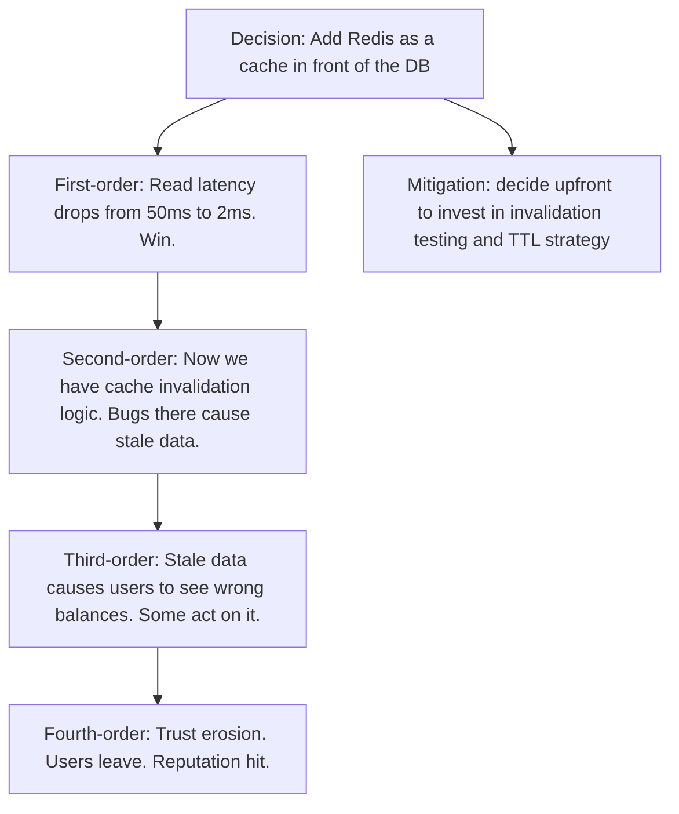
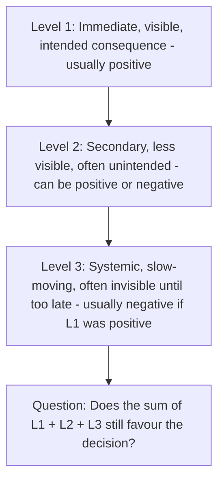
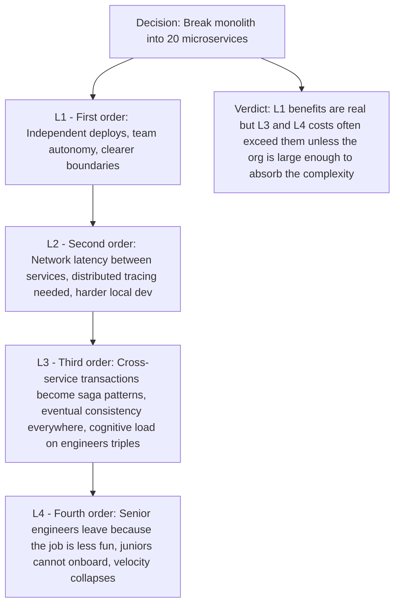
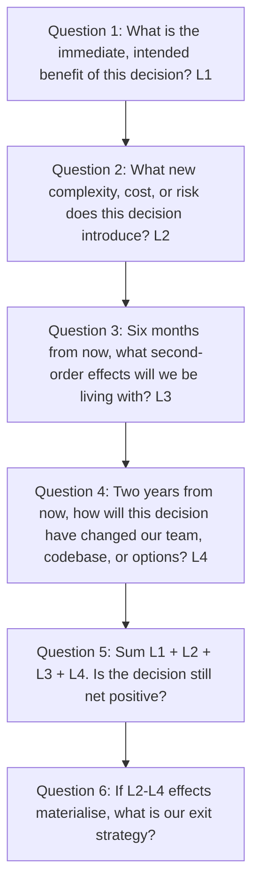

# 8.3. Second-Order Thinking in Engineering Decisions

## 1. Background and Origin

Second-order thinking is the discipline of asking "and then what?" after every decision. It was popularised by Howard Marks in *The Most Important Thing* and is closely related to the systems-thinking concept of consequences across time. First-order thinking asks: what is the immediate effect of this action? Second-order thinking asks: what are the subsequent effects, and the effects of those effects? The gap between first-order and second-order consequences is where most engineering disasters are born.

For software engineers, this matters because almost every "obvious" engineering decision has hidden second-order costs that dwarf the first-order benefit. Adding a cache speeds up reads (first-order) but introduces cache invalidation problems (second-order) that can produce subtle data corruption (third-order) that destroys user trust (fourth-order). Skipping tests to ship faster (first-order) produces bugs in production (second-order) that require emergency fixes (third-order) that further skip tests (fourth-order) in a vicious spiral.

---

## 2. The Three-Level Consequence Framework

For any non-trivial decision, force yourself to enumerate consequences at three levels:

The discipline is in the explicit enumeration. Most decisions are made on L1 alone. Most failures are caused by L2 or L3 effects that were predictable but not predicted.

---

## 3. Practical Application: Second-Order Analysis of "Adopt Microservices"

The decision to move from monolith to microservices is a textbook case where second-order thinking would prevent many disasters.

The point is not "never adopt microservices." The point is: if you do not enumerate L2 through L4 upfront, you will be surprised by them, and surprise is expensive. If you enumerate them, you can either (a) decide the trade-off is worth it, (b) decide to adopt a partial decomposition (modular monolith) that captures most of L1 with less of L3, or (c) decide to invest upfront in the mitigations (service mesh, tracing, saga framework) that reduce L2-L4 costs.

---

## 4. Concrete Exercise: The Three-Level Audit

For any decision you are about to make that would take more than a week to reverse, run this audit with a teammate:

Question 6 is the most often skipped. Every decision should have an imagined exit. If you cannot articulate how you would undo or recover from the decision, you are not making a decision — you are making a bet with no hedge.

---

## 5. Common Pitfalls and Student Misunderstandings

* **Stopping at L1.** "This will make things faster" is L1 thinking. Faster for whom? For how long? At what cost? These are L2 questions.
* **Assuming L2 effects are small because L1 effects are large.** L1 effects are visible immediately, so they feel big. L2 effects accumulate slowly, so they feel small per day. But L2 effects compound. A 1% per-day L2 cost overwhelms a 50% one-time L1 benefit within months.
* **Confusing second-order thinking with pessimism.** Second-order thinking often surfaces negatives, but it also surfaces positives that L1 misses. "Adopting strict types slows us down at first (L1 negative) but catches whole classes of bugs at compile time (L2 positive) and makes refactoring safe (L3 positive)." Both directions matter.
* **Treating L3 as unknowable.** L3 effects are hard to predict but not impossible. Look at past analogous decisions in your own career or in industry case studies. The patterns repeat.
* **Ignoring the team dimension.** Most L3 and L4 effects are about people, not technology. A technically excellent decision that erodes team morale is a net negative over a 2-year horizon.

---

## 6. Essential Reminders

* First-order thinking asks "what happens." Second-order thinking asks "and then what."
* Most engineering disasters are L2 or L3 effects of decisions that looked good at L1.
* Run the three-level audit before any decision that takes more than a week to reverse.
* Every decision needs an imagined exit. If you cannot undo it, treat it as a bet, not a decision.
* "The first-order consequence of a decision is usually the opposite of the second-order consequence." — Howard Marks (paraphrased)
