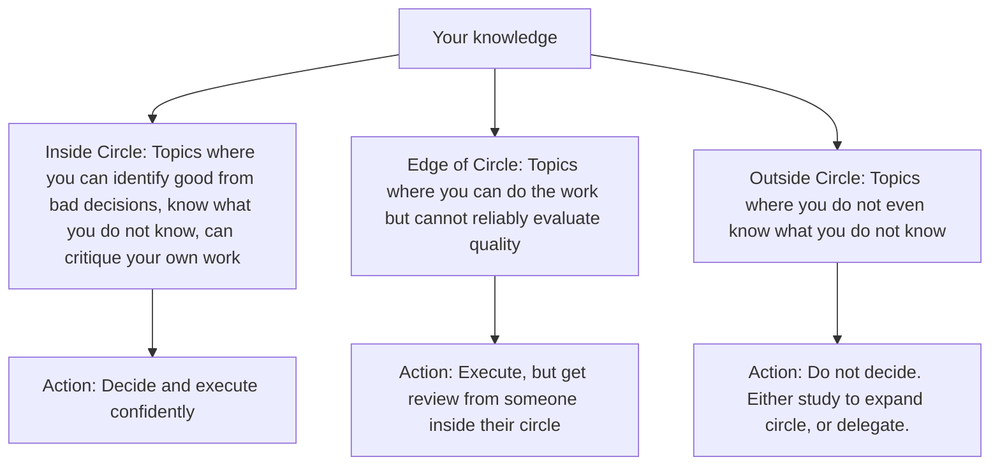
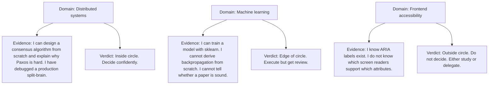
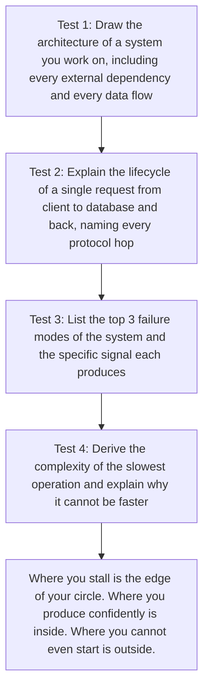

# 8.4. The Circle of Competence

## 1. Background and Origin

The Circle of Competence is a mental model articulated by Warren Buffett and Charlie Munger as part of their value-investing philosophy. The core idea: every person has a domain where their knowledge is genuinely deep, where they can identify good decisions from bad ones with high accuracy, and where they understand the limits of their own understanding. Outside that circle, they are guessing. The discipline is to (a) know where your circle actually is, (b) operate inside it as much as possible, and (c) when forced to operate outside it, either expand the circle through deliberate study or defer to someone whose circle covers the problem.

For software engineers, the Circle of Competence is unusually important because the field is too large for any individual to master. No one is simultaneously world-class at distributed systems, machine learning, frontend engineering, security, database internals, mobile, and DevOps. Engineers who pretend their circle is larger than it is — who opine confidently on topics they have not actually studied — cause predictable damage. Engineers who know their circle and operate within it deliver disproportionate value.

---

## 2. Why Engineers Overestimate Their Circle

Engineers are unusually prone to circle inflation for several reasons:

* **Success in one domain breeds confidence in others.** A great backend engineer assumes they understand frontend, because both involve code. They do not.
* **The Dunning-Kruger effect.** People who know very little about a topic cannot calibrate their own ignorance, because the knowledge required to assess competence is the same knowledge required to have it.
* **Social pressure.** Saying "I don't know" feels like weakness, especially in technical interviews or design reviews. So engineers bluff.
* **The illusion of explanatory depth.** Most engineers can give a plausible-sounding explanation of how the internet works, but few can actually reconstruct TCP from first principles. The plausible explanation feels like understanding.

The counter-discipline is to regularly test your circle by trying to explain things from scratch, on a whiteboard, without references. What you can produce is your actual circle. What you can recognise but not produce is your edge. What you cannot even recognise is outside.

---

## 3. Practical Application: Honest Skill Mapping

Map your competencies honestly, using evidence rather than self-assessment:

The exercise is to write this down for every domain you touch in your work. Most engineers discover their actual inside-circle is much smaller than they thought — which is fine, and useful, because it tells them where to focus their learning.

---

## 4. Concrete Exercise: The Whiteboard Test

For each domain you claim competence in, schedule a 30-minute session with yourself and a whiteboard (or a blank document). Try to produce, from scratch and without references:

Most engineers who do this exercise discover that domains they thought were "inside" are actually "edge." This is not a failure — it is the necessary first step toward genuine mastery. You cannot expand your circle until you know where its boundary actually is.

---

## 5. Common Pitfalls and Student Misunderstandings

* **Treating the circle as fixed.** Your circle expands through deliberate study and contracts through disuse. A skill you have not used in 2 years is no longer inside your circle, even if it once was.
* **Confusing recognition with competence.** "I can read this code" is recognition. "I can write equivalent code from scratch" is competence. Recognition is much easier and much less valuable.
* **Pretending to be inside the circle to save face.** The cost of being caught bluffing is much higher than the cost of admitting ignorance. Senior engineers respect "I don't know" far more than confident nonsense.
* **Refusing to expand the circle.** Knowing your circle is not an excuse to never leave it. The career trajectory of an engineer is largely the story of which circles they chose to expand.
* **Letting other people define your circle.** Performance reviews, job titles, and team assignments do not determine your circle. Only your actual demonstrated ability does. A "Senior Engineer" title does not make you inside-circle on topics you have never studied.

---

## 6. Essential Reminders

* Your circle is smaller than you think. Test it regularly with the whiteboard exercise.
* "I don't know" is a position of strength. Bluffing is a position of weakness.
* Recognition is not competence. If you cannot produce it from scratch, it is edge, not inside.
* Expand the circle through deliberate study, not through osmosis.
* "What counts for most people in investing is not how much they know, but rather how realistically they define what they don't know." — Warren Buffett
