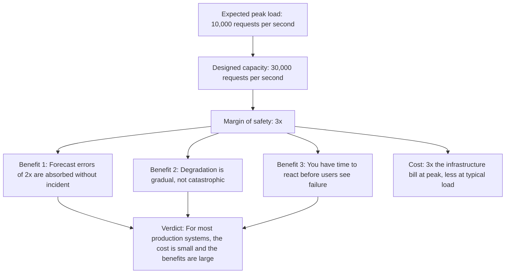
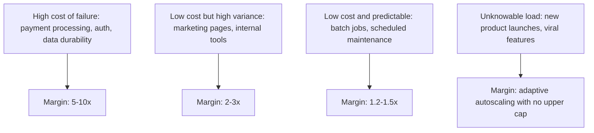
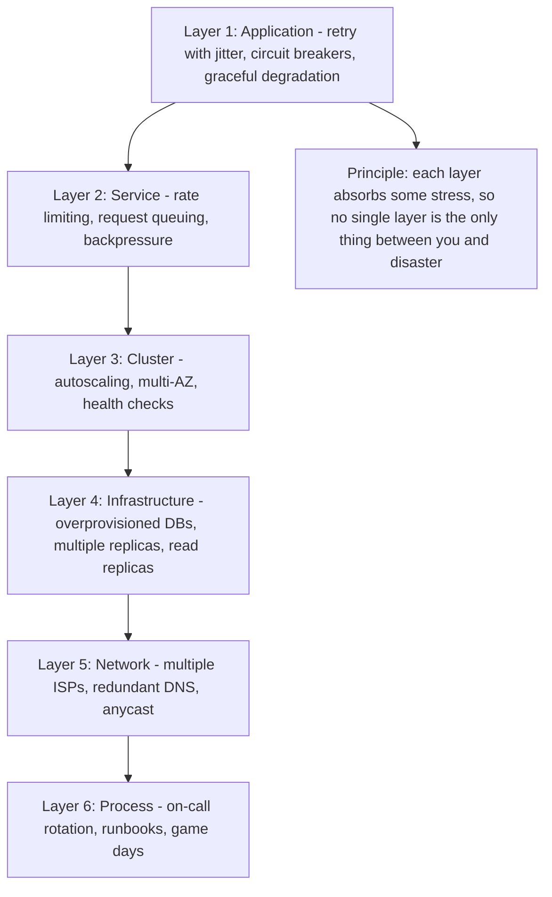
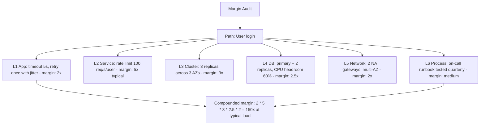

# 8.5. Margin of Safety in Production Systems

## 1. Background and Origin

Margin of safety is an engineering and investing principle that originated in civil engineering: a bridge designed to hold 10,000 kg should be built to hold 30,000 kg, so that unpredictable real-world conditions (weather, material defects, traffic spikes) do not cause catastrophic failure. The same principle was adopted by Benjamin Graham as the foundational concept of value investing: never buy a stock at its fair value, only at a discount, so that errors in your valuation do not produce losses.

For software engineers, margin of safety is the discipline of designing systems to handle significantly more than their expected load, latency budget, or failure tolerance. The "expected" case is a forecast, and forecasts are wrong. The margin is what absorbs the gap between forecast and reality.

---

## 2. Where Margins Matter Most

Not every component needs the same margin. Margins should be proportional to (a) the cost of failure and (b) the unpredictability of load:

The mistake is to apply a uniform margin everywhere. A 2x margin on payment processing is reckless; a 10x margin on a batch job is wasteful. Calibrate the margin to the consequence and predictability of failure.

---

## 3. Practical Application: The Multi-Layer Margin Strategy

Production reliability comes from margins stacked at multiple layers, not a single margin at one layer:

The key insight: a single layer with a 5x margin is more fragile than six layers each with a 1.5x margin, because the single layer has a single failure mode while the six-layer system has independent failure modes that compose multiplicatively.

---

## 4. Concrete Exercise: Margin Audit

For each critical path in your system, list every layer and its current margin:

For most systems, the audit will reveal that one layer has a much smaller margin than the others — and that layer is the bottleneck. Improving the bottleneck layer is far more effective than improving any other layer.

---

## 5. Common Pitfalls and Student Misunderstandings

* **Treating margin as waste.** Idle capacity feels wasteful, especially to finance teams. But idle capacity is what absorbs the unpredictable. A system running at 90% utilisation has zero margin and will fail at the first spike.
* **Conflating average and peak.** A system that averages 30% utilisation but spikes to 95% during peak has effectively no margin. Always size to peak, plus margin.
* **Putting all margin in one layer.** A common mistake is to overprovision the database (because it is expensive) but underprovision the application layer (because it feels cheap). When the app layer is the bottleneck, the DB margin is wasted.
* **Ignoring process margin.** On-call response time, runbook quality, and team energy are all margins. A team that is exhausted has no process margin and will fail at incidents that a fresh team would handle easily.
* **Forgetting that margins shrink under correlated failures.** Three replicas across three AZs gives you 3x margin *if* the AZs fail independently. If a deploy takes down all three at once (correlated failure), the margin is zero. Always ask: "Is this margin real, or does it disappear under the failure mode I am most worried about?"

---

## 6. Essential Reminders

* Margin of safety is the difference between expected load and designed capacity.
* Calibrate margin to consequence of failure, not to a uniform standard.
* Stack margins at multiple layers; multiplicative small margins beat single large margins.
* Find the layer with the smallest margin — that is your bottleneck.
* Margins disappear under correlated failures. Always ask whether your margin is real under the failure mode you fear most.
* "The three most important words in investing are margin of safety." — Benjamin Graham
