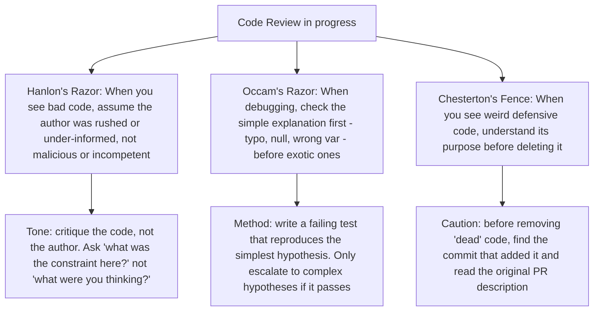
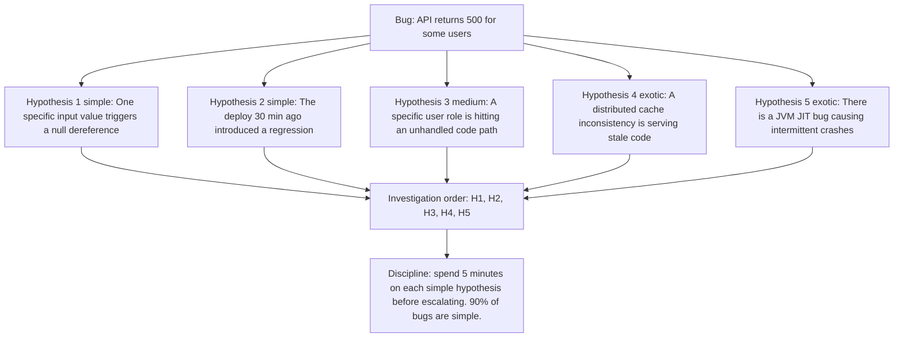
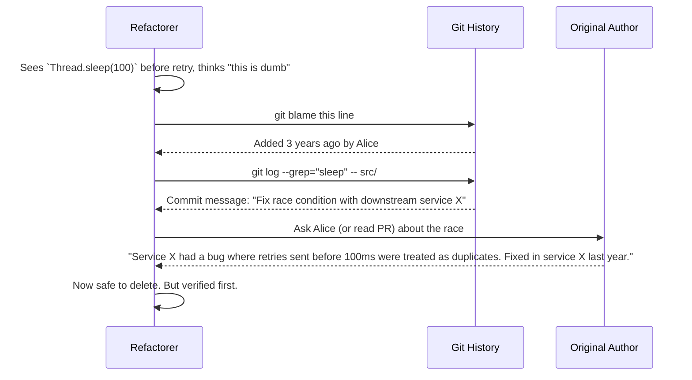
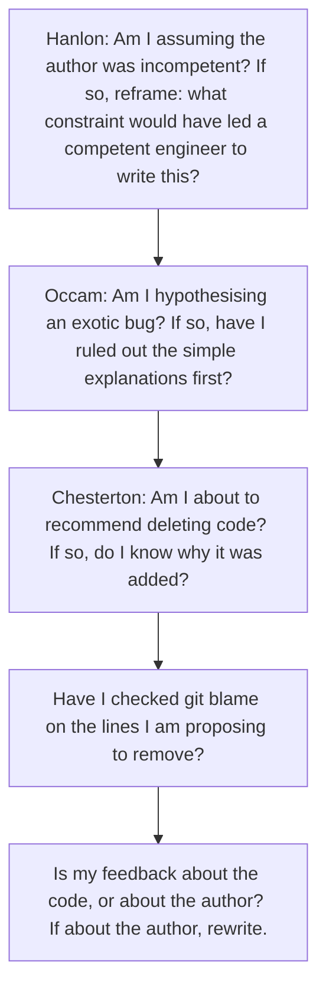

# 8.6. Hanlon's Razor, Occam's Razor, and Chesterton's Fence in Code Review

## 1. Background and Origin

Three razors and one fence, all of them powerful in code review:

* **Hanlon's Razor:** "Never attribute to malice that which is adequately explained by stupidity." More charitably: never attribute to malice what is adequately explained by ignorance, fatigue, or haste. Applied to code review: most bad code is not malicious, it is rushed or under-informed. Treat the author accordingly.
* **Occam's Razor:** "The simplest explanation that fits the facts is most likely to be correct." Applied to code review: if a bug has a simple explanation (typo, missing null check, wrong variable name), do not invent a complex one (race condition, framework bug, compiler defect) until the simple explanations have been ruled out.
* **Chesterton's Fence:** "Do not remove a fence until you understand why it was put up." Applied to code review: when you see code that looks pointless, defensive, or weirdly written, do not delete it until you understand what failure mode it was defending against.

---

## 2. Hanlon's Razor in Code Review

Code review is one of the most emotionally loaded engineering activities. Authors feel attacked; reviewers feel frustrated. Hanlon's Razor, applied consistently, defuses this dynamic. When you see bad code, your default assumption should be that the author was working under constraints you do not see — a tight deadline, an unfamiliar codebase, an ambiguous spec, a production fire — not that they are incompetent or careless.

This does not mean you accept bad code. It means you frame your feedback as "this code does not meet our bar, here is why, here is what we should change" rather than "how did you not see this?" The former produces better code; the latter produces defensiveness and worse code over time, because authors stop sharing work in progress.

The charitable reading also has a useful side effect: it forces you to articulate what was actually wrong, rather than dismissing the code with a vibe. "This is hard to read" is a vibe. "This function does three things and I had to read it twice to identify the actual logic" is feedback the author can act on.

---

## 3. Occam's Razor in Debugging

When a bug appears, engineers have a strong tendency to leap to exotic hypotheses. "It must be a race condition." "The framework must have a bug." "Maybe the network is dropping packets." These hypotheses are sometimes correct, but they are almost never the *first* thing to check. The first thing to check is the boring stuff: typos, nulls, wrong variable names, off-by-one errors, incorrect configuration values.

Occam's Razor is not a guarantee that the simplest explanation is correct. It is a heuristic that you should *rule out* simple explanations before investing in complex ones. The cost of ruling out a typo is 30 seconds. The cost of chasing a JIT bug is three days. The expected value strongly favours ruling out the simple first.

---

## 4. Chesterton's Fence in Refactoring

When refactoring, you will frequently encounter code that looks wrong. A null check that seems unnecessary. A sleep() call before an API request. A "redundant" database transaction wrapping an obviously idempotent operation. The temptation is to delete this code as dead weight. Chesterton's Fence warns: do not, until you understand why it is there.

The discipline is `git blame` → original commit → original PR → original author (if available). Only after you understand the *why* are you licensed to delete the *what*. Most senior engineers have a story about deleting "obviously dead" code that turned out to be load-bearing, often in subtle ways (working around a framework bug, defending against a known-but-rare input, providing a side effect that some other code depends on).

---

## 5. Concrete Exercise: The Three-Razor Code Review

Before commenting on any PR, run this internal checklist:

After a few weeks of this discipline, two things will happen. First, your reviews will become more useful, because they will focus on the code rather than the author. Second, you will discover that a surprising fraction of "weird" code is actually defending against real (if obscure) failure modes, and your deletions will become more conservative and more correct.

---

## 6. Common Pitfalls and Student Misunderstandings

* **Using Hanlon's Razor to excuse bad code.** The charitable reading is about the *author*, not the *code*. You can say "I assume this was rushed" and still say "this code is not acceptable, we need to fix it."
* **Using Occam's Razor to dismiss real complexity.** Some bugs really are exotic. Occam's Razor says *check simple first*, not *assume simple is always correct*. If you have ruled out the simple explanations, escalate to the complex ones without apology.
* **Using Chesterton's Fence to defend dead code.** Sometimes code really is dead and should be deleted. The fence principle requires you to *understand* the original purpose, not to *preserve* the code forever. Once you understand it, you can judge whether the original reason still applies.
* **Skipping the git blame step.** Most engineers skip git blame because it feels slow. It takes 30 seconds and prevents the most embarrassing refactoring mistakes.
* **Applying the razors asymmetrically.** Be charitable to *others'* code; be ruthless with *your own*. The opposite — excusing your own code and harshly judging others' — is the pathology that destroys team code review culture.

---

## 7. Essential Reminders

* Hanlon: assume the author was constrained, not malicious or incompetent.
* Occam: rule out simple explanations before chasing exotic ones.
* Chesterton: understand why code exists before deleting it. Always `git blame`.
* Be charitable to others, ruthless with yourself.
* Code review is a team activity, not a duel. The goal is better code, not victory.
