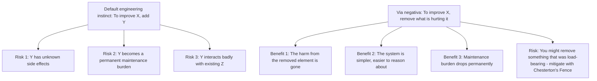
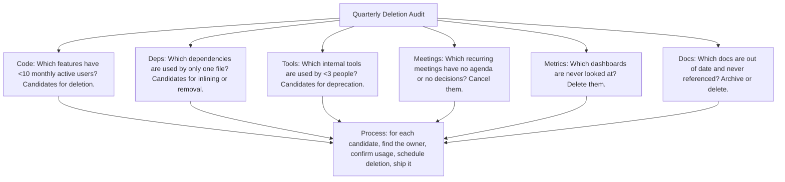
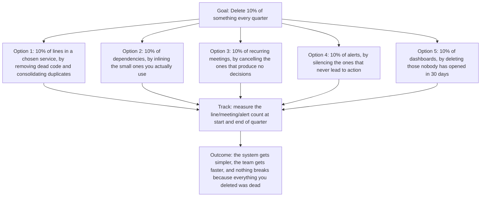

# 8.7. Via Negativa: Improvement by Subtraction

## 1. Background and Origin

Via Negativa is a Latin phrase meaning "the negative way." It originated in Christian theology (describing God by what He is not, rather than what He is) and was adopted as a general epistemic principle by Nassim Nicholas Taleb in his books *Antifragile* and *Skin in the Game*. The core insight: it is often more reliable to improve a system by removing what is harmful than by adding what is supposedly beneficial. Addition is risky because new elements have unpredictable side effects. Subtraction is safer because the harmful effects of the removed element are by definition gone.

For software engineers, via negativa is a powerful counterweight to the default engineering instinct, which is to add. New features, new abstractions, new tools, new dependencies, new layers, new metrics — engineers add because adding feels like progress. But every addition has a maintenance cost, a cognitive cost, and a failure surface. The most reliable improvements to a codebase often come from deletion, not addition.



---

## 2. Where Subtraction Beats Addition

Subtraction is superior to addition in several specific situations:

```mermaid
graph TD
    Situation1[Situation 1: The system is already complex. Adding makes it more complex; subtracting makes it simpler.]
    Situation2[Situation 2: The team is overloaded. Adding tools increases cognitive load; removing tools reduces it.]
    Situation3[Situation 3: A feature is barely used. Removing it eliminates a maintenance burden and a failure surface.]
    Situation4[Situation 4: A dependency is fragile. Removing it (and reimplementing the small part you actually need) eliminates a class of supply-chain risk.]
    Situation5[Situation 5: A meeting is unproductive. Removing it gives everyone an hour back.]
    Situation1 --> Principle[Principle: when in doubt, ask 'what can I delete?' before asking 'what can I add?']
    Situation2 --> Principle
    Situation3 --> Principle
    Situation4 --> Principle
    Situation5 --> Principle
```

---

## 3. Practical Application: The Deletion Audit

Run a deletion audit on your codebase, your tooling, and your schedule every quarter:



Most teams that run this audit for the first time are shocked at how much dead weight they are carrying. A typical 5-year-old codebase has 20-30% dead code by line count, several unused dependencies, half a dozen dashboards that nobody looks at, and a meeting schedule full of legacy rituals. Removing this dead weight produces an immediate, durable improvement in velocity, simply because the surface area that engineers have to reason about shrinks.

---

## 4. Concrete Exercise: The 10 Percent Delete

Commit to deleting 10% of something every quarter:



The 10% target is achievable in almost any system, and the cumulative effect over a year is dramatic. A codebase that loses 10% per quarter for a year ends up at 65% of its original size, with no loss of functionality — and a team that can ship faster because the surface area they reason about is much smaller.

---

## 5. Common Pitfalls and Student Misunderstandings

* **Deleting without understanding (Chesterton's Fence violation).** Via negativa is not license to delete recklessly. You still need to understand why something exists before removing it. The two principles work together: subtract by default, but verify before subtracting.
* **Subtracting only what is obviously dead.** The biggest wins come from subtracting things that are *technically alive but barely*. A feature with 0.1% adoption is technically alive, but the maintenance burden falls on 100% of the team. Subtract it.
* **Treating subtraction as defeat.** Engineers often feel that deleting their own code is admitting failure. It is the opposite — the willingness to delete is a sign of seniority. Junior engineers add; senior engineers subtract.
* **Forgetting that subtraction is reversible, addition often is not.** A deleted feature can be re-added if usage spikes. A feature you added and now maintain cannot be deleted without coordinated effort. Subtraction is the lower-risk move.
* **Subtracting only code, not process.** Process subtraction (meetings, rituals, approvals, tickets) often produces larger gains than code subtraction, because process costs are paid every day while code costs are paid only during maintenance.

---

## 6. Essential Reminders

* Default to subtraction. Ask "what can I delete?" before "what can I add?"
* Run a deletion audit quarterly. Most systems carry 20-30% dead weight.
* Target 10% deletion per quarter. The cumulative effect is dramatic.
* Apply Chesterton's Fence before deleting: understand why something exists first.
* Subtract process as well as code. Meetings are often the biggest waste.
* "Knowledge grows by subtraction much more than by addition, given that what we know today might turn out to be wrong but what we know not to be true remains so." — Nassim Nicholas Taleb
