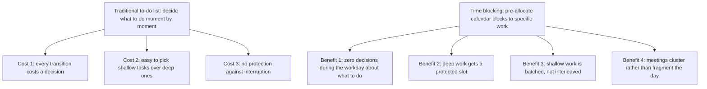
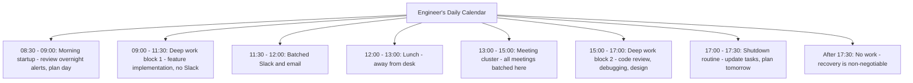
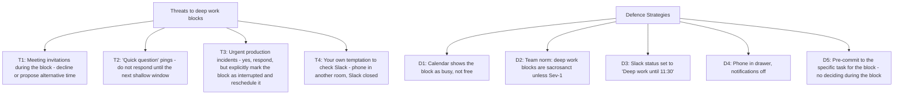
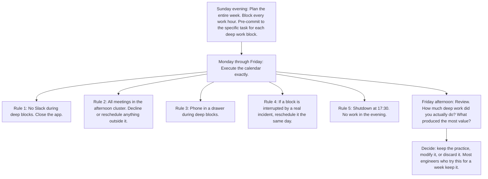

# 9.1. Time Blocking and Calendar-Driven Execution

## 1. Background and Origin

Time blocking is the practice of pre-allocating specific blocks of calendar time to specific tasks, rather than working from a prioritised to-do list and deciding moment-to-moment what to do. The technique is most associated with Cal Newport (who calls it the "deep work scheduling" foundation of *Deep Work*) and with Benjamin Franklin, who documented a similar daily structure in his autobiography. The cognitive mechanism is decision-cost reduction: every decision about "what should I do now" consumes cognitive resources, and a pre-committed calendar eliminates those decisions entirely during the workday.

For software engineers specifically, time blocking addresses the chronic problem of fragmented attention. An engineer who checks Slack between every compile, attends three scattered 30-minute meetings, and tries to write code in the gaps will produce significantly less than an engineer who blocks 4 hours for deep work, attends meetings in a single cluster, and processes Slack in two batched windows per day. The difference is not effort or talent; it is the structure that protects attention.

---

## 2. The Time Block Calendar

A well-structured engineer's calendar is mostly full before the day begins. A typical pattern:

The key features: two deep work blocks (morning and late afternoon), one meeting cluster (early afternoon, when post-lunch dip makes deep work harder anyway), and bounded shallow-work windows (Slack and email are processed, not constantly checked).

---

## 3. Practical Application: Defending the Blocks

The hardest part of time blocking is not creating the blocks — it is defending them. The default state of an engineering team is to fragment everyone's calendar with meetings, syncs, and "quick chats." Without active defence, your deep work blocks will be eroded within a week.

The pre-commitment in D5 is critical. If you arrive at the deep work block and have not decided what you are working on, you will spend the first 20 minutes context-switching between options, which destroys the block. Decide the night before, write it on a sticky note, and start immediately when the block begins.

---

## 4. Concrete Exercise: The One-Week Time Block Trial

Run this experiment for one week. Treat it as a strict experiment, not a guideline:

The most common outcome of this experiment is that engineers discover they have been doing 1-2 hours of real deep work per day, while believing they were doing 6-8. Time blocking forces the truth into the open, which is the prerequisite for improvement.

---

## 5. Common Pitfalls and Student Misunderstandings

* **Treating the calendar as aspirational.** A calendar that is "fully blocked" but routinely ignored is worse than no calendar, because it trains you to ignore your own commitments. Only block what you will actually do.
* **Not pre-committing to the task.** A block labelled "deep work" with no specific task is a block that will be wasted on context-switching. Always specify the task.
* **Allowing the meeting cluster to expand.** Meeting clusters have a tendency to grow until they consume the entire afternoon. Set a hard cap on meeting hours per day (e.g., 2 hours) and decline anything beyond it.
* **Skipping the shutdown routine.** Without an explicit shutdown, work bleeds into the evening, the brain never fully disengages, and the next day's deep work suffers. The shutdown is as important as the deep block.
* **Being rigid about block placement.** Some days your energy is best in the morning; other days, in the evening. The blocks themselves are non-negotiable; their exact placement can flex within reason.

---

## 6. Essential Reminders

* Time blocking eliminates in-the-moment decisions about what to do.
* Pre-commit to the specific task the night before. Never decide during the block.
* Defend the blocks aggressively. The default team behaviour is to fragment them.
* Cluster meetings. Never scatter them across the day.
* End with a shutdown routine. Evening work destroys next-day deep work.
* "Clarity about what matters provides clarity about what does not." — Cal Newport
