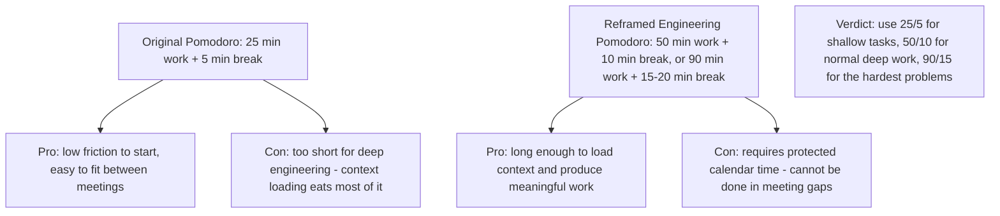
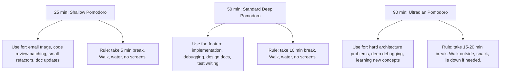
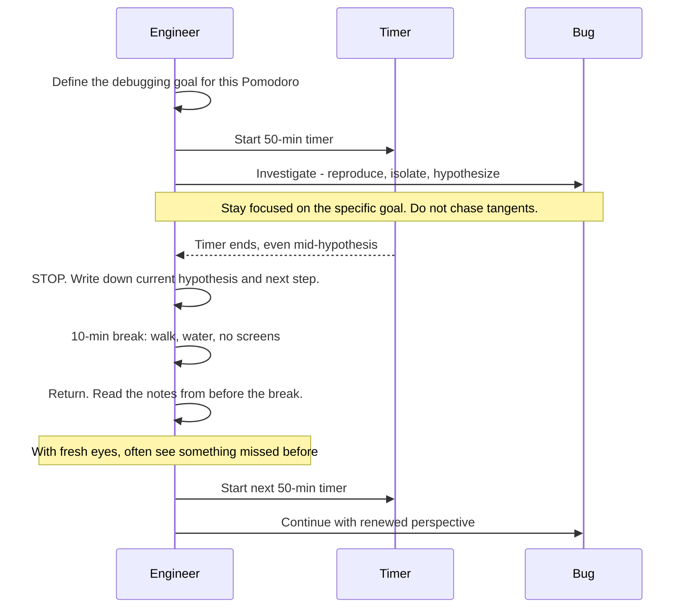
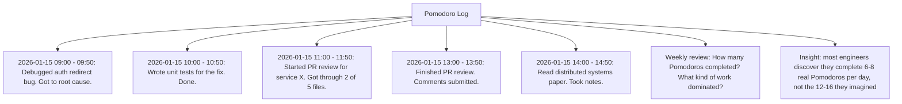

# 9.2. The Pomodoro Technique Reframed for Deep Engineering

## 1. Background and Origin

The Pomodoro Technique was developed by Francesco Cirillo in the late 1980s, named after a tomato-shaped kitchen timer he used as a university student. The original technique is simple: work for 25 minutes, take a 5-minute break, repeat. After four cycles, take a longer break. The cognitive mechanism is twofold: (a) the timer creates a clear start and end to a work period, which reduces the friction of beginning, and (b) the fixed duration creates a finite commitment, which makes the brain willing to engage fully rather than resisting an open-ended task.

For software engineers, the original 25/5 Pomodoro is often too short for deep engineering work. Loading a complex codebase into working memory takes 10-15 minutes, and a 25-minute timer ends just as the engineer reaches productive flow. The reframed Pomodoro for engineering uses longer cycles (50/10 or 90/15) while preserving the core mechanism of timed commitment and enforced breaks.

---

## 2. The Three Engineering Pomodoro Lengths

Different work requires different cycle lengths:

The 90-minute cycle corresponds to the body's *ultradian rhythm* — the natural oscillation of focus and fatigue that runs in roughly 90-minute cycles throughout the day. Working with this rhythm, rather than against it, produces noticeably more output for less perceived effort.

---

## 3. Practical Application: The Pomodoro-Driven Debugging Session

Debugging is the engineering activity that benefits most from Pomodoro discipline. Without it, engineers tend to grind on a bug for 4 hours, make no progress, and feel both exhausted and unproductive. With it, the same 4 hours produce real progress because the breaks force re-orientation.

The discipline of stopping mid-hypothesis is uncomfortable but productive. The break allows the brain's default mode network to process the problem in the background, and the return often produces an insight that continuous grinding would not have found. Engineers who adopt this practice report that bugs that used to take 4 hours now take 2, because the breaks do the work that grinding could not.

---

## 4. Concrete Exercise: The Pomodoro Log

For two weeks, log every Pomodoro you complete:

The log serves two purposes. First, it provides ground-truth data on how much focused work you actually do — almost always less than you estimate. Second, it lets you identify the work types that consistently produce value (and the ones that consistently drain time without producing anything).

---

## 5. Common Pitfalls and Student Misunderstandings

* **Skipping breaks.** The break is the technique. Without it, you are just working with a timer, which provides none of the cognitive reset benefits. If you skip breaks, you are not doing Pomodoro.
* **Continuing past the timer when "in flow."** This feels productive but destroys the technique's long-term benefit. The discipline of stopping at the timer is what makes the next Pomodoro productive. If you always overrun when focused, the timer loses its commitment power.
* **Using 25-minute Pomodoros for deep work.** 25 minutes is too short for most engineering tasks. You will spend 15 minutes loading context and 10 minutes working, which is demoralising and inefficient.
* **Treating incomplete Pomodoros as failures.** Sometimes a Pomodoro ends with no visible progress. That is information, not failure. The log entry "tried 3 hypotheses, all ruled out" is real progress — you have narrowed the search space.
* **Filling every break with another screen.** Checking Slack during a break is not a break. The break must involve looking away from a screen, standing up, and ideally walking. Without physical reset, the cognitive reset does not happen.

---

## 6. Essential Reminders

* Pomodoro is not a timer; it is a commitment device.
* Match the length to the work: 25 for shallow, 50 for normal deep, 90 for hardest.
* The break is the technique. Skip it and you lose the benefit.
* Stop mid-hypothesis if the timer ends. The break will often solve the next step for you.
* Log your Pomodoros. Your estimates are wrong; the log is not.
* "It is not that we have a short time to live, but that we waste a lot of it." — Seneca
