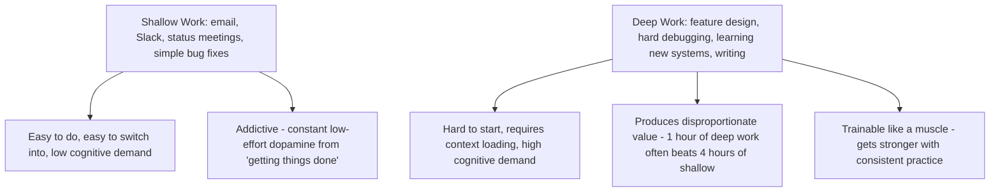
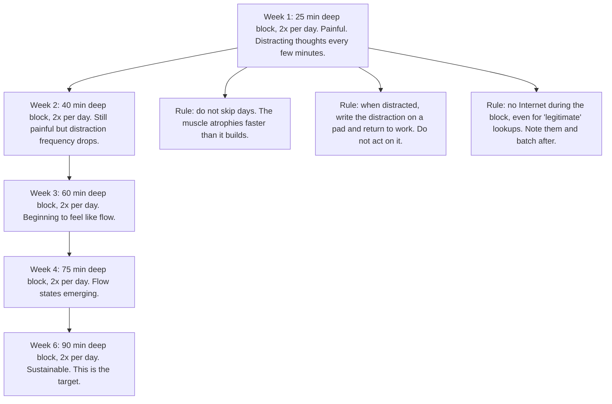
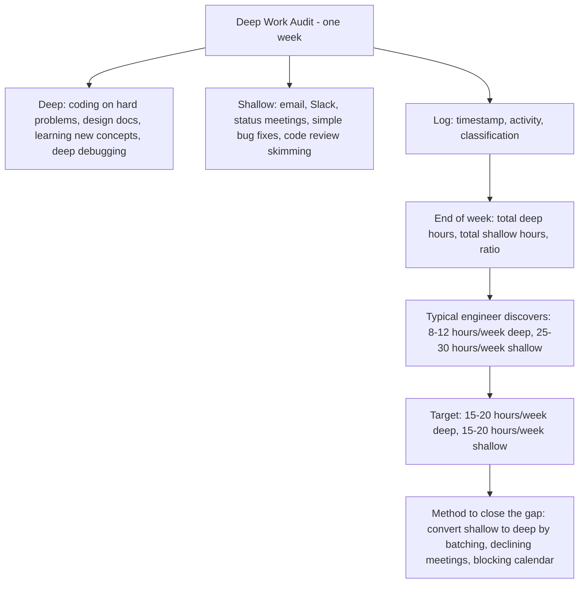

# 9.3. Deep Work and the Concentration Muscle

## 1. Background and Origin

*Deep Work* is a 2016 book by Cal Newport that defines "deep work" as "professional activities performed in a state of distraction-free concentration that push your cognitive capabilities to their limit." Newport's central claim is that deep work is both increasingly rare (because of constant connectivity and shallow-work tools) and increasingly valuable (because complex cognitive work is what the economy rewards). The engineers who cultivate this capacity will thrive; those who do not will be replaced by either AI or by engineers who can.

The concentration muscle is the metaphor Newport uses: deep work is not a state you enter by luck, it is a capacity you train. Like a physical muscle, it strengthens with progressive overload and atrophies with disuse. An engineer who has spent six months context-switching every 5 minutes will find 90 minutes of unbroken focus physically painful at first — and that pain is the muscle being trained, not a sign that the technique is wrong.



---

## 2. The Four Deep Work Scheduling Philosophies

Newport identifies four approaches to scheduling deep work, suitable for different life situations:

```mermaid
graph TD
    Philosophies[Deep Work Philosophies]
    Philosophies --> Monastic[Monastic: total isolation from shallow work for long periods. Suitable for: writers, researchers. Unsuitable for: most engineers.]
    Philosophies --> Bimodal[Bimodal: clearly defined deep work periods (days or weeks) alternating with shallow periods. Suitable for: senior engineers who can block weeks.]
    Philosophies --> Rhythmic[Rhythmic: daily deep work block at the same time every day. Suitable for: most engineers. The most practical default.]
    Philosophies --> Journalistic[Journalistic: deep work whenever a few minutes free up. Suitable for: very advanced practitioners only - most engineers cannot do this.]
```

For most software engineers, the Rhythmic philosophy is the right default: a 90-minute deep work block at the same time every morning (e.g., 9:00-10:30), protected religiously. The Bimodal philosophy becomes possible for senior engineers who can negotiate focus days. The Journalistic philosophy is a trap for most engineers because it requires the concentration muscle to be already well-trained.

---

## 3. Practical Application: Training the Concentration Muscle

If you have not done consistent deep work for months, you cannot suddenly do 4 hours of it. You must train up. The training protocol:



The "no Internet during the block" rule sounds extreme but is essential. The brain treats any context switch — even a "quick" lookup — as permission to switch again. Looking up one API doc leads to checking Slack leads to checking Twitter, and the block is destroyed. Note the lookups needed and batch them into the post-block shallow window.

---

## 4. Concrete Exercise: The Deep Work Audit

For one week, track every minute of work you do, classified as deep or shallow:



The audit is uncomfortable because it forces you to confront how little deep work you actually do. But the gap between perceived and actual deep work is exactly the opportunity. Most engineers can double their deep work hours within a month by restructuring their calendar and saying no to low-value meetings.

---

## 5. Common Pitfalls and Student Misunderstandings

* **Treating deep work as a luxury.** Deep work is not what you do when you have time; it is what you protect so that you have anything to show for the week. Engineers who treat deep work as a luxury find that they never have time for it, and their careers plateau.
* **Allowing "legitimate" lookups during deep blocks.** The brain does not distinguish between a "quick doc lookup" and a "quick Twitter check." Both are context switches. Batch all lookups for after the block.
* **Not training up gradually.** Trying to jump from 0 deep work hours per day to 4 will fail and produce discouragement. Train up over 6 weeks.
* **Skipping days.** The concentration muscle atrophies fast. Skipping 3 days in a row resets weeks of progress. Consistency matters more than duration.
* **Confusing long hours with deep work.** Working 12-hour days of shallow work produces less value than 6 hours of deep work, and burns you out faster. Long hours are not the same as deep work.

---

## 6. Essential Reminders

* Deep work is a trainable muscle, not a personality trait.
* Train up gradually: 25 min → 90 min over 6 weeks.
* No Internet during the block. Note lookups and batch them.
* Audit your actual deep vs. shallow hours. The gap is your opportunity.
* Most engineers can double their deep work hours within a month.
* "High-Quality Work Produced = (Time Spent) x (Intensity of Focus)." — Cal Newport
