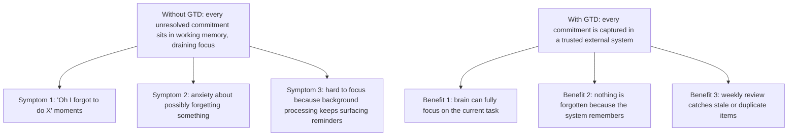
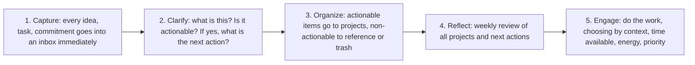
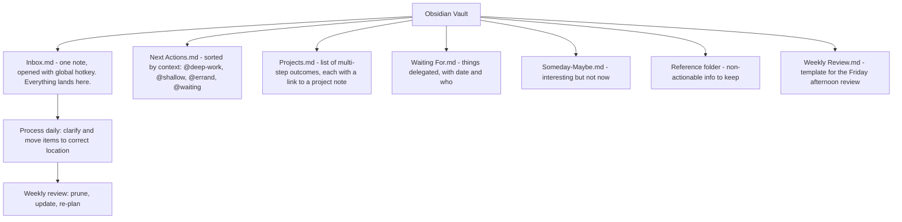
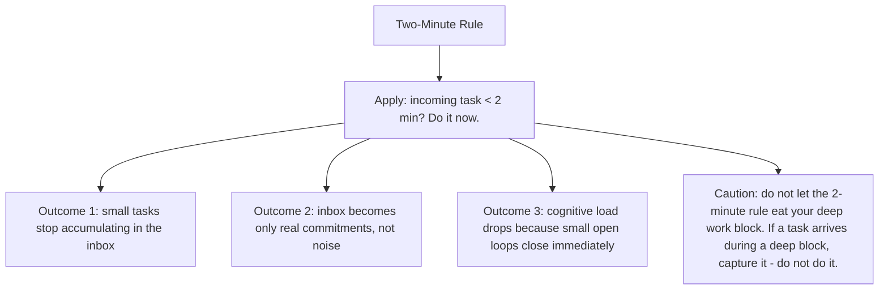

# 9.4. Getting Things Done (GTD) for Engineers

## 1. Background and Origin

*Getting Things Done* (GTD) is a productivity methodology developed by David Allen and published as a book in 2001. The core thesis is that the human brain is excellent at generating ideas but terrible at storing and tracking them. Every unresolved commitment (Allen calls these "open loops") consumes cognitive bandwidth, regardless of whether you are actively thinking about it. The GTD methodology externalises all commitments into a trusted system, freeing the brain to focus on the work at hand rather than on remembering what work needs doing.

For software engineers, GTD is unusually valuable because engineering work generates a constant stream of small commitments: "investigate that flaky test," "reply to the design doc thread," "fix the typo in the API doc," "read the linked PR." Engineers who try to hold all of these in their head suffer background cognitive load that reduces their effective IQ during deep work. Engineers who externalise them into a trusted system can give their full attention to whatever they are doing.

---

## 2. The Five GTD Steps

GTD consists of five processes that operate on the stream of incoming commitments:

### 2.1. Capture
The capture step requires a frictionless inbox — a single place where every commitment goes immediately. For most engineers, this is a single note in Obsidian (or a similar tool) that opens with a keyboard shortcut. If capturing a task takes more than 5 seconds, you will not do it consistently, and the system breaks.

### 2.2. Clarify
For each inbox item, ask: "Is this actionable?" If no, it goes to reference (information to keep) or trash (delete it). If yes, ask: "Can it be done in under 2 minutes?" If yes, do it now. If no, ask: "What is the next concrete action?" and write that down.

### 2.3. Organize
Actionable items go to one of four places: a *Next Actions* list (sorted by context: @computer, @code-review, @meeting), a *Projects* list (anything requiring more than one action), a *Waiting For* list (items delegated to others), and a *Someday/Maybe* list (interesting but not now).

### 2.4. Reflect
The weekly review is the most important and most-skipped step. Once a week, review every list, update statuses, prune stale items, and re-plan the next week. Without this, the system degrades into a junk drawer within a month.

### 2.5. Engage
When working, choose the next action based on context (where are you, what tools do you have), time available, energy level, and priority. The point is to never wonder "what should I do next" — the system has already surfaced the candidates.

---

## 3. Practical Application: GTD in Obsidian for an Engineer

A minimal Obsidian-based GTD setup:

The key engineering-specific adaptation: distinguish between *deep work* next actions (require 60+ minutes of focus) and *shallow work* next actions (can be done in 15 minutes between meetings). When you have a 90-minute block, filter to deep-work actions. When you have 15 minutes before a meeting, filter to shallow actions. This prevents the failure mode of using deep work blocks for shallow tasks.

---

## 4. Concrete Exercise: The Two-Minute Rule Audit

For one week, apply the two-minute rule religiously: if a task comes in and would take under 2 minutes, do it immediately. Do not capture it. Track the results:

The two-minute rule sounds trivial but produces a disproportionate improvement. Most engineers' inboxes are 50-70% tasks that would have taken under 2 minutes to do at the moment of capture. Handling these immediately keeps the inbox small and the cognitive load low.

---

## 5. Common Pitfalls and Student Misunderstandings

* **Capturing into multiple inboxes.** Email inbox, Slack starred messages, browser tabs, sticky notes, head — if you have multiple inboxes, you have to check all of them, and you will miss items. Consolidate into one inbox.
* **Skipping the weekly review.** The weekly review is the only thing that keeps the system trusted. Skip it for two weeks and the system becomes a junk drawer, at which point you stop trusting it, at which point you stop capturing into it, at which point you are back to holding everything in your head.
* **Capturing vague items.** "Look into the performance issue" is not a next action; it is a project. The next action is "run the profiler on the staging environment and capture the top 5 hot functions." Always capture the next concrete physical action.
* **Using the inbox as a to-do list.** The inbox is for capture only. Items must be moved out during the daily processing. An inbox with 200 items in it is a junk drawer, not an inbox.
* **Treating GTD as a religion.** GTD is a starting framework. Adapt it to your work. The principles (capture, clarify, organize, reflect, engage) are universal; the specific tools (Obsidian, Todoist, paper) are interchangeable.

---

## 6. Essential Reminders

* The brain is for generating ideas, not storing them.
* One inbox, opened with a hotkey, processed daily.
* Two-minute rule: if it is under 2 minutes, do it now.
* The weekly review is the system. Skip it and the system fails.
* Capture the next concrete physical action, not the vague project.
* "Your mind is for having ideas, not holding them." — David Allen
