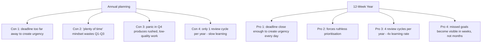
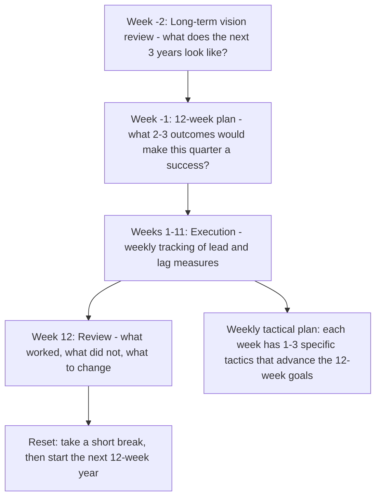
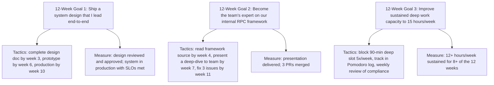
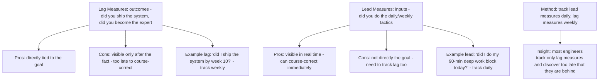

# 9.5. The 12-Week Year Methodology

## 1. Background and Origin

*The 12 Week Year* is a 2013 book by Brian Moran and Michael Lennington. The core thesis is that annual planning is structurally broken because the deadline is too far away to create urgency, which produces a "I have plenty of time" mindset that wastes the first 9 months and panics in the last 3. By compressing the planning horizon to 12 weeks — roughly one quarter — you get the urgency of a deadline without losing the strategic depth of multi-month planning. The 12-week year treats each quarter as a complete cycle: plan, execute, review, reset.

For software engineers, the 12-week year maps naturally to quarterly OKR cycles and provides a structured cadence for personal growth that is longer than a sprint but shorter than a year. An engineer who treats each quarter as a "year" can make 4x the strategic progress of one who treats the year as the unit, because the compressed deadline forces prioritisation that annual planning never does.

---

## 2. The 12-Week Cycle

Each 12-week year has the same structure:

The key discipline is in the planning step: a 12-week plan that has 8 goals is not a plan, it is a wish list. Moran's rule is 2-3 outcomes per 12-week cycle. Anything more dilutes focus and ensures nothing gets done well.

---

## 3. Practical Application: An Engineer's 12-Week Plan

A sample 12-week plan for a mid-level engineer who wants to grow toward senior:

Note that each goal has tactics (what you will do) and measures (how you will know it worked). Tactics without measures produce effort without accountability; measures without tactics produce wishful thinking.

---

## 4. Concrete Exercise: Lead vs. Lag Measures

A core 12-Week Year concept is the distinction between lead and lag measures:

For one 12-week cycle, track one lead measure daily. Put a checkmark on a calendar for each day you hit it. The visual streak becomes its own motivator, and the days you miss become data for the weekly review.

---

## 5. Common Pitfalls and Student Misunderstandings

* **Planning too many goals.** 2-3 is the limit. 5+ guarantees none get done. The discipline of cutting from 8 to 3 is the most valuable part of the planning step.
* **Treating the 12 weeks as 12 individual weeks.** The 12 weeks are a unit. A bad week 4 is not a fresh start in week 5; it is a deficit that must be made up. This is what creates the urgency.
* **Skipping the review week.** Week 12 is for review, not for cramming. Engineers who skip the review to "ship one more thing" lose the learning that makes the next cycle better.
* **Setting goals you cannot control.** "Get promoted" is not a 12-week goal because the decision is not yours. "Lead a system design end-to-end" is. Set goals you can fully control through your own actions.
* **Tracking only lag measures.** By the time lag measures show red, it is too late to recover the cycle. Lead measures must be tracked daily so you can intervene in week 3, not week 11.

---

## 6. Essential Reminders

* Compress the planning horizon to 12 weeks to create daily urgency.
* 2-3 goals per cycle. Anything more dilutes focus.
* Track lead measures daily, lag measures weekly.
* Week 12 is for review, not for cramming.
* Set goals you can fully control through your own actions.
* "The deadline is the friend of focus." — Brian Moran (paraphrased)
