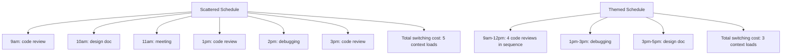
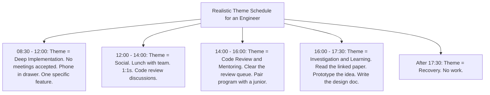
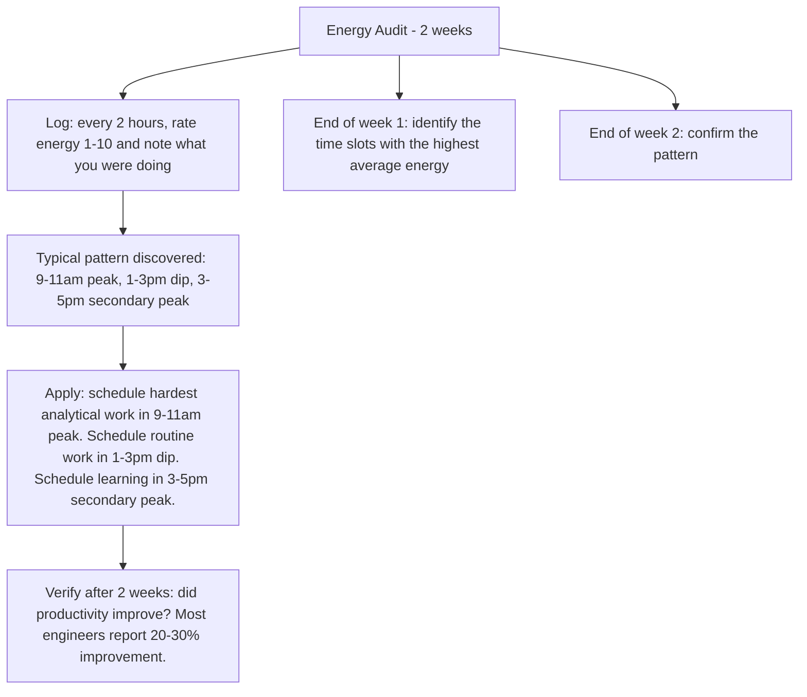

# 9.6. Theme-Based Scheduling and Energy Management

## 1. Background and Origin

Theme-based scheduling assigns a single theme to each day of the week, so that all the work on that day aligns with one type of cognitive demand. The technique was popularised by Mike Vardy and adopted widely by entrepreneurs like Jack Dorsey, who reported running Square and Twitter simultaneously by theming his days (Monday: management, Tuesday: product, Wednesday: marketing, etc.). The cognitive mechanism is task-switching cost reduction: switching between dissimilar task types costs more than switching between similar tasks, and theme days minimise the number of dissimilar transitions.

For software engineers, theme-based scheduling pairs naturally with energy management — the practice of matching task types to the time of day when your brain is best suited for them. Most engineers have peak analytical energy in the morning, peak social energy midday, and peak creative energy late afternoon. A schedule that respects both themes and energy produces noticeably more output for the same hours.

```mermaid
graph TD
    Themes[Theme Days]
    Themes --> Mon[Monday: Planning and Review - weekly planning, sprint grooming, retros]
    Themes --> Tue[Tuesday: Deep Implementation - feature work, no meetings]
    Themes --> Wed[Wednesday: Code Review and Mentoring - review queue, 1:1s, pair programming]
    Themes --> Thu[Thursday: Deep Implementation - feature work, no meetings]
    Themes --> Fri[Friday: Investigation and Learning - reading, prototyping, system design docs]
    Energy[Energy Mapping]
    Energy --> Morning[08:30 - 11:30: Peak analytical - hardest problem of the day]
    Energy --> Midday[11:30 - 14:00: Social peak - meetings, code review discussion]
    Energy --> Afternoon[14:00 - 17:00: Secondary analytical - implementation, writing]
    Energy --> Evening[After 17:30: Recovery - no work]
    Themes --> Combined[Combined: theme + energy = each task lands in its optimal slot]
    Energy --> Combined
```

---

## 2. Why Theme Days Work

Every task has two costs: the execution cost (the time to do it) and the switching cost (the cognitive effort to load the relevant context). Theme days reduce the switching cost by clustering similar tasks together. Five code reviews done back-to-back take less total time than five code reviews scattered across a day, because each review builds on the context loaded by the previous one.

For most engineers, the savings from theming are 1-2 hours per day that would otherwise be lost to context switches. That is enough to fit in another deep work block.

---

## 3. Practical Application: A Two-Theme Engineer Schedule

Most engineers cannot fully theme each day because meeting schedules are not under their control. A realistic compromise is to theme only the *blocks within* the day:

Even this two-block theming (morning = deep implementation, afternoon = review + learning) produces noticeable improvements over an unstructured day, because each block has a clear theme that determines what is and is not appropriate to do.

---

## 4. Concrete Exercise: Energy Audit

Track your energy levels for two weeks to identify your personal peaks:

Most engineers discover they have been scheduling their hardest work in their energy dip (right after lunch) and wasting their peak on email. Simple reordering produces disproportionate gains.

---

## 5. Common Pitfalls and Student Misunderstandings

* **Treating themes as rigid.** Themes are defaults, not laws. If a production incident lands on your "Deep Implementation" morning, you respond to the incident. The theme returns the next day.
* **Themming days you do not control.** If your team has scattered standups, mid-sprint syncs, and PM check-ins across every day, theming the day is impossible. First negotiate the meeting cluster (see 9.1), then theme.
* **Ignoring energy.** A perfect theme schedule that puts deep work in your 2pm energy dip will fail. Themes must respect energy.
* **Confusing themes with task lists.** A theme is a category of work, not a specific task. "Monday is implementation" is a theme. "Monday is implementing feature X" is a task. Tasks go inside themes; themes are not tasks.
* **Forgetting to theme the non-work hours.** Recovery time also benefits from theming. "Saturday is family, Sunday morning is reading, Sunday evening is weekly planning" is a theme schedule for the weekend that protects recovery.

---

## 6. Essential Reminders

* Theme days reduce switching cost by clustering similar work.
* Map themes to energy peaks: hardest work in morning peak, routine work in afternoon dip.
* Two-block theming (morning deep, afternoon shallow) is realistic for most engineers.
* Audit your energy for 2 weeks to find your personal peaks.
* Themes are defaults, not laws. Adapt to incidents.
* "Until we can manage time, we can manage nothing else." — Peter Drucker
