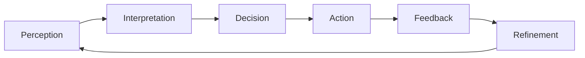
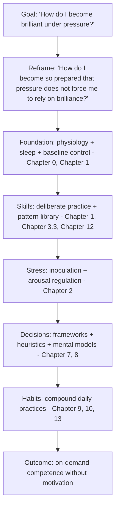

# Elite Cognitive Performance and Reliability (ECPR) Vault

A structured Obsidian vault for software engineers who want to systematically construct on-demand competence, eliminate reliance on motivation, and build stress-tolerant execution protocols.

This vault is built on the premise that elite performance is not a state but a pipeline:



Most people fail because this pipeline breaks under stress. ECPR is about making each stage stable, predictable, and low-friction.

---

## Course Structure

```mermaid
graph TD
    Course[Elite Cognitive Performance and Reliability]
    Course --> C0[0. Foundations]
    Course --> C1[1. Cognitive Foundations of On-Demand Competence]
    Course --> C2[2. Stress Tolerance and Execution Under Pressure]
    Course --> C3[3. Systemic Protocols and Routine Engineering]
    Course --> C4[4. The Software Engineer's Cognitive Operating System]
    Course --> C5[5. Behavioral Decoupling, Addiction, and Self-Sabotage Mitigation]
    Course --> C6[6. Literature for the Software Engineer's Mind]
    Course --> C7[7. Decision-Making Frameworks for Engineers]
    Course --> C8[8. Mental Models for Software Engineers]
    Course --> C9[9. Productivity Methods for Cognitive Performance]
    Course --> C10[10. Cognitive Habits and Intelligence Amplification]
    Course --> C11[11. Books for the Engineer's Mind - Expanded Library]
    Course --> C12[12. Becoming a Stronger Software Engineer]
    Course --> C13[13. Long-Term Reliability and Compounding Growth]
```



---

## Chapter Map

```
ECPR Course {
    0. Foundations
        - 0.1. ECPR Roadmap
        - 0.2. Smart Where It Matters
        - 0.3. The Harvey Specter Debate

    Chapter 1: Cognitive Foundations of On-Demand Competence
        - 1.1. Crystallized Intelligence vs. Creative Inspiration
        - 1.2. Cognitive Load Theory and Automation of Heuristics
        - 1.3. Neural Consolidation and Myelination in Skill Acquisition
        - 1.4. The Cognitive Compilation Pipeline

    Chapter 2: Stress Tolerance and Execution Under Pressure
        - 2.1. State-Dependent Neuromodulation and Arousal Regulation
        - 2.2. Stress-Inoculation Training Protocols
        - 2.3. Dual-Process Theory and Cognitive De-biasing Under Stress
        - 2.4. Engineering Stress-Tolerant Execution

    Chapter 3: Systemic Protocols and Routine Engineering
        - 3.1. Designing High-Reliability Execution Frameworks
        - 3.2. Cognitive Offloading and Externalized Systems
        - 3.3. Deliberate Practice Methodologies and Feedback Loops
        - 3.4. Recommended Literature for High-Reliability Cognitive Execution
        - 3.5. Decoupling Execution from Motivation

    Chapter 4: The Software Engineer's Cognitive Operating System
        - 4.1. The Programmer's Mental Sandbox: Deep Thinking and Systemic Debugging
        - 4.2. Heuristics, Design Patterns, and Mental Models of Elite Engineers
        - 4.3. Cognitive Architecture for Software Engineering: Managing Context-Switches

    Chapter 5: Behavioral Decoupling, Addiction, and Self-Sabotage Mitigation
        - 5.1. The Dopamine Trap: Eradicating Compulsive Distraction and Addiction
        - 5.2. Cognitive Re-framing of Self-Sabotage and Imposter Syndrome
        - 5.3. High-Performance Behavioral Conditioning and Discipline Systems

    Chapter 6: Literature for the Software Engineer's Mind
        - 6.1. Pragmatic Thinking and Learning (Andy Hunt)
        - 6.2. Dopamine Nation (Dr. Anna Lembke)
        - 6.3. A Philosophy of Software Design (John Ousterhout)

    Chapter 7: Decision-Making Frameworks for Engineers
        - 7.1. The OODA Loop Applied to Software Engineering
        - 7.2. Inversion: Solving Problems Backwards
        - 7.3. Pre-mortem Analysis for Software Projects
        - 7.4. First Principles Thinking in System Design
        - 7.5. Probabilistic Reasoning and Expected Value

    Chapter 8: Mental Models for Software Engineers
        - 8.1. The Map Is Not the Territory
        - 8.2. Feedback Loops and System Dynamics
        - 8.3. Second-Order Thinking in Engineering Decisions
        - 8.4. The Circle of Competence
        - 8.5. Margin of Safety in Production Systems
        - 8.6. Hanlon's Razor, Occam's Razor, and Chesterton's Fence in Code Review
        - 8.7. Via Negativa: Improvement by Subtraction

    Chapter 9: Productivity Methods for Cognitive Performance
        - 9.1. Time Blocking and Calendar-Driven Execution
        - 9.2. The Pomodoro Technique Reframed for Deep Engineering
        - 9.3. Deep Work and the Concentration Muscle
        - 9.4. Getting Things Done for Engineers
        - 9.5. The 12-Week Year Methodology
        - 9.6. Theme-Based Scheduling and Energy Management

    Chapter 10: Cognitive Habits and Intelligence Amplification
        - 10.1. Spaced Repetition and Anki for Engineers
        - 10.2. The Feynman Technique for Technical Concepts
        - 10.3. Active Recall vs. Passive Review
        - 10.4. Interleaved Practice for Skill Transfer
        - 10.5. Building a Zettelkasten for Engineering Knowledge
        - 10.6. Elaborative Interrogation and Self-Explanation

    Chapter 11: Books for the Engineer's Mind (Expanded Library)
        - 11.1. Thinking, Fast and Slow (Daniel Kahneman)
        - 11.2. Deep Work (Cal Newport)
        - 11.3. Atomic Habits (James Clear)
        - 11.4. The Pragmatic Programmer (Hunt and Thomas)
        - 11.5. The Psychology of Computer Programming (Gerald Weinberg)
        - 11.6. Outliers (Malcolm Gladwell)
        - 11.7. Mindset (Carol Dweck)
        - 11.8. The Effective Executive (Peter Drucker)
        - 11.9. Antifragile (Nassim Taleb)
        - 11.10. The Algorithm Design Manual (Steven Skiena)
        - 11.11. Surely You're Joking, Mr. Feynman! (Richard Feynman)
        - 11.12. Hackers and Painters (Paul Graham)

    Chapter 12: Becoming a Stronger Software Engineer
        - 12.1. Reading Code as a Skill
        - 12.2. Code Review as Cognitive Practice
        - 12.3. System Design Practice and Case Studies
        - 12.4. Building a Personal Engineering Playbook
        - 12.5. The Seniority Transition
        - 12.6. Writing Engineering Design Documents
        - 12.7. On-Call and Incident Response Protocols

    Chapter 13: Long-Term Reliability and Compounding Growth
        - 13.1. The Compound Effect of Small Daily Practices
        - 13.2. Anti-Fragility in Career
        - 13.3. Career Audit and Quarterly Review Protocol
        - 13.4. Building a 10-Year Learning Roadmap
}
```

---

## How to Use This Vault

### For a New Reader
1. Start with **0. Foundations** to understand the ECPR framework.
2. Read **Chapter 1** to understand why "on-demand competence" is a trained capacity, not a talent.
3. Read **Chapter 2** before your next high-stress situation (incident, deadline, interview).
4. Skim **Chapter 11** and pick the 3 books that resonate most. Read them in full.
5. Pick one practice from **Chapter 9** (e.g., time blocking) and one from **Chapter 10** (e.g., spaced repetition) and start this week.

### For a Senior Engineer
1. Read **Chapter 4** to audit your cognitive operating system.
2. Read **Chapter 12.5** on the seniority transition if you are aiming for staff.
3. Read **Chapter 13.2** on antifragility in career to assess your own optionality.
4. Build a **personal engineering playbook** (Chapter 12.4) — this is the single highest-leverage artifact for senior engineers.

### For Interview Preparation
1. **Chapter 7.4** (First Principles) and **Chapter 7.5** (Probabilistic Reasoning) for system design interviews.
2. **Chapter 12.3** (System Design Practice) for the design repertoire.
3. **Chapter 12.6** (Writing Design Docs) for take-home design exercises.
4. **Chapter 2.1** (Arousal Regulation) for the in-person interview stress.

### For On-Call Engineers
1. **Chapter 2** (all four files) for stress tolerance.
2. **Chapter 12.7** (On-Call and Incident Response) for the protocols.
3. **Chapter 8.5** (Margin of Safety) for system design.
4. **Chapter 13.1** (Compound Effect) for the long game.

---

## Conventions Used in This Vault

* **File and section titles**: numbered with a period and space (`1. Cloud Computing Definition`), no underscores anywhere.
* **Diagrams**: all diagrams are Mermaid. No ASCII art.
* **Each note** follows the same template:
  1. Background and Origin
  2. Core mechanism or framework
  3. Practical Application
  4. Concrete Exercise
  5. Common Pitfalls and Student Misunderstandings
  6. Essential Reminders
* **Book notes** (Chapter 11) additionally include verbatim quotes with chapter/page citations.
* **Cross-references** are written explicitly (e.g., "see Chapter 8.5") so links can be added later in Obsidian.

---

## Provenance

* **Chapters 0-6**: extracted verbatim from the user's original "Vault 1.md" using a Python `Splitter` class that processes the content using start/end markers. No content was rewritten.
* **Chapters 7-13**: generated as new content by the assistant, building on top of the existing vault without modifying it. Each new file is a focused, polished Obsidian note with Mermaid diagrams, exercises, and pitfalls.
* **Book quotes** in Chapter 11: verified by parallel research agents against published editions and corroborated against Goodreads, SuperSummary, and the books' own chapter structures. No quotes are paraphrased or invented.

---

## Final Mental Model



ECPR is not about being "smart on demand." It is about this transformation:

> From: "I must think well under pressure."
> To: "I have already precomputed most of what pressure would demand."

Under stress, elite performers are not inventing intelligence. They are executing prebuilt structures.

---

*This vault is a living document. Revise it, annotate it, and make it yours.*
