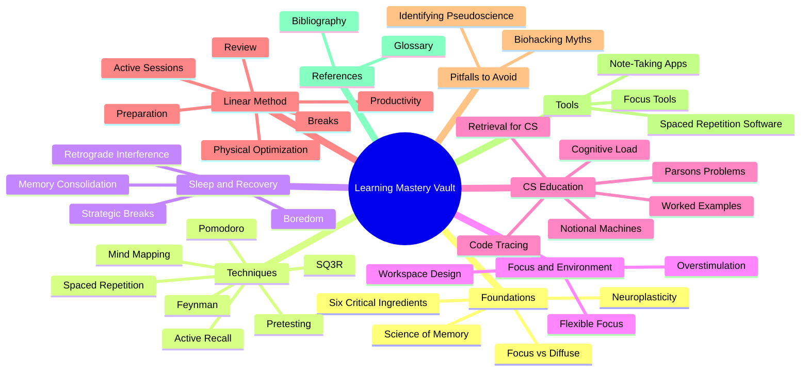

# Learning Mastery Vault

Welcome to the **Learning Mastery Vault** — a rigorously curated, evidence-based knowledge base for mastering how to learn. This vault synthesizes decades of peer-reviewed cognitive psychology, neuroscience, and Computer Science Education (CSEd) research into a single, navigable Obsidian workspace. Every concept in this vault is backed by either robust clinical literature or by heuristics that have stood up to decades of classroom testing. Pseudoscientific "biohacking" trends have been deliberately excluded from the main learning path and quarantined in [[7.1 MOC - Pitfalls]] so you can recognize and avoid them.

> [!tip] How to Use This Vault
> 1. Start with [[1.1 MOC - Foundations]] to build the theoretical bedrock.
> 2. Move through the techniques in [[2.1 MOC - Learning Techniques]] and try each one for at least one week.
> 3. If you study computer science or any technical subject, read [[5.1 MOC - CS Education]] carefully — it contains techniques that non-CS learners never encounter.
> 4. Use [[6.1 MOC - The Linear Method]] as the daily operating system that ties everything together.
> 5. Periodically consult [[7.1 MOC - Pitfalls]] to stay vigilant against pop-neuroscience.

## Mermaid Mind Map of the Vault

## Chapter Index

| # | Chapter | Purpose | Map of Content |
|---|---------|---------|----------------|
| 1 | [[1. Foundations of Learning Science]] | Theoretical bedrock: how memory, plasticity, and attention actually work | [[1.1 MOC - Foundations]] |
| 2 | [[2. Evidence-Based Learning Techniques]] | The proven toolkit: active recall, spaced repetition, Feynman, SQ3R | [[2.1 MOC - Learning Techniques]] |
| 3 | [[3. Sleep Recovery and Consolidation]] | How sleep and breaks turn short-term effort into long-term memory | [[3.1 MOC - Sleep and Recovery]] |
| 4 | [[4. Focus and Environment]] | Designing attention, workspace, and digital hygiene | [[4.1 MOC - Focus and Environment]] |
| 5 | [[5. Computer Science Education Research]] | CSEd-specific techniques: tracing, worked examples, Parsons problems, notional machines | [[5.1 MOC - CS Education]] |
| 6 | [[6. The Linear Method Implementation]] | A daily operating system that integrates all of the above | [[6.1 MOC - The Linear Method]] |
| 7 | [[7. Pitfalls and Pseudoscience to Avoid]] | A quarantine zone for the myths you must NOT practice | [[7.1 MOC - Pitfalls]] |
| 8 | [[8. Tools and Workflow]] | Software and workflows (Anki, Obsidian, REMNote, coding platforms) | [[8.1 MOC - Tools]] |
| 9 | [[9. References]] | Bibliography, glossary, source attribution | [[9.1 MOC - References]] |

## Core Principles of This Vault

These five principles appear repeatedly. Memorize them.

1. **Retrieval beats review.** Forcing information out of your brain strengthens it far more than passively re-reading it. See [[2.2 Active Recall]].
2. **Spacing beats massing.** Distributed practice produces dramatically more durable memories than cramming. See [[2.3 Spaced Repetition]].
3. **Sleep is non-negotiable.** Memory consolidation happens during slow-wave and REM sleep, not during study. See [[3.2 Sleep and Memory Consolidation]].
4. **Errors are signals, not failures.** The hypercorrection effect and neuroplasticity triggers both depend on making mistakes. See [[2.4 Pretesting and Hypercorrection]].
5. **Cognitive depth beats format.** Mind maps are not biologically superior to outlines. What matters is how actively you process the material. See [[2.7 Mind Mapping (Properly Understood)]].

## Suggested Learning Path

If you are new to learning science, read the notes in this order:

1. [[1.2 The Science of Memory]] → understand the encoding / consolidation / retrieval pipeline.
2. [[1.4 The Six Critical Ingredients]] → the high-level checklist of what learning requires.
3. [[2.2 Active Recall]] → the single most important technique in the vault.
4. [[2.3 Spaced Repetition]] → the second most important technique.
5. [[3.2 Sleep and Memory Consolidation]] → why all-nighters are catastrophic.
6. [[5.2 Code Comprehension and Tracing]] (if you study CS) → why writing code before you can trace it is malpractice.
7. [[6.1 MOC - The Linear Method]] → put it all into a daily schedule.

## Tags Used Throughout the Vault

- `#moc` — Map of Content / index note
- `#technique` — A specific, applicable learning technique
- `#theory` — A theoretical concept or mechanism
- `#science` — Backed by peer-reviewed research
- `#heuristic` — A practical rule of thumb, not a hard biological law
- `#pitfall` — A warning about a myth or bad practice
- `#cs-education` — Specific to computer science learning
- `#tool` — A software tool or workflow
- `#reference` — A citation, glossary entry, or source

## Vault Maintenance

This vault is designed to scale. When you add new notes:
- Place them inside the most appropriate chapter folder.
- Use the numbering convention `<chapter>.<note> Title.md` (e.g., `2.11 Elaborative Interrogation.md`).
- Update the relevant chapter MOC to include a link to the new note.
- Add appropriate tags at the top of the note in YAML frontmatter.
- Cross-link to at least two related notes using `[[Wiki Links]]`.

#learning #moc #root
