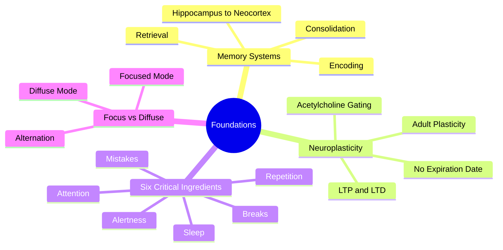

# 1.1 MOC - Foundations of Learning Science

This chapter is the theoretical bedrock of the entire vault. Before you adopt any specific technique (Active Recall, Spaced Repetition, Pomodoro), you need to understand *why* those techniques work at the level of neurons, synapses, and memory systems. Without this foundation, every technique becomes a superstitious ritual rather than a principled intervention.

## Mermaid Mind Map - Chapter 1

## Notes in This Chapter

- [[1.2 The Science of Memory]] — Encoding, consolidation, retrieval, and the hippocampus-to-neocortex transfer that happens during sleep.
- [[1.3 Neuroplasticity Across the Lifespan]] — Why the "mid-twenties drop-off" myth is wrong, and how adult plasticity actually works via top-down neuromodulation.
- [[1.4 The Six Critical Ingredients of Learning]] — Attention, alertness, sleep, repetition, breaks, and mistakes. The unified checklist.
- [[1.5 Focus Mode vs Diffuse Mode]] — Barbara Oakley's two-mode model and how to alternate between them productively.

## Why Foundations Matter

Techniques without theory become cargo cults. If you do Active Recall without understanding *why* retrieval strengthens synaptic connections, you will eventually drift back to passive review when motivation wanes. If you do Spaced Repetition without understanding *why* the spacing effect works, you will skip sessions and lose the benefit. The foundations in this chapter act as a **forcing function**: when you understand the mechanism, you stop negotiating with the technique.

## Key Cross-References

- All techniques in [[2.1 MOC - Learning Techniques]] assume you have read this chapter.
- The break protocols in [[3.1 MOC - Sleep and Recovery]] are grounded in [[1.2 The Science of Memory]] and [[1.4 The Six Critical Ingredients of Learning]].
- The adult learning discussion in [[1.3 Neuroplasticity Across the Lifespan]] directly refutes one of the myths catalogued in [[7.2 Biohacking Myths]].

#moc #foundations #theory
