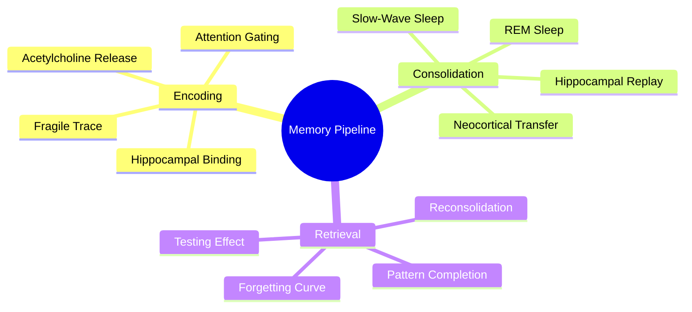

# 1.2 The Science of Memory

Memory is not a recording. It is a **reconstructive process** in which the brain encodes fragile patterns of neural activity, consolidates them through offline replay, and re-activates them during retrieval — slightly differently every time. Understanding this three-stage pipeline (encoding → consolidation → retrieval) is the foundation of every technique in this vault. If you skip this note, every other note becomes magic.

## The Three Stages of Memory

### 1. Encoding

Encoding is the process by which sensory input becomes a temporary neural trace. It happens in the **hippocampus** for episodic memory (events, facts tied to context) and across distributed cortical regions for semantic memory (general knowledge).

Encoding is **gated by attention**. Information that you do not pay attention to is not encoded. This is not a metaphor — it is a literal neurochemical fact. Acetylcholine release in the basal forebrain marks the synapses that should be retained; without acetylcholine, encoding fails. This is why studying while distracted produces zero learning. The brain literally does not mark the synapses for storage.

Key factors that strengthen encoding:

- **Focused attention** (acetylcholine release)
- **Emotional salience** (amygdala modulation)
- **Novelty** (dopamine reinforcement)
- **Active processing** (depth of processing: semantic > phonological > structural)

### 2. Consolidation

Consolidation is the offline process that turns a fragile hippocampal trace into a stable neocortical memory. It happens primarily during **slow-wave sleep (SWS)** and **REM sleep**. During SWS, the hippocampus replays the firing patterns of the day at 10-20x speed, gradually transferring the memory to the neocortex. During REM, emotional and procedural components are integrated.

Consolidation has two windows:

- **Synaptic consolidation** — happens within the first few hours after learning. Disrupting this window (e.g., with alcohol, stress, or another cognitively demanding task) significantly impairs retention.
- **Systems consolidation** — happens over weeks to months. The memory slowly becomes hippocampus-independent.

The practical implication: **sleep is non-negotiable**. Skipping sleep after studying sacrifices the consolidation window. See [[3.2 Sleep and Memory Consolidation]].

### 3. Retrieval

Retrieval is the act of re-activating a stored memory. It is not a passive readout — it is an active reconstruction. Each retrieval event also triggers **reconsolidation**: the memory is briefly destabilized and then re-stored, often stronger than before. This is the mechanism behind the testing effect (see [[2.2 Active Recall]]).

The retrieval process is governed by **pattern completion**: a partial cue (a question, a context) reactivates the full memory pattern. The more cues you have, the easier retrieval is. This is why testing yourself with diverse question types produces more robust memory than repeating the same prompt.

## Memory Systems (Atkinson-Shiffrin Revisited)

The original Atkinson-Shiffrin model (1968) proposed three stores:

1. **Sensory memory** — <1 second, high capacity, modality-specific.
2. **Short-term memory (STM)** — 15-30 seconds, 7±2 items (Miller's law).
3. **Long-term memory (LTM)** — effectively unlimited capacity and duration.

Modern neuroscience refines this:

- Short-term memory is now understood as **working memory**, governed by the prefrontal cortex and limited to roughly 4 chunks (Cowan, 2001).
- Long-term memory subdivides into:
  - **Declarative (explicit):** episodic (events) and semantic (facts). Hippocampus-dependent.
  - **Non-declarative (implicit):** procedural (skills), priming, conditioning. Basal ganglia and cerebellum.

For studying computer science or any technical subject, both declarative and procedural memory are involved. Knowing syntax is declarative. Writing code fluently is procedural. The two require different practice strategies.

## The Forgetting Curve

Hermann Ebbinghaus (1885) discovered that memory decays predictably over time if no review occurs. The decay follows a steep logarithmic curve: roughly 50% of new information is lost within an hour, 70% within a day, and 90% within a week — unless retrieval practice interrupts the decay.

The forgetting curve is the empirical foundation for [[2.3 Spaced Repetition]]. By scheduling review sessions just before the predicted decay threshold, you flatten the curve and convert fragile traces into stable memories.

## Why This Matters for Technique Selection

Every effective learning technique targets one of the three stages:

- **Encoding techniques** (Feynman, SQ3R, mind mapping) improve the depth of processing at input time.
- **Consolidation techniques** (sleep hygiene, breaks, avoiding retrograde interference) protect the offline stabilization window.
- **Retrieval techniques** (active recall, pretesting, practice tests) exploit reconsolidation to strengthen memory.

If you only use encoding techniques (which most students do — highlighting, re-reading, taking notes), you get encoding without consolidation or retrieval. This is why students who "study hard" still fail exams. The full pipeline must be activated.

## Common Misconceptions

- **"Memory is a recording."** No. Memory is reconstructive and editable. Every retrieval modifies the trace.
- **"I learn best by reading."** Reading is encoding only. Without retrieval, the trace decays.
- **"Cramming works."** Cramming produces short-term performance via working memory and stress hormones, not long-term retention. The forgetting curve resumes immediately after the exam.
- **"I have a bad memory."** Almost certainly false. You have a bad *retrieval strategy*, not a bad memory. Active recall fixes this within weeks.

## Cross-References

- The retrieval stage is operationalized in [[2.2 Active Recall]] and [[2.4 Pretesting and Hypercorrection]].
- The consolidation stage is detailed in [[3.2 Sleep and Memory Consolidation]] and [[3.3 Retrograde Interference]].
- Adult plasticity (encoding capacity in adults) is covered in [[1.3 Neuroplasticity Across the Lifespan]].

#memory #theory #hippocampus #consolidation #neuroscience
