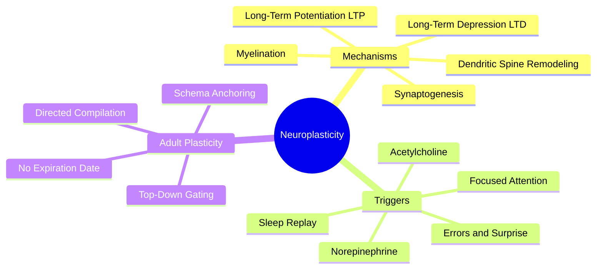

# 1.3 Neuroplasticity Across the Lifespan

Neuroplasticity is the brain's ability to physically rewire itself — forming new synapses, strengthening existing ones, and pruning unused ones — in response to experience. The myth that "your brain's ability to learn collapses in your mid-twenties" is one of the most damaging misconceptions in modern pop-neuroscience. It is false, it is discouraging, and it causes adult learners to underinvest in their own learning. This note explains what actually happens.

## What Neuroplasticity Actually Is

### The Cellular Mechanisms

Neuroplasticity operates at several levels:

1. **Long-Term Potentiation (LTP)** — A sustained increase in synaptic strength following high-frequency stimulation. Coined by Bliss & Lømo (1973). LTP is the cellular correlate of learning: neurons that fire together, wire together (Hebb, 1949).
2. **Long-Term Depression (LTD)** — A sustained decrease in synaptic strength. LTD is the mechanism of forgetting and competitive pruning. Without LTD, your brain would saturate with irrelevant connections.
3. **Synaptogenesis** — Formation of entirely new synapses. Most active in critical periods of development but continues throughout life in the hippocampus and cortex.
4. **Dendritic spine remodeling** — Dendritic spines are tiny protrusions on dendrites that host synapses. Spines form, grow, shrink, and disappear on the timescale of hours to days. Their physical structure *is* the physical memory.
5. **Myelination** — Oligodendrocytes wrap axons in myelin, increasing signal speed up to 50x. Myelination continues into your 30s and is experience-dependent. Practiced skills get more myelin.

### The Molecular Triggers

Adult plasticity is **gated** by three neuromodulators released during focused, effortful learning:

- **Acetylcholine** (from the basal forebrain) — Marks the synapses that should be retained. Without acetylcholine, learning does not consolidate.
- **Norepinephrine** (from the locus coeruleus) — Provides the arousal and alertness that drive plasticity. Released in response to novelty, surprise, and errors.
- **Dopamine** (from the ventral tegmental area) — Signals reward prediction error. Reinforces the behaviors that led to success.

Without all three, plasticity does not happen. This is why passive review (low arousal, no errors, no acetylcholine) does not produce learning.

## Childhood vs Adult Plasticity — The Real Difference

Children's brains are characterized by:

- **Massive synaptic overproduction** — Children have roughly twice as many synapses as adults. The excess is gradually pruned.
- **Passive plasticity** — Children absorb information without needing to focus intensely. The brain is in a default "sponge" state.
- **Critical periods** — Windows of heightened plasticity for specific functions (vision, language phonology, absolute pitch). These close in childhood.
- **Low myelination** — Less efficient signal transmission, but more flexibility.

Adult brains operate differently:

- **Stable synapse count** — Adults have pruned down to a stable architecture. New learning requires modifying existing circuits, not building from scratch.
- **Directed plasticity** — Adults must *actively gate* plasticity via focused attention and neuromodulator release. Passive absorption does not work.
- **Schema-rich** — Adults have vast networks of existing knowledge. New information is anchored to these schemas, making conceptual learning faster than in children.
- **High myelination** — Faster signal transmission, more efficient execution of practiced skills.

The crucial point: **adult plasticity is not weaker. It is *directed*.** Adults must choose to learn; children absorb by default. Once adults engage the right mechanisms (attention + acetylcholine + sleep), they often *outperform* children in conceptual learning because they have schemas to anchor new information.

## The Prefrontal Cortex Matures Until 25

One of the most underpublicized facts in neuroscience is that the **prefrontal cortex — the brain region responsible for executive control, complex logic, and system design — does not reach full structural and myelinated maturity until approximately age 25.** This means:

- The "mid-twenties drop-off" myth is not just wrong — it is backwards. Your prefrontal cortex is *most capable* starting at 25, not declining.
- Complex abstract reasoning, system architecture, and long-term planning are adult strengths, not childhood strengths.
- The 30s and 40s are often the peak decades for intellectual production in fields that require integration (philosophy, theoretical physics, software architecture).

## Adult Neurogenesis Continues

Adult neurogenesis (the birth of new neurons) was once thought to be impossible. It is now well-established in two regions:

1. **Hippocampal dentate gyrus** — New neurons are continually added throughout life, supporting pattern separation (distinguishing similar memories). Adult neurogenesis is stimulated by aerobic exercise and impaired by chronic stress.
2. **Olfactory bulb** — Less relevant to learning science.

Adult neurogenesis declines with age but does not stop. Exercise is the single most reliable intervention to maintain it.

## Implications for Adult Learners

If you are an adult learning a new field (programming, a language, mathematics, a musical instrument), the strategy is clear:

1. **Direct your attention deliberately.** You cannot absorb passively. Use the techniques in [[2.1 MOC - Learning Techniques]] to force active engagement.
2. **Embrace errors.** Errors trigger norepinephrine release, which gates plasticity. Get things wrong on purpose — see [[2.4 Pretesting and Hypercorrection]].
3. **Anchor to existing schemas.** When learning a new concept, ask "what does this resemble that I already know?" Analogy is the adult learner's superpower.
4. **Sleep after every learning session.** Without sleep, the plasticity triggered by your effort does not consolidate. See [[3.2 Sleep and Memory Consolidation]].
5. **Exercise regularly.** Aerobic exercise maintains adult neurogenesis and increases BDNF, which supports synaptic plasticity.

## Why the Myth Persists

The "mid-twenties drop-off" myth persists because:

- It is partially true that *passive* learning becomes harder with age. Adults who try to learn like children (passive absorption) fail and blame their age.
- It excuses adult laziness. "I'm too old to learn X" is more comfortable than "I am not using the right techniques."
- It serves the biohacking industry, which sells interventions to "restore youthful plasticity." See [[7.2 Biohacking Myths]].

## Cross-References

- This note refutes the myth catalogued in [[7.2 Biohacking Myths]].
- The "attention" and "alertness" ingredients in [[1.4 The Six Critical Ingredients of Learning]] are the *triggers* for adult plasticity described here.
- The cellular mechanism of LTP is what [[2.2 Active Recall]] activates through retrieval-induced reconsolidation.

#neuroplasticity #ltp #adult-learning #theory #neuroscience
