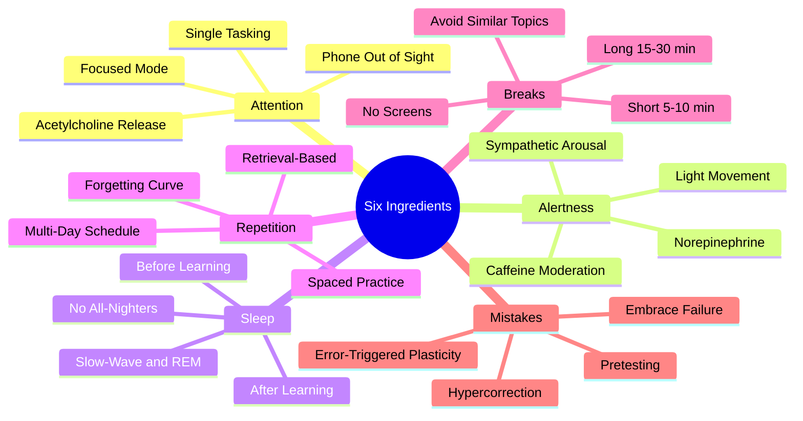
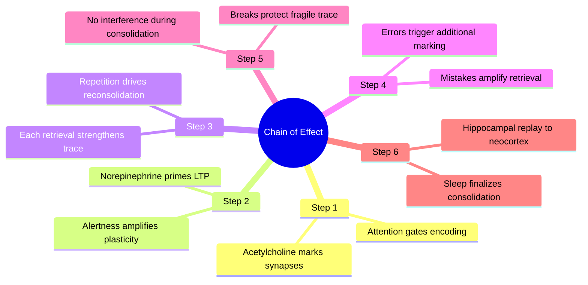

# 1.4 The Six Critical Ingredients of Learning

Effective learning requires six neurobiological ingredients to be present simultaneously. If any one is missing, the others cannot compensate. This note is the unified checklist that ties together every technique in the vault. It is adapted and rigorously filtered from Anna Kalynchuk's framework — the original framing contained valid neuroscience; this version removes the biohacking embellishments and grounds each ingredient in the cognitive psychology literature.

## The Six Ingredients

## Ingredient 1: Attention

**What it is:** The selective gating of sensory input into the hippocampus for encoding.

**Why it matters:** Information you do not attend to is not encoded. Acetylcholine release in the basal forebrain marks synapses for retention. Without attention, there is no acetylcholine, and there is no learning.

**How to engineer it:**
- Remove the phone from the room (not just face-down — out of the room).
- Single-task. No music with lyrics. No podcast in the background.
- Use the Pomodoro Technique ([[2.6 The Pomodoro Technique]]) to externalize focus discipline.
- See [[4.2 The Cost of Overstimulation]] for the cost of divided attention.

**Common failure:** Studying with the phone on the desk "for music." Each notification, even ignored, costs ~23 minutes of focus recovery.

## Ingredient 2: Alertness

**What it is:** A moderate level of sympathetic nervous system arousal that optimizes cognitive performance.

**Why it matters:** Alertness triggers norepinephrine release from the locus coeruleus, which gates neuroplasticity. A sleepy brain cannot encode information efficiently.

**How to engineer it:**
- Get morning light exposure (10-15 minutes outside within an hour of waking).
- Engage in light cardiovascular exercise before study (10 minutes of brisk walking).
- Use caffeine strategically (100-200mg, 90 minutes after waking to avoid afternoon crash).
- Avoid heavy meals immediately before studying (post-prandial somnolence).

**Common failure:** Studying immediately after a large meal, in a dim room, after poor sleep. The brain is in a low-arousal state and plasticity does not occur.

**Note on biohacking:** Cold showers and Wim Hof breathing do produce acute arousal via adrenaline release, but they are unnecessary and the arousal is short-lived. See [[7.2 Biohacking Myths]]. Light exercise works better and lasts longer.

## Ingredient 3: Sleep

**What it is:** The offline consolidation period during which hippocampal traces are transferred to the neocortex.

**Why it matters:** Without 7-9 hours of quality sleep, the day's learning does not consolidate. Sleep also prepares the hippocampus to encode the *next* day's information.

**How to engineer it:**
- Sleep 7-9 hours, consistently, including weekends.
- Sleep *before* learning (to prepare the hippocampus) and *after* learning (to consolidate).
- No screens 60 minutes before bed (blue light suppresses melatonin).
- No caffeine within 8 hours of bedtime.
- See [[3.2 Sleep and Memory Consolidation]] for the full protocol.

**Common failure:** Studying until 2 AM, sleeping 5 hours, and "making up" the deficit on weekends. Sleep debt does not work that way; consolidation loss is permanent.

## Ingredient 4: Repetition

**What it is:** Re-exposure to material across distributed intervals, ideally through retrieval rather than re-reading.

**Why it matters:** Each retrieval event triggers reconsolidation, which strengthens the synaptic trace. Cramming produces shallow encoding; spaced repetition produces deep, durable encoding.

**How to engineer it:**
- Use Anki or REMNote for fact-based material ([[8.2 Spaced Repetition Software]]).
- Schedule study sessions across multiple days rather than one marathon session.
- Re-derive algorithms from memory rather than re-reading code ([[5.6 Retrieval Practice for Algorithmic Thinking]]).
- See [[2.3 Spaced Repetition]] for the algorithmic details.

**Common failure:** Reviewing by re-reading notes. Re-reading produces *recognition fluency* (the feeling of familiarity), not *retrieval ability*. Recognition is not memory.

## Ingredient 5: Breaks

**What it is:** Low-stimulation rest periods interspersed with focused study.

**Why it matters:** Breaks serve two functions: (1) they allow attention networks to recover from vigilance decrement, and (2) they provide a clean consolidation window during which the brain replays recently encoded information without interference.

**How to engineer it:**
- Take a 5-10 minute break every 25-50 minutes of focused work.
- During breaks: no screens, no social media, no podcasts. Walk, stretch, stare out a window.
- After studying, take a 10-20 minute walk *before* doing anything else cognitively demanding.
- Avoid studying similar topics back-to-back (retrograde interference — see [[3.3 Retrograde Interference]]).

**Common failure:** "Breaks" spent scrolling social media. The high-novelty, high-dopamine input disrupts consolidation and produces zero attention recovery. A real break is *boring*.

## Ingredient 6: Mistakes

**What it is:** Errors made during retrieval attempts, especially before the correct answer is known.

**Why it matters:** Errors trigger a surprise signal in the brain, releasing norepinephrine and dopamine. This neuromodulator cocktail marks the synapses involved in the failed retrieval, priming them to encode the correct information when it is presented. This is the **hypercorrection effect**: high-confidence errors produce the strongest subsequent learning.

**How to engineer it:**
- Pretest before studying new material ([[2.4 Pretesting and Hypercorrection]]).
- Take practice tests early and often — celebrate wrong answers as learning signals.
- When debugging code, attempt a fix before searching Stack Overflow.
- See [[5.4 Parsons Problems]] for a structured way to introduce productive errors.

**Common failure:** Avoiding practice tests until "you are ready." The waiting strategy ensures you never experience the errors that would accelerate your learning.

## How the Six Ingredients Interact

The six ingredients are not independent. They form a chain:

If any step is broken, the chain fails. A perfectly attentive, alert, repetitive study session with no sleep produces zero long-term retention. A perfectly slept, well-rested learner who never makes errors and never takes breaks learns slowly. The full stack is required.

## The Audit Question

After every study session, ask yourself:

> Did I have all six ingredients today?

If the answer is no, identify which ingredient was missing and fix it for the next session. Most students fail at one specific ingredient chronically (often sleep or breaks). Identify yours.

## Cross-References

- Each ingredient is operationalized in later chapters:
  - Attention → [[4.1 MOC - Focus and Environment]]
  - Alertness → [[4.4 Flexible Focus vs Rigid Blocks]]
  - Sleep → [[3.2 Sleep and Memory Consolidation]]
  - Repetition → [[2.3 Spaced Repetition]]
  - Breaks → [[3.4 Strategic Breaks]]
  - Mistakes → [[2.4 Pretesting and Hypercorrection]]
- The daily schedule in [[6.1 MOC - The Linear Method]] is built around activating all six ingredients in the correct order.

#learning #ingredients #attention #alertness #sleep #repetition #breaks #mistakes #theory
