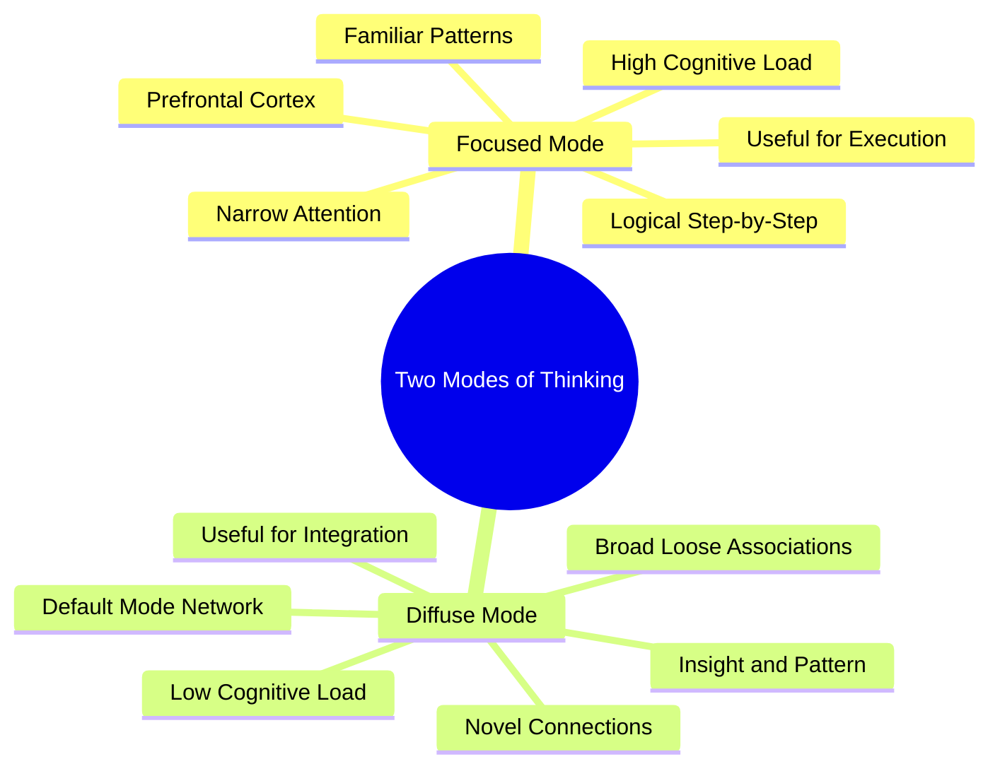

# 1.5 Focus Mode vs Diffuse Mode

Barbara Oakley popularized the distinction between **focused mode** and **diffuse mode** thinking in her book *A Mind for Numbers* and her Coursera course *Learning How to Learn*. The model is a useful heuristic — not a strict neurobiological dichotomy — for understanding why both intense concentration and relaxed mind-wandering are required for learning. This note explains both modes, how to alternate between them, and the limits of the model.

## The Two Modes

### Focused Mode

The focused mode is what most people think of as "studying." It is characterized by:

- Narrow, directed attention on a specific task.
- Activation of the prefrontal cortex and the central executive network.
- Step-by-step logical processing.
- Use of existing neural patterns (schemas) to solve familiar problems.
- High cognitive load; fatiguing if sustained too long.

**Best for:** Practicing known techniques, executing algorithms, memorizing facts, debugging specific errors.

**Limitations:** Cannot easily form novel connections. If you are stuck on a problem, more focused-mode effort often makes things worse — you keep applying the same failing pattern.

### Diffuse Mode

The diffuse mode is the brain's resting-state network — technically the **Default Mode Network (DMN)**. It is characterized by:

- Broad, undirected attention.
- Activation of the DMN (medial prefrontal cortex, posterior cingulate, angular gyrus).
- Loose, associative thinking.
- Novel connections between distant concepts.
- Low cognitive load; restorative.

**Best for:** Insight, creative problem-solving, integrating new material with existing schemas, recovering from cognitive fatigue.

**Limitations:** Cannot execute detailed logical procedures. The diffuse mode will not write your code; it will only help you see the architecture.

## The Alternation Principle

Oakley's key insight is that **effective learning requires alternating between the two modes**, not just maximizing focused time. The pattern is:

1. **Focus** on a problem intensely until you hit a wall.
2. **Switch to diffuse mode** (walk, shower, sleep, do dishes).
3. The brain continues processing the problem in the background.
4. **Return to focus** with a fresh perspective.

Salvador Dali and Thomas Edison famously used this technique. Dali would hold a key over a plate while napping; as he drifted off, his grip loosened, the key clattered, and he woke — capturing the diffuse-mode insight before it slipped away. Edison used ball bearings the same way.

Modern equivalents:

- Take a 15-minute walk after a stuck debugging session.
- Sleep on a hard problem and review it first thing in the morning.
- Do household chores during a coding break.

## The Neurobiology (What's Real, What's Metaphor)

The two-mode model is a heuristic. The brain does not cleanly switch between two states; rather, the **central executive network** and the **default mode network** are anticorrelated — when one is highly active, the other is suppressed, but both are always partially engaged.

What the model gets right:

- Focused attention and diffuse mind-wandering are genuinely distinct cognitive modes.
- The DMN is critical for memory consolidation, future thinking, and creative insight.
- Anticorrelation between executive and DMN activity is well-documented.

What the model oversimplifies:

- The brain has more than two networks (salience network, dorsal attention network, etc.).
- The transition between modes is graded, not binary.
- The DMN is active during specific tasks (autobiographical memory, theory of mind), not just "rest."

## Practical Implementation

To use the alternation principle in your daily study:

1. **Schedule diffuse periods deliberately.** Don't fill every break with phone scrolling. A 15-minute walk without earbuds is diffuse mode. Scrolling TikTok is *not* diffuse mode — it's high-novelty distraction that disrupts consolidation.
2. **Use sleep as a macro diffuse period.** A 90-minute nap or a full night's sleep allows extensive DMN-driven integration. If you are stuck on a hard problem, sleep on it.
3. **Use the Pomodoro rhythm.** 25 minutes focused + 5 minutes diffuse walk. This is the optimal rhythm for most learners. See [[2.6 The Pomodoro Technique]].
4. **Capture diffuse insights.** Keep a notepad nearby during walks and showers. Diffuse-mode insights are fragile — they evaporate within minutes if not recorded.
5. **Don't force focus on a stuck problem.** If you have been stuck on a single bug for 30 minutes, switch tasks or take a walk. Continued focused effort on a stuck problem produces diminishing returns and learned helplessness.

## Common Mistakes

- **Treating diffuse mode as wasted time.** Many learners feel guilty for not "studying" during breaks. The guilt is misplaced. Diffuse periods are when consolidation happens.
- **Confusing distraction with diffuse mode.** Social media is *not* diffuse mode. The high-novelty, high-dopamine input disrupts the very consolidation that diffuse mode is supposed to enable.
- **Trying to maintain focused mode indefinitely.** Vigilance decrement sets in after 20-40 minutes for most tasks. Forcing focus beyond this point produces errors, not learning.
- **Skipping diffuse periods entirely.** A "grind" of 8 hours of focused work with no breaks produces less learning than 4 hours of properly alternated focus and diffuse periods.

## Cross-References

- The focused-mode ingredient (attention) is one of the six ingredients in [[1.4 The Six Critical Ingredients of Learning]].
- The diffuse-mode ingredient (breaks) is operationalized in [[3.4 Strategic Breaks]] and [[3.5 Embracing Boredom and Scatter Focus]].
- The Pomodoro Technique ([[2.6 The Pomodoro Technique]]) is the structured scheduling of focus/diffuse alternation.
- The "scatter focus" concept from Chris Bailey is closely related — see [[3.5 Embracing Boredom and Scatter Focus]].

#focus #diffuse #oakley #attention #theory
