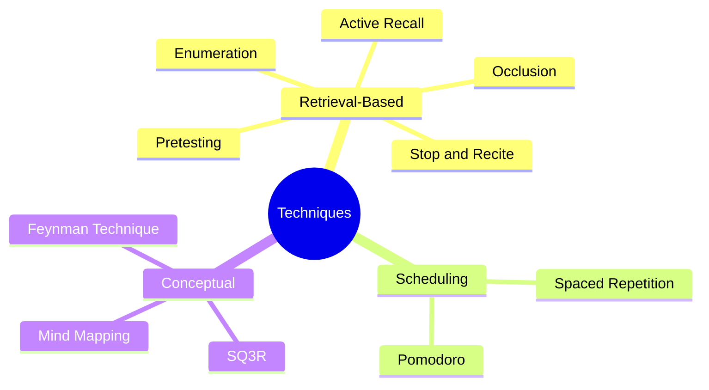

# 2.1 MOC - Evidence-Based Learning Techniques

This chapter is the toolkit. Every technique here is either (a) backed by decades of peer-reviewed cognitive psychology research, or (b) a robust heuristic that has held up under classroom testing. The chapter is organized from highest-evidence techniques (Active Recall, Spaced Repetition) down to useful heuristics (Pomodoro, Mind Mapping).

## Mermaid Mind Map - Chapter 2

## Notes in This Chapter

### Retrieval-Based Techniques (The Gold Standard)

- [[2.2 Active Recall]] — The testing effect. Forcing information out of memory strengthens it.
- [[2.4 Pretesting and Hypercorrection]] — Attempting problems *before* learning the material.
- [[2.9 Stop and Recite]] — The micro-retrieval habit you should use during every reading session.

### Scheduling Techniques

- [[2.3 Spaced Repetition]] — Distributing review sessions across expanding intervals.
- [[2.6 The Pomodoro Technique]] — 25-minute focus blocks. A heuristic, not a biological law.

### Conceptual Techniques

- [[2.5 The Feynman Technique]] — Explain it simply to expose your knowledge gaps.
- [[2.7 Mind Mapping (Properly Understood)]] — A spatial organization tool, NOT a brain-aligned superpower.
- [[2.8 SQ3R Method]] — Survey, Question, Read, Recite, Review. A structured reading protocol.

## How to Read This Chapter

If you only have time for two techniques, choose **Active Recall** and **Spaced Repetition**. They are the two most evidence-backed techniques in the entire learning science literature, and together they account for roughly 80% of the measurable benefit.

If you have time for five, add **Pretesting**, the **Feynman Technique**, and the **Pomodoro Technique**.

If you have time for all of them, work through the chapter in order. Each note explains:
1. What the technique is.
2. The cognitive mechanism that makes it work.
3. The empirical evidence (with citations where possible).
4. How to implement it in practice.
5. Common pitfalls and misconceptions.

## Cross-References

- The memory mechanisms that justify these techniques are explained in [[1.2 The Science of Memory]].
- The scheduling of these techniques inside a daily routine is shown in [[6.3 Active Learning Sessions]].
- Tools that automate several of these techniques (Anki, REMNote) are reviewed in [[8.2 Spaced Repetition Software]].

#moc #technique #learning
