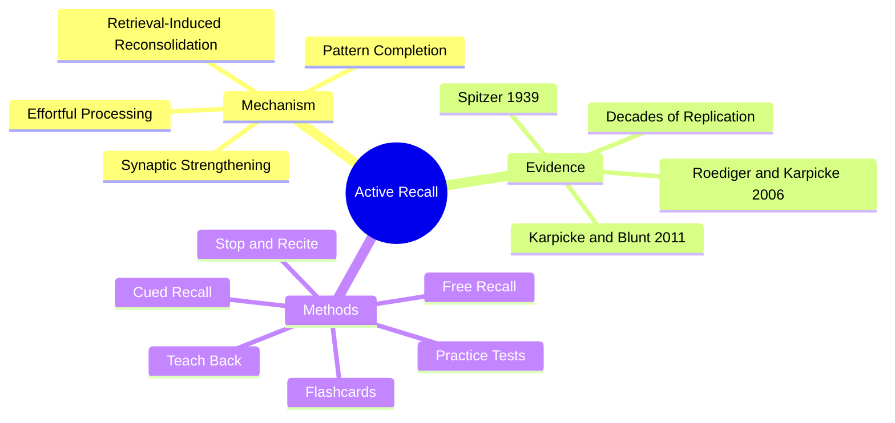

# 2.2 Active Recall

Active Recall — also called the **testing effect** or **retrieval practice** — is the single most evidence-backed learning technique in cognitive psychology. It is the gold standard against which every other technique is measured. The principle is simple: forcing your brain to retrieve information from memory strengthens that memory far more than passively re-exposing yourself to the information. This note explains the mechanism, the evidence, the implementation, and the common pitfalls.

## The Core Principle

The naive model of learning is: *information goes in → information is stored → information is retrieved on demand.* Under this model, studying is a process of putting information in (via reading, watching, listening).

The actual model is: *information goes in → fragile trace → retrieval attempts strengthen the trace → repeated retrieval consolidates into durable memory.* Studying by re-exposure does little. Studying by retrieval does a lot.

This is counterintuitive. Most students believe that retrieval is the *output* of learning, not the *process* of learning. The opposite is true: retrieval is the process.

## The Mechanism

When you attempt to retrieve information, three things happen:

1. **Pattern completion.** A partial cue (the question) triggers reactivation of the full memory trace in the hippocampus. The more effortful this reactivation, the more it strengthens the trace.
2. **Retrieval-induced reconsolidation.** Successful retrieval destabilizes the memory briefly, then re-stores it — usually stronger than before. This is the same mechanism as consolidation, but triggered by retrieval rather than sleep.
3. **Effortful processing.** The cognitive effort of retrieval engages the prefrontal cortex and releases acetylcholine and norepinephrine, which mark the relevant synapses for retention.

Passive review (re-reading, re-watching) does none of these. It produces only *recognition fluency* — the feeling that the material is familiar — without producing *retrieval ability*. Recognition is not memory.

## The Empirical Evidence

Active recall is one of the most replicated findings in cognitive psychology. Key studies:

### Roediger & Karpicke (2006)

The landmark study. Students read a passage under four conditions:
- Study once.
- Study once, then test.
- Study repeatedly.
- Study repeatedly, then test.

One week later, the test condition dramatically outperformed the rest — even though students in the repeated-study condition *felt* they had learned more (a metacognitive illusion).

| Condition | Performance on test 1 week later |
|-----------|----------------------------------|
| Study once | ~40% |
| Study once + test | ~55% |
| Repeated study | ~40% |
| Repeated study + test | ~60% |

The testing effect was large, robust, and underestimated by the students themselves.

### Karpicke & Blunt (2011)

Compared retrieval practice to concept mapping (a form of elaborative study). Retrieval practice produced better retention than concept mapping, even though concept mapping is widely considered an "active" learning technique.

### Spitzer (1939)

One of the earliest demonstrations, with Iowa schoolchildren. Spaced testing produced dramatically better retention than single exposure.

### Decades of Replication

The testing effect has been replicated across age groups (children to elderly), materials (word lists, prose, diagrams, foreign language vocabulary), retention intervals (minutes to months), and testing formats (multiple choice, free recall, cued recall).

## Implementation: How to Practice Active Recall

### Method 1: Free Recall

After reading a chapter or watching a lecture, close the book and write down everything you can remember. Don't peek. Don't structure it. Just dump.

- Time: 5-10 minutes after each study block.
- Effort: High.
- Output: A messy document showing what you actually know — and revealing the gaps.

### Method 2: Cued Recall (Flashcards)

Use a spaced repetition system (Anki, REMNote) with question/answer pairs. The retrieval is cued by the question.

- Time: 15-30 minutes daily.
- Effort: Medium.
- Output: Long-term retention of discrete facts.

See [[2.3 Spaced Repetition]] for the scheduling algorithm.

### Method 3: Practice Tests

Take full practice exams under test conditions. This combines retrieval with time pressure and integrates multiple concepts.

- Time: 1-3 hours, weekly.
- Effort: High.
- Output: Identification of conceptual gaps and weak retrieval pathways.

### Method 4: Teach Back (Feynman Technique)

Explain the concept aloud, in simple terms, as if teaching a beginner. See [[2.5 The Feynman Technique]].

- Time: 10-20 minutes after each major topic.
- Effort: High (forces conceptual synthesis).
- Output: Identification of conceptual confusion (not just fact gaps).

### Method 5: Stop and Recite

Pause every 10 minutes during reading and recite the key points from memory. See [[2.9 Stop and Recite]].

- Time: 30 seconds, every 10 minutes.
- Effort: Low.
- Output: Immediate identification of comprehension gaps.

### Method 6: Enumeration

Recall ordered lists (e.g., the steps of TCP handshake, the planets, the OSI layers) in order.

- Time: Variable.
- Effort: Medium.
- Output: Sequence memory, which is harder than item memory.

### Method 7: Occlusion

Cover parts of a diagram, image, or text and recall what is hidden. Excellent for anatomy, geography, and code structure.

## Common Pitfalls

### Pitfall 1: Confusing Recognition with Recall

Re-reading notes produces recognition fluency: "Yes, I recognize this." Recognition is much easier than recall and produces a false sense of mastery. The test is simple: **close the book and try to explain it.** If you cannot, you have recognition, not recall.

### Pitfall 2: Reviewing Too Soon

If you test yourself immediately after reading, the information is still in working memory and the test feels easy — but it produces little long-term benefit. Allow time for the trace to decay slightly before retrieval. This is the basis of spaced repetition; see [[2.3 Spaced Repetition]].

### Pitfall 3: Avoiding Tests Because You "Aren't Ready"

The most common student mistake. Students wait to "feel prepared" before taking practice tests. By then, they have lost the hypercorrection benefit. Pretest *before* you feel ready — see [[2.4 Pretesting and Hypercorrection]].

### Pitfall 4: Using Passive Flashcards

A flashcard that says "Define photosynthesis" on the front and the definition on the back is barely better than re-reading. To make flashcards active:
- Force yourself to *produce* the answer before flipping.
- Use application questions, not definition questions.
- Use image occlusion for visual material.

### Pitfall 5: Studying Without Errors

If your retrieval practice never produces errors, you are not pushing the edge of your knowledge. Errors trigger the hypercorrection effect and additional plasticity. Aim for ~15-20% error rate during practice.

## Daily Application

A simple active recall protocol for any study session:

1. **Pretest** (5 minutes) — attempt practice problems on today's material, get them wrong, embrace the errors.
2. **Study** (30-45 minutes) — read or watch the material actively, using Stop and Recite.
3. **Free recall** (10 minutes) — close everything, dump what you remember.
4. **Review gaps** (10 minutes) — check your free recall against the material, identify gaps.
5. **Teach back** (5 minutes) — explain the concept aloud.
6. **Create flashcards** (10 minutes) — for any discrete facts that need long-term retention.

This protocol is integrated into the daily schedule in [[6.3 Active Learning Sessions]].

## Cross-References

- The mechanism is grounded in [[1.2 The Science of Memory]] (reconsolidation) and [[1.3 Neuroplasticity Across the Lifespan]] (LTP).
- The scheduling protocol is in [[2.3 Spaced Repetition]].
- The pretest variant is in [[2.4 Pretesting and Hypercorrection]].
- The CS-specific application is in [[5.6 Retrieval Practice for Algorithmic Thinking]].
- The tooling is in [[8.2 Spaced Repetition Software]] (Anki, REMNote).

#active-recall #retrieval #testing-effect #technique #science
