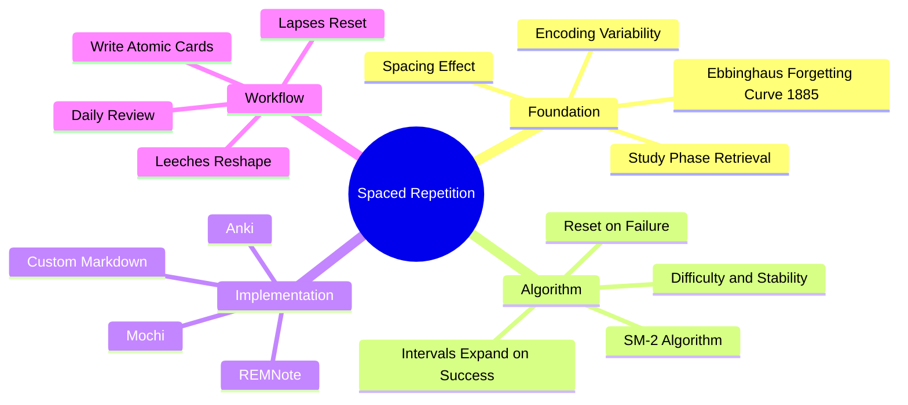

# 2.3 Spaced Repetition

Spaced Repetition is the systematic scheduling of review sessions at expanding intervals, designed so that each review occurs just before the memory trace is about to decay. Combined with [[2.2 Active Recall]], it is the most powerful technique in the learning science literature. This note explains the spacing effect, the algorithmic implementation, and the practical workflow.

## The Core Principle

The spacing effect, first documented by Hermann Ebbinghaus in 1885, is the empirical observation that **distributed practice produces stronger memory than massed practice**, even when the total study time is identical. Ten 1-minute sessions spread across ten days produce dramatically better retention than one 10-minute session.

The mechanism is twofold:

1. **Study-phase retrieval.** Each review session requires you to retrieve the information from long-term memory. The more time has passed since the last review, the more effortful the retrieval — and effortful retrieval produces stronger reconsolidation.
2. **Encoding variability.** Spaced reviews occur in slightly different contexts (different times of day, different moods, different surrounding thoughts). This contextual variability creates a richer, more robust memory trace that can be retrieved from more cue patterns.

## The Forgetting Curve

Ebbinghaus memorized lists of nonsense syllables and tested himself at varying intervals. He discovered that memory decays predictably:

| Time since learning | % retained (no review) |
|---------------------|------------------------|
| 20 minutes | ~58% |
| 1 hour | ~44% |
| 9 hours | ~36% |
| 1 day | ~33% |
| 2 days | ~28% |
| 6 days | ~25% |
| 31 days | ~21% |

The decay is logarithmic — steep at first, then flattening. The key insight: if you review *just before* the trace decays below a threshold, you reset the decay curve — but with a *shallower* slope. After several spaced reviews, the curve becomes nearly flat.

## The Algorithm: SM-2

The most widely used spaced repetition algorithm is **SM-2**, developed by Piotr Woźniak in 1987 and used by Anki. The algorithm:

1. Each card has an **ease factor** (initially 2.5) and an **interval** (initially 1 day).
2. After each review, you grade your recall:
   - **Again** (failed recall) — interval resets to 1 day; ease decreases by 0.20.
   - **Hard** — interval multiplied by 1.2; ease decreases by 0.15.
   - **Good** — interval multiplied by current ease (e.g., 2.5); ease unchanged.
   - **Easy** — interval multiplied by ease × 1.3; ease increases by 0.15.
3. Ease is clamped between 1.3 and 3.0.

The result: well-remembered cards drift to longer and longer intervals (1d → 3d → 8d → 21d → 60d → 180d → 1y), while poorly remembered cards stay short.

Modern variants (SM-17, FSRS) use more sophisticated machine learning on your historical review data, but SM-2 is good enough for almost all learners.

## Implementation: Anki

Anki is the dominant spaced repetition software. The workflow:

### Step 1: Create Atomic Cards

Each card should test exactly one fact. Bad card: "List the steps of TCP handshake." Good cards:
- "What is the first step of the TCP handshake?" → SYN
- "What is the second step of the TCP handshake?" → SYN-ACK
- "What is the third step of the TCP handshake?" → ACK

Atomic cards are easier to recall, easier to schedule, and easier to diagnose when they fail.

### Step 2: Write Clear, Minimal Prompts

- Front: "What is the time complexity of binary search?"
- Back: "O(log n)"

Do not write paragraphs. Do not include multiple facts on one card. The card should be answerable in under 10 seconds.

### Step 3: Review Daily

Anki shows you cards that are due. Review them every day, ideally at the same time. Missed days accumulate and create overwhelming backlog.

### Step 4: Handle Lapses

When you fail a card ("Again"), Anki resets it to 1 day. Do not be discouraged — lapses are part of the process. The card will re-stabilize within a few reviews.

### Step 5: Identify and Reshape Leeches

A **leeche** is a card that you fail repeatedly (typically defined as 6+ lapses). Leeches indicate that the card is poorly designed or the concept is not understood. When a card becomes a leeche:
- Rewrite it.
- Break it into smaller cards.
- Re-study the underlying concept.

## Implementation: REMNote

REMNote combines note-taking with spaced repetition. Each bullet in your notes can become a flashcard with a single keystroke. The advantage: cards stay connected to their context. The disadvantage: less mature than Anki, fewer plugins.

## Common Pitfalls

### Pitfall 1: Cramming New Cards

New cards have a high initial review load. If you add 100 new cards in a day, you will face 100 reviews tomorrow, plus the existing backlog. Add new cards gradually (10-30 per day).

### Pitfall 2: Passive Card Design

Cards that ask "What is X?" where X is a definition are barely active. Use application questions: "Given Y, what is the result?" See [[2.2 Active Recall]] for card design principles.

### Pitfall 3: Reviewing by Recognition

If you flip the card before trying to recall, you are practicing recognition, not recall. Force yourself to produce the answer before flipping.

### Pitfall 4: Inconsistent Reviews

Spaced repetition requires daily engagement. Missing 3 days creates a backlog that takes a week to clear. Build it into your daily routine (see [[6.6 Review and Reinforcement System]]).

### Pitfall 5: Adding Cards Without Understanding

Flashcards test discrete facts. They do not test conceptual understanding. If you add cards for material you do not understand, the cards will become leeches. Understand first, then make cards.

### Pitfall 6: Over-Reliance on SRS

Spaced repetition is excellent for vocabulary, definitions, formulas, and procedural steps. It is poor for complex conceptual understanding, system architecture, and problem-solving. Combine it with [[2.5 The Feynman Technique]] and (for CS) [[5.6 Retrieval Practice for Algorithmic Thinking]].

## Evidence

The spacing effect is one of the most robust findings in cognitive psychology. Meta-analyses:

- Cepeda et al. (2006) — Spacing effect replicates across 251 studies, age groups, materials, and retention intervals.
- Dunlosky et al. (2013) — Spaced practice ranked as one of the two "high-utility" techniques (along with practice testing) in their comprehensive review of learning techniques.

## Cross-References

- The mechanism is grounded in [[1.2 The Science of Memory]] (forgetting curve, reconsolidation).
- The retrieval component is [[2.2 Active Recall]].
- The pretesting variant is in [[2.4 Pretesting and Hypercorrection]].
- The CS-specific application is in [[5.6 Retrieval Practice for Algorithmic Thinking]].
- The tooling is detailed in [[8.2 Spaced Repetition Software]].
- Daily integration is in [[6.6 Review and Reinforcement System]].

#spaced-repetition #srs #anki #technique #science
