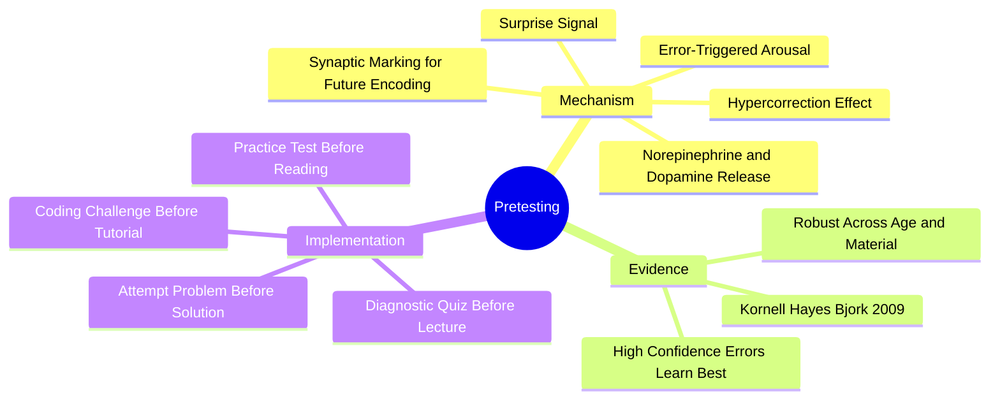

# 2.4 Pretesting and the Hypercorrection Effect

Pretesting is the practice of attempting to answer questions on material *before* you have studied it. Intuitively, this seems wasteful — how can you benefit from getting things wrong? Yet the empirical evidence shows that pretesting produces stronger subsequent learning than the same time spent studying the material directly. The mechanism is the **hypercorrection effect**: high-confidence errors produce the strongest learning. This note explains both.

## The Core Principle

The naive model: *study first, then test.* The reality: *test first, then study.* Pretesting primes the brain to encode the correct answer when it is finally presented, because the brain has been signaled that this information matters and that its current model is wrong.

## The Mechanism

When you attempt a question and get it wrong, three things happen:

1. **Surprise signal.** If you were confident in your wrong answer, the discovery of the error triggers a strong prediction error signal in the brain. The brain expected reward (correct answer); it received negative feedback. This releases norepinephrine and dopamine.
2. **Synaptic marking.** The neuromodulator cocktail marks the synapses involved in the failed retrieval. These synapses are now primed to encode the correct information when it is presented.
3. **Attentional capture.** When you later encounter the correct answer, your attention is captured by it (because the brain has flagged this as "important, your model was wrong"). Encoding is stronger.

The **hypercorrection effect** is the surprising finding that high-confidence errors produce *better* subsequent learning than low-confidence errors. Intuitively, you would expect low-confidence errors (where you knew you were guessing) to be more easily corrected. The opposite is true: when you are confidently wrong, the surprise is maximal, and the correction is encoded deeply.

## The Empirical Evidence

### Kornell, Hayes & Bjork (2009)

The landmark study. Students were given lists of word pairs to memorize. In one condition, they studied the pairs directly. In the other, they were *pretested* — asked to guess the second word before seeing it. Even though their guesses were almost always wrong, the pretest group outperformed the study-only group on the final test.

### Subsequent Replications

The hypercorrection effect has been replicated across:
- Age groups (children to elderly).
- Materials (word pairs, general knowledge questions, classroom content).
- Retention intervals (immediate to one week).
- Confidence levels (the effect is strongest for high-confidence errors).

### Practical Studies

In classroom settings, students who took a pretest before reading a chapter outperformed students who spent the same time reading the chapter without a pretest — even when the pretest students got most questions wrong.

## Implementation

### Method 1: Practice Test Before Reading

Before reading a new chapter or watching a new lecture:
1. Find or create 5-10 practice questions on the material.
2. Attempt them all, even if you have no idea.
3. Note your confidence level for each answer.
4. *Then* read the material.
5. After reading, re-attempt the questions.

The pretest primes you to notice the relevant information while reading.

### Method 2: Diagnostic Quiz Before Lecture

Before attending a lecture on a new topic, take a 5-minute diagnostic quiz. Even if you score 0%, you will get more out of the lecture because you have activated the relevant mental frameworks.

### Method 3: Attempt Problem Before Solution

When learning a new algorithm or technique:
1. Look at the problem statement.
2. Attempt a solution (or sketch an approach) for 10-15 minutes.
3. *Then* read the tutorial or watch the explanation.

This is especially powerful in computer science; see [[5.2 Code Comprehension and Tracing]] and [[5.6 Retrieval Practice for Algorithmic Thinking]].

### Method 4: Coding Challenge Before Tutorial

Before watching a tutorial on a new framework or technique:
1. Attempt to build the thing the tutorial will show.
2. Note where you get stuck.
3. *Then* watch the tutorial, focusing on the points where you got stuck.

This converts passive tutorial-watching into active problem-solving.

## Common Pitfalls

### Pitfall 1: Skipping the Pretest Because You "Don't Know Anything"

The most common mistake. Students feel that attempting questions on unstudied material is a waste of time. The evidence shows the opposite. The pretest is the highest-value 5 minutes of your study session.

### Pitfall 2: Pretesting Without Commitment

If you look at the question and immediately say "I don't know," without committing to a guess, you lose most of the benefit. The hypercorrection effect requires *commitment* — you must form a confidence-rated guess for the surprise signal to fire.

### Pitfall 3: Skipping the Re-Attempt

The pretest is only half the protocol. After studying, you must re-attempt the questions to consolidate the correction. Students who pretest but never re-attempt lose the benefit.

### Pitfall 4: Avoiding High-Confidence Errors

Some students, knowing they will be tested, deliberately under-commit ("I'm just guessing") to avoid the sting of being wrong. This eliminates the hypercorrection effect. Commit fully. Be wrong confidently. The correction will stick.

### Pitfall 5: Pretesting on Material That Has No Schema Hook

Pretesting works best when you have *some* relevant prior knowledge to draw on. Pretesting on a topic where you have zero context (e.g., quantum chromodynamics for a beginner) produces little benefit because you cannot form a confidence-rated guess. In those cases, read first, then pretest subsequent chapters.

## Daily Application

Integrate pretesting into every study session:

1. **Pretest** (5-10 minutes) — attempt practice problems on today's topic, even if unstudied.
2. **Study** (30-45 minutes) — read or watch, with attention captured by the pretest gaps.
3. **Re-attempt** (10 minutes) — re-take the pretest questions; compare to your original answers.
4. **Free recall** (10 minutes) — close everything and dump what you now know.
5. **Create flashcards** (10 minutes) — for any discrete facts, schedule them with Anki.

This protocol is integrated into [[6.3 Active Learning Sessions]].

## Why Pretesting Feels Counterintuitive

Pretesting feels wasteful because:
- You get most questions wrong, which feels bad.
- It produces no immediate feeling of learning.
- It requires admitting ignorance.

But the *feeling* of learning is a poor proxy for actual learning. Re-reading feels productive but produces little retention. Pretesting feels unproductive but produces strong retention. Trust the evidence, not the feeling.

## Cross-References

- The mechanism is grounded in [[1.2 The Science of Memory]] (reconsolidation) and [[1.3 Neuroplasticity Across the Lifespan]] (norepinephrine gating).
- Pretesting is one of the six ingredients in [[1.4 The Six Critical Ingredients of Learning]] (the "Mistakes" ingredient).
- The CS-specific application is in [[5.6 Retrieval Practice for Algorithmic Thinking]].
- Daily integration is in [[6.3 Active Learning Sessions]].

#pretesting #hypercorrection #errors #technique #science
