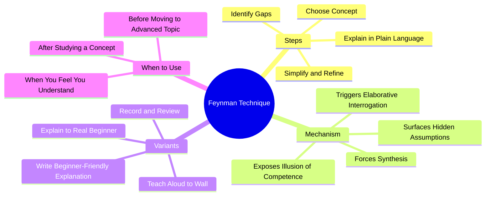

# 2.5 The Feynman Technique

The Feynman Technique is a learning heuristic named after physicist Richard Feynman, who was renowned for his ability to explain complex ideas in simple terms. The technique is simple: **attempt to explain the concept in plain language, as if teaching a beginner.** Wherever your explanation breaks down, you have found a gap in your understanding. This note explains the technique, the cognitive mechanism behind it, and how to implement it.

## The Core Principle

The technique exploits a fundamental asymmetry in cognition: **recognition is easy, reproduction is hard, but synthesis is hardest of all.** You can recognize a correct explanation when you read it. You can reproduce it with effort. But to synthesize your own explanation in plain language — without reference to the source — you must actually understand the concept at a deep level.

This is the same asymmetry that makes [[2.2 Active Recall]] effective: passive review produces recognition, but active production exposes gaps.

## The Four Steps

### Step 1: Choose a Concept

Pick a single, specific concept you have just studied. Examples:
- "How does the TCP handshake work?"
- "Why does Big-O notation ignore constants?"
- "How does a hash table handle collisions?"
- "What is the difference between LTP and LTD?"

The concept should be narrow enough to explain in 5-10 minutes.

### Step 2: Explain It in Plain Language

Write or speak an explanation as if you were teaching it to a smart beginner — someone with no background in the field but with general intelligence. Constraints:

- **No jargon.** If you must use a technical term, define it.
- **No analogies to other advanced concepts** the beginner wouldn't know.
- **Use simple sentences.**
- **Cover the why, not just the what.** A beginner asking "why?" is the most powerful gap-finder.

If you cannot explain it without jargon, you don't understand it well enough — you have memorized the vocabulary without the underlying concept.

### Step 3: Identify the Gaps

Wherever your explanation breaks down — you stumble, you reach for jargon, you skip a step, you say "you know what I mean" — you have found a gap. Mark these gaps explicitly. They are the agenda for your next study session.

Common gap patterns:
- "It just does." (You don't know the mechanism.)
- "Trust me on this." (You don't know the evidence.)
- "It's complicated." (You haven't decomposed it.)
- "It's like X." (You're leaning on analogy because you can't explain directly.)

### Step 4: Simplify and Refine

Once you have filled the gaps with additional study, rewrite the explanation simpler. The Feynman test: **if a smart 12-year-old could not follow your explanation, simplify further.**

This step is what separates Feynman from rote teaching. The first explanation is often cluttered with unnecessary complexity. The simplified version reveals whether you truly understand the essence.

## The Cognitive Mechanism

The Feynman Technique works through three mechanisms:

### Mechanism 1: Forced Synthesis

Most study activities are decompositional — they break material into smaller pieces. The Feynman Technique is *compositional* — it forces you to integrate the pieces into a coherent explanation. This compositional act engages the prefrontal cortex in a way that decomposition does not, and produces stronger, more interconnected memory traces.

### Mechanism 2: Exposing the Illusion of Competence

When you read a textbook explanation, you experience **fluency** — the feeling that the material is clear and you understand it. This feeling is often illusory. The textbook author did the synthesis work for you; you only had to follow along. The Feynman Technique forces you to do the synthesis yourself, which exposes the gap between "I understood the explanation" and "I can generate the explanation."

### Mechanism 3: Elaborative Interrogation

Explaining *why* (not just *what*) triggers **elaborative interrogation** — a well-studied learning technique in which you ask yourself why a fact is true. Elaborative interrogation is one of the techniques rated as "moderate utility" by Dunlosky et al. (2013). It works by integrating new information with existing schemas, producing deeper encoding.

## Implementation

### Variant 1: Teach Aloud to a Wall

Stand up, walk to a whiteboard or wall, and explain the concept aloud as if teaching a class. The physical act of standing and speaking engages different cognitive resources than sitting and writing. This is the variant Feynman himself used.

### Variant 2: Write a Beginner-Friendly Explanation

Write the explanation in a markdown document. The slower pace of writing gives you more time to notice gaps. Save these explanations in your Obsidian vault — they become a personal textbook that you can revise over time.

### Variant 3: Explain to a Real Beginner

If you have a willing friend, partner, or colleague who is not in your field, explain the concept to them. Their questions will expose gaps you didn't know you had. This is the most powerful variant because the beginner's questions are unpredictable.

### Variant 4: Record and Review

Record yourself explaining the concept (audio or video). Listen back the next day. You will hear your own gaps more clearly than you noticed them in the moment.

## Common Pitfalls

### Pitfall 1: Explaining With Jargon

"This is a stateful protocol that uses sequence numbers to handle reliable in-order delivery." — This is not a Feynman explanation. It is a definition using jargon.

Feynman version: "Imagine you and I are sending letters through a slow, unreliable postal service. We both write numbers on our letters. Every time I send you a letter, I write the next number. When you get letter #3, you write back saying 'I got #3, send #4.' If you don't get #3, you don't write back, and after a while I send #3 again. This way, even if some letters get lost, we both end up with all the letters in the right order."

### Pitfall 2: Skipping the Simplify Step

The first explanation is usually too complex. The Feynman Technique requires the *second* pass — the simplification — to confirm true understanding.

### Pitfall 3: Using It Only on Hard Concepts

The technique is most valuable when applied to concepts you *think* you understand. If you only use it on hard concepts, you miss the gaps in your "easy" understanding. Apply it to fundamentals regularly.

### Pitfall 4: Not Identifying Gaps Explicitly

If you stumble but don't mark the gap, you lose the benefit. Always write down: "I could not explain X. Re-study X."

### Pitfall 5: Copying From the Textbook

If you have the textbook open while "explaining," you are transcribing, not synthesizing. Close everything. Explain from memory.

## When to Use the Feynman Technique

- After studying a concept (to verify understanding).
- Before moving to an advanced topic that depends on it (to ensure the foundation is solid).
- When you *feel* you understand something (the feeling is often illusory).
- During review sessions (it counts as active recall; see [[2.2 Active Recall]]).
- When preparing to teach or present (the technique doubles as presentation prep).

## Cross-References

- The technique is a form of [[2.2 Active Recall]] (specifically, free recall with synthesis).
- The mechanism overlaps with elaborative interrogation, covered in [[2.8 SQ3R Method]].
- Daily integration is in [[6.3 Active Learning Sessions]].
- For CS concepts, the technique pairs well with [[5.5 Notional Machines and Mental Models]] — explaining the notional machine in plain language is a Feynman exercise.

#feynman #teach-back #elaboration #technique #heuristic
