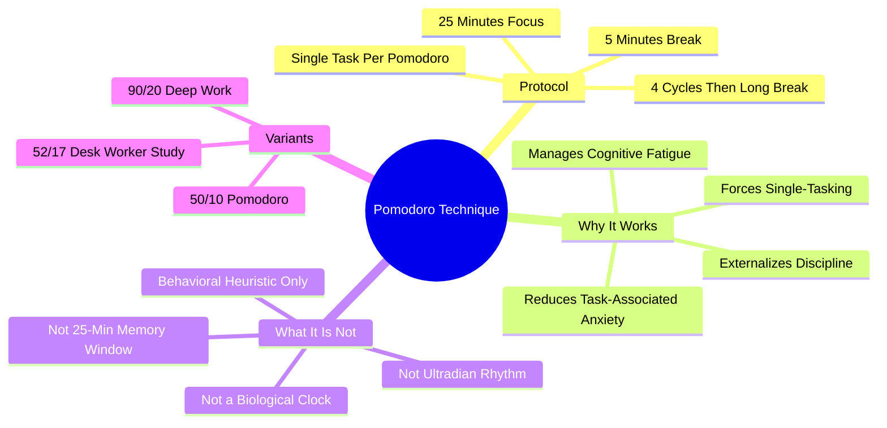

# 2.6 The Pomodoro Technique

The Pomodoro Technique is a time-management method developed by Francesco Cirillo in the late 1980s. The protocol is simple: work in 25-minute focused intervals ("pomodoros"), separated by 5-minute breaks. After four pomodoros, take a longer 15-30 minute break. This note explains why the technique works, what it actually does (and does not do), and how to implement it correctly.

## The Core Principle

The technique's name comes from the tomato-shaped kitchen timer Cirillo used as a student. The protocol:

1. Choose a single task.
2. Set a timer for 25 minutes.
3. Work with focused attention until the timer rings.
4. Take a 5-minute break.
5. After 4 pomodoros, take a 15-30 minute break.

## What It Actually Does (and Doesn't)

### What It Does

The Pomodoro Technique works through **behavioral** mechanisms, not biological ones:

1. **Reduces task-associated anxiety.** A large task ("write the thesis") is intimidating. A 25-minute block ("write one paragraph of the thesis") is approachable. The smaller unit reduces the activation energy required to start.
2. **Externalizes discipline.** The timer becomes the enforcer. You do not need to decide whether to keep working; the timer decides. This reduces the cognitive load of self-regulation.
3. **Manages cognitive fatigue.** Vigilance decrement — the natural decline in attention quality over time — begins after 20-40 minutes for most tasks. The 5-minute break resets the attention network before it degrades.
4. **Forces single-tasking.** The technique's rule is "one task per pomodoro." No multitasking, no phone checks. This is the single biggest contributor to its effectiveness.
5. **Provides structure for breaks.** Without a structured break protocol, "breaks" tend to become open-ended distraction. The 5-minute limit forces you back to work.

### What It Does Not Do

The Pomodoro Technique is **not** a biological clock. It does not:

- **Align with a "25-minute memory window."** There is no such biological mechanism. Memory formation does not happen in 25-minute cycles.
- **Match the brain's natural ultradian rhythm.** The 90-minute ultradian rhythm is itself a myth (see [[7.2 Biohacking Myths]] and [[4.4 Flexible Focus vs Rigid Blocks]]); 25 minutes certainly does not match it.
- **Optimize dopamine dynamics.** Whatever that phrase means (it's mostly pseudoscience), the Pomodoro Technique does not do it.

The technique is a *behavioral heuristic* for managing focus and anxiety. It is highly effective as such. It is not a neurobiological optimization.

## Implementation

### Step 1: Choose a Single Task

Before starting the timer, write down the single task you will work on for the next 25 minutes. Specificity matters:

- Bad: "Study algorithms."
- Good: "Trace through Dijkstra's algorithm on the example graph in chapter 4."

If the task is too large, the pomodoro will feel aimless. If the task is too small, the pomodoro will feel trivial.

### Step 2: Set the Timer

Use a physical kitchen timer, a phone timer, or a Pomodoro app. The phone should be in another room — use a dedicated Pomodoro timer or a kitchen timer. Avoid apps that require you to look at your phone.

### Step 3: Work With Focused Attention

- Single-task. No email. No Slack. No phone.
- If you remember something else you need to do, write it on a notepad and continue the current task.
- If you get stuck, do not switch tasks. Stay with the task for the full 25 minutes. Stuck time is part of the work.
- If you finish the task early, do not stop the pomodoro. Use the remaining time to review or extend the work.

### Step 4: Take a 5-Minute Break

- Stand up. Move your body.
- Look out a window (eye fatigue from screens is real).
- Drink water.
- No screens, no phone. A "break" spent scrolling social media is not a break — it disrupts consolidation.
- See [[3.4 Strategic Breaks]] for break design.

### Step 5: After 4 Pomodoros, Take a Long Break

After 4 cycles (~2 hours of focused work), take a 15-30 minute break. Use it for a walk, a meal, exercise, or genuine rest.

## Variants

### 50/10 Pomodoro

For deep work that requires more warmup time (writing, complex coding, mathematical proofs), use 50-minute focus blocks with 10-minute breaks. The first 5-10 minutes of any deep work session is transition time; 25-minute pomodoros waste this transition repeatedly.

### 90/20 Deep Work Block

For the deepest work (system design, architectural thinking, long-form writing), 90-minute blocks with 20-minute breaks can be more productive. Cal Newport advocates this in *Deep Work*. Note: this is *not* because of ultradian rhythms; it is because 90 minutes is approximately the maximum sustained effort most people can give to a single problem before quality degrades.

### 52/17

A study of productive desk workers (DeskTime, 2014) found that the most productive workers averaged 52 minutes of work followed by 17 minutes of break. This is close to the 50/10 variant.

### Choose Based on Task

- Routine tasks (email, administrative): 25/5.
- Standard study: 50/10.
- Deep work (writing, complex coding): 90/20.
- Don't force yourself into a rhythm that doesn't fit the task.

## Common Pitfalls

### Pitfall 1: Using the Break for Distraction

The 5-minute break spent on social media is worse than no break — it disrupts consolidation and produces zero attention recovery. A real break is *boring*.

### Pitfall 2: Stopping the Pomodoro Early

If you "finish" the task in 18 minutes, do not stop. Use the remaining 7 minutes to review, extend, or verify. Stopping early trains you to quit when the work feels done.

### Pitfall 3: Switching Tasks Mid-Pomodoro

If you hit a wall, do not switch to a different task. Stay with the original task for the full 25 minutes. If the task is genuinely stuck, use the time to diagnose *why* you are stuck.

### Pitfall 4: Treating the Timer as Inflexible

If a 25-minute pomodoro is interrupted by a legitimate emergency, do not abandon the technique — pause the timer and resume when you can. The technique is a tool, not a religion.

### Pitfall 5: Using Pomodoro for Everything

Pomodoro is excellent for focused individual work. It is poor for:
- Pair programming (the constant interruptions disrupt flow).
- Meetings (the timer is irrelevant).
- Creative exploration (which requires long, unstructured periods).

## Why the Technique Works Despite the Myths

The Pomodoro Technique is surrounded by pop-neuroscience claims that are false (25-minute brain cycles, dopamine optimization, ultradian alignment). Strip away the myths and what remains is a robust behavioral tool:

- It reduces procrastination by shrinking the task.
- It externalizes discipline by transferring regulation to the timer.
- It manages fatigue by enforcing breaks.
- It blocks distraction by enforcing single-tasking.

These are sufficient mechanisms. The technique does not need biology to justify itself.

## Cross-References

- The technique operationalizes the "Attention" ingredient in [[1.4 The Six Critical Ingredients of Learning]].
- The break design is detailed in [[3.4 Strategic Breaks]].
- The myth of the rigid 90-minute ultradian cycle is debunked in [[7.2 Biohacking Myths]].
- The flexible alternative is in [[4.4 Flexible Focus vs Rigid Blocks]].
- Daily integration is in [[6.3 Active Learning Sessions]].

#pomodoro #focus #time-management #technique #heuristic
