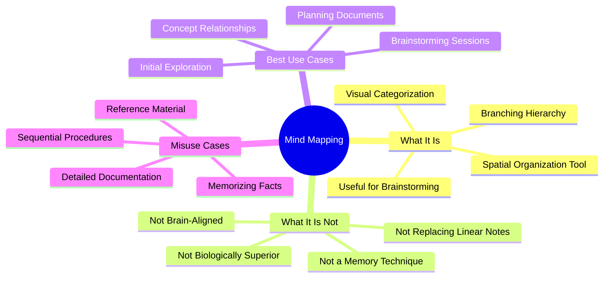

# 2.7 Mind Mapping (Properly Understood)

A mind map is a visual note-taking technique in which a central concept is placed in the middle of a page, with related ideas branching outward radially. Mind mapping is a useful tool — but the marketing claims surrounding it are pseudoscientific. This note explains what mind mapping is good for, what it is *not* good for, and how to use it correctly without falling for the neuromyths.

## The Core Principle

A mind map represents information as a radial graph: a central node (the main topic) connects to subtopics, which connect to sub-subtopics, forming a tree structure emanating outward. The format emphasizes *relationships* between concepts at the expense of *sequence* and *detail*.

## The Marketing Claims (Mostly False)

Mind mapping advocates (and the multi-million-dollar industry that sells mind mapping software) make several claims that are not supported by evidence:

- **"Mind maps align with the brain's natural radial structure of organizing information."** — False. The brain does not organize semantic information as a 2D radial spider diagram. Semantic memory is structured as high-dimensional, non-linear connectionist networks distributed across vast cortical areas.
- **"Traditional linear note-taking is biologically inferior."** — False. The variable that determines retention is the *cognitive depth of processing*, not the *geometric shape* of the notes.
- **"Mind maps engage both hemispheres of the brain."** — False. This is an extension of the long-debunked left-brain/right-brain neuromyth. Both hemispheres are engaged in essentially all complex cognitive tasks.
- **"Mind maps dramatically improve memory."** — Mixed. They can improve memory *for the mind map itself* (because creating it is a form of elaborative encoding), but they do not outperform other forms of elaborative encoding (like writing a structured summary) for general retention.

## What Mind Mapping Is Actually Good For

Despite the false marketing, mind mapping has legitimate uses:

### Use 1: Brainstorming and Initial Exploration

When you are first encountering a topic and do not yet know its structure, a mind map is a fast way to dump everything you know (or think you know) without committing to a hierarchy. The radial format lets you add branches without restructuring the document.

### Use 2: Visualizing Concept Relationships

When the *relationships* between concepts are the focus (rather than the details of each concept), a mind map is more efficient than a linear outline. Example: mapping the dependencies between components in a software architecture.

### Use 3: Planning Documents and Talks

A mind map is a good intermediate step between "I have scattered ideas" and "I have a structured outline." Use it to organize thoughts before converting to a linear outline for the final document.

### Use 4: Personal Knowledge Navigation

In tools like Obsidian, the graph view is essentially a mind map of your vault. It helps you see which notes are densely connected and which are orphaned. This is meta-use: the mind map represents your knowledge base, not a single concept.

## What Mind Mapping Is Bad For

### Bad Use 1: Memorizing Facts

Mind maps are not flashcards. They do not enforce retrieval. For factual retention, use [[2.3 Spaced Repetition]].

### Bad Use 2: Detailed Documentation

Mind maps compress information to short node labels. This loses detail. For documentation, use linear notes with full sentences.

### Bad Use 3: Sequential Procedures

Mind maps are radial; procedures are linear. A mind map of "how to deploy a web app" will lose the order. Use a numbered checklist instead.

### Bad Use 4: Reference Material

Mind maps are difficult to search and difficult to update. For reference material (which you will consult many times in the future), use a structured linear document.

## How to Use a Mind Map Correctly

If you decide to use mind mapping, follow these principles:

### Principle 1: Use It for Exploration, Not Retention

Make the mind map to *understand* the structure of the topic. Once you understand the structure, convert it to a linear outline and study from that. Do not try to memorize the mind map itself.

### Principle 2: Keep It Shallow

Limit the depth to 3 levels (central → subtopic → detail). Deeper mind maps become illegible. If you need more depth, split the topic into multiple mind maps.

### Principle 3: Use Keywords, Not Sentences

Each node should be a keyword or short phrase, not a sentence. The mind map is a *skeleton* of relationships, not a transcript.

### Principle 4: Don't Force Radial Layout

If your topic is naturally hierarchical (which most are), a linear outline or a tree diagram is more readable than a forced radial layout. Use mind mapping when the radial structure genuinely helps; otherwise use outlines.

### Principle 5: Cognitive Depth > Visual Format

The variable that matters is how actively you process the material while creating the mind map. If you copy from a textbook into a mind map without thinking, you get little benefit. If you synthesize, reorganize, and connect concepts while creating it, you get substantial benefit — *regardless of the visual format*.

## Evidence

The educational psychology literature on mind mapping is mixed:

- **Farrand, Hussain & Hennessy (2002):** Found that mind mapping improved recall compared to "student's preferred study method," but only modestly, and only when students were trained in the technique.
- **Holliday, Brunner & Donais (1977):** Found mind mapping superior to linear note-taking for retention of specific facts from a chapter — but the effect size was small.
- **Dunlosky et al. (2013):** Did not include mind mapping in their review of learning techniques, but the techniques they did rate highly (practice testing, distributed practice) consistently outperform mind mapping.

The honest summary: mind mapping is a useful tool for exploration and synthesis. It is not a memory technique and should not be your primary study method.

## Integration With Other Techniques

In this vault, mind mapping has a small but legitimate role:

1. **Initial exploration of a new topic.** Use a mind map to dump everything you know.
2. **Synthesis after studying.** Use a mind map to integrate concepts from multiple sources.
3. **Planning.** Use a mind map to outline a writing project or a study plan.

For everything else, use the more evidence-backed techniques:

- Factual retention → [[2.3 Spaced Repetition]]
- Conceptual understanding → [[2.5 The Feynman Technique]]
- Reading comprehension → [[2.8 SQ3R Method]]
- Procedural skill → practice (for CS, see [[5.1 MOC - CS Education]])

## Common Pitfalls

### Pitfall 1: Treating Mind Maps as Memory Tools

The biggest misuse. Mind maps are not flashcards. They do not enforce retrieval. Use them for understanding, then convert to other formats for retention.

### Pitfall 2: Over-Aestheticizing

Students spend hours making mind maps look beautiful (colors, icons, curves). This is procrastination disguised as productivity. A mind map should take 10-20 minutes, tops.

### Pitfall 3: Mind Maps as the Only Study Method

Mind maps alone will not get you through an exam. They are one tool among many.

### Pitfall 4: Believing the Brain-Alignment Claim

If you catch yourself thinking "this matches how my brain stores information," remind yourself: your brain does not store information as a 2D radial diagram. The mind map is a *tool*, not a mirror.

## Cross-References

- The myth that mind maps are "brain-aligned" is debunked in [[7.2 Biohacking Myths]].
- The visual/auditory learning styles neuromyth (which mind mapping claims often invoke) is also debunked there.
- For note-taking in Obsidian specifically, see [[8.3 Note-Taking Apps]].
- The general principle of "cognitive depth > format" is shared with [[2.2 Active Recall]] (effortful retrieval > format).

#mind-mapping #note-taking #visualization #technique #heuristic
