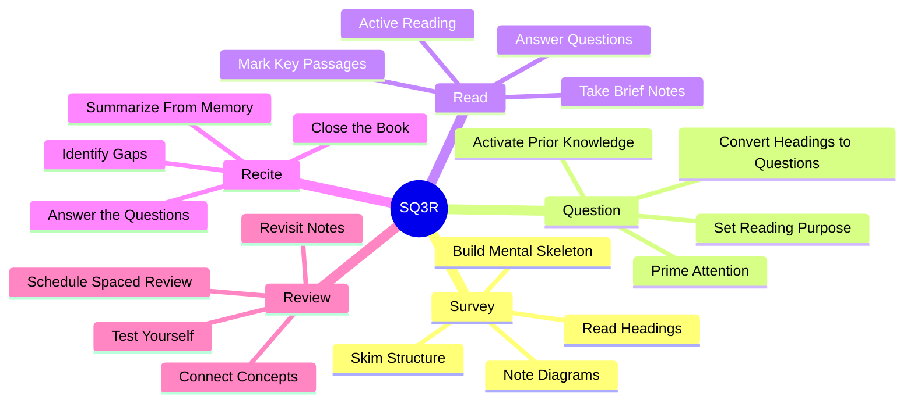

# 2.8 SQ3R Method

SQ3R is a structured reading protocol developed by Francis P. Robinson in his 1946 book *Effective Study*. The acronym stands for **Survey, Question, Read, Recite, Review**. The method is a heuristic — not a biological mechanism — but it has held up well in 75+ years of classroom testing. This note explains the five steps, why each works, and how to implement them.

## The Core Principle

The naive approach to reading a textbook is: open the book, read from the first word to the last, highlight some sentences, close the book. This produces poor retention because it skips two crucial steps: *priming* (setting up the brain to notice what matters) and *retrieval* (forcing the brain to actively reconstruct the content).

SQ3R inserts priming (Survey + Question) before reading, and retrieval (Recite) after reading, with a final consolidation step (Review).

## The Five Steps

### Step 1: Survey (5 minutes)

Before reading the chapter, scan its structure:
- Read the title and any chapter summary.
- Read all the headings and subheadings.
- Look at every diagram, chart, and image.
- Read the first and last sentence of each section.
- Read any bolded or italicized terms.

The goal is to build a **mental skeleton** of the chapter before you read it. This skeleton serves as a scaffold onto which the detailed content will attach during reading. Without the scaffold, the detail has nowhere to attach and is forgotten.

Why this works: schema theory. The brain encodes new information by attaching it to existing schemas. If you have no schema for the chapter content, your brain has nowhere to put the detail. The survey creates a minimal schema in 5 minutes that would take 30 minutes to build during reading.

### Step 2: Question (5 minutes)

Convert each heading into a question. Examples:
- Heading: "The Hippocampus and Memory Consolidation" → Question: "How does the hippocampus consolidate memory?"
- Heading: "Time Complexity of Quicksort" → Question: "What is the time complexity of quicksort, and why?"
- Heading: "The Renin-Angiotensin-Aldosterone System" → Question: "How does the RAAS regulate blood pressure?"

Write the questions down. You will answer them during the Read step.

Why this works: questions prime the brain's attentional system to notice relevant information. When you read with a question in mind, your attention is captured by the answer. Without a question, you read passively and notice nothing.

### Step 3: Read (variable)

Read the chapter actively, section by section. For each section:
- Read with the question from Step 2 in mind.
- When you find the answer, mark it (highlight or note).
- Take brief notes in your own words (not copying the textbook).
- If a section introduces new terms, define them in your notes.
- Pause every few paragraphs and use [[2.9 Stop and Recite]] to check comprehension.

Do not highlight more than 10-15% of the text. Over-highlighting is a sign of passive reading.

### Step 4: Recite (10 minutes)

After finishing a section (or the whole chapter, if short):
- Close the book.
- Out loud or in writing, summarize the section in your own words.
- Answer the question from Step 2 without looking.
- If you cannot answer, you have not learned the section — re-read it.

This is the most important step. Recitation is [[2.2 Active Recall]] applied to reading. Without recitation, you have only encoded the information; you have not retrieved it. Without retrieval, the trace decays.

### Step 5: Review (ongoing)

After finishing the chapter:
- Re-read your notes within 24 hours.
- Re-attempt the questions from Step 2.
- Identify gaps and re-study those sections.
- Schedule spaced reviews with Anki for any facts that need long-term retention. See [[2.3 Spaced Repetition]].
- Connect the chapter's content to other chapters (elaborative interrogation).

## Why SQ3R Works

### Reason 1: Schema Activation Before Reading

The Survey + Question steps activate prior knowledge and create a minimal schema. This is the difference between "reading with the brain prepared" and "reading cold." Prepared reading encodes information 2-3x more effectively.

### Reason 2: Active Reading

The Question step converts passive reading into active reading. You are no longer "reading the chapter"; you are "hunting for answers to specific questions." This engages attentional systems that passive reading does not.

### Reason 3: Forced Retrieval

The Recite step forces retrieval immediately after encoding. This exploits the testing effect (see [[2.2 Active Recall]]) at the moment the trace is most fragile, dramatically strengthening it.

### Reason 4: Spaced Review

The Review step converts the chapter's content into a spaced repetition system, ensuring long-term retention rather than short-term familiarity.

## Implementation Notes

### Adapting SQ3R to Different Materials

- **Textbooks:** Use SQ3R as described.
- **Research papers:** Survey = read abstract, intro, conclusion, and section headings. Question = convert each section heading to a question. Read = read the paper with questions in mind. Recite = summarize each section from memory. Review = integrate with related papers.
- **Technical documentation:** Survey = scan the table of contents and code examples. Question = convert headings to questions. Read = read with the documentation open in a side panel. Recite = try to use the API from memory. Review = schedule spaced reviews for any non-obvious API details.
- **Video lectures:** Survey = scan the lecture outline or chapter list. Question = convert each topic to a question. Read = watch the lecture with questions in mind, pausing to take notes. Recite = after each major section, pause and summarize. Review = schedule spaced reviews.

### Adapting SQ3R to Time Constraints

Full SQ3R takes ~1.5-2x as long as passive reading. If you are short on time:
- Always do Survey + Question (these steps take 10 minutes and double retention).
- Read actively but skip the marginal notes.
- Always do Recite (this is where the learning happens).
- Compress Review into the end-of-session summary.

Never skip Recite. If you have to skip a step, skip Survey — not Recite.

## Common Pitfalls

### Pitfall 1: Skipping Survey Because "It Wastes Time"

The most common mistake. Survey takes 5 minutes and doubles retention. Skipping it to "save time" is false economy.

### Pitfall 2: Reading Without the Questions in Mind

If you generate questions in Step 2 but then forget them during Step 3, you have lost the benefit. Keep the questions visible while reading.

### Pitfall 3: Skipping Recite Because "You'll Review Later"

Recite is the active recall step. Without it, no learning happens. Review is consolidation, not learning.

### Pitfall 4: Copying the Textbook During Read

The Read step is not transcription. Take notes in your own words. If you copy verbatim, you are not encoding — you are transcribing.

### Pitfall 5: Treating SQ3R as a Religion

SQ3R is a heuristic. Adapt it to the material. If a chapter has no real structure (e.g., a narrative chapter in a novel), Survey produces little benefit. Skip it and read.

## Cross-References

- The Recite step is an application of [[2.2 Active Recall]].
- The Review step integrates with [[2.3 Spaced Repetition]].
- The micro-recitation variant is in [[2.9 Stop and Recite]].
- The Question step overlaps with [[2.4 Pretesting and Hypercorrection]] (questions prime the brain).
- Daily integration is in [[6.3 Active Learning Sessions]].

#sq3r #reading #comprehension #technique #heuristic
