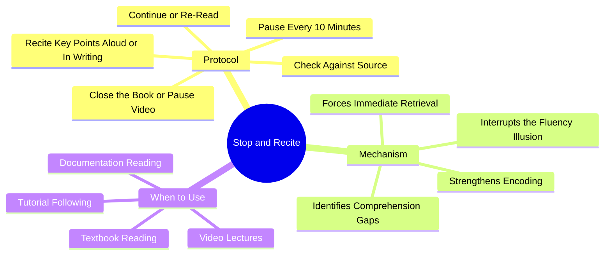

# 2.9 Stop and Recite

Stop and Recite is a micro-retrieval habit you should use during every reading or watching session. The protocol is simple: **every 10 minutes, pause and recite the key points from memory before continuing.** This note explains why such a small habit produces disproportionate benefits.

## The Core Principle

The naive approach to reading is continuous: you read from the first word to the last without pausing, then close the book. This produces a strong feeling of fluency — the sentences made sense, the explanations were clear, you followed the argument. The feeling is misleading. **Fluency is recognition, not recall.** Without retrieval, the information will be gone in hours.

Stop and Recite inserts retrieval checkpoints into the reading process, converting passive consumption into active learning.

## The Protocol

### Step 1: Read for 10 Minutes

Read actively, with a question in mind (see [[2.8 SQ3R Method]]). Take brief notes if helpful.

### Step 2: Pause

After 10 minutes (or after a natural section break — whichever comes first), stop reading. Close the book. Pause the video. Look away from the screen.

### Step 3: Recite

Out loud or in writing, summarize the key points from the last 10 minutes:
- What was the main idea?
- What were the supporting points?
- Were there any definitions, formulas, or procedures introduced?
- Did anything surprise you or contradict prior knowledge?

The recitation should take 30-60 seconds. If it takes much longer, you read too much without processing.

### Step 4: Check

Open the book or resume the video. Compare your recitation to the source:
- Did you miss anything important?
- Did you get anything wrong?
- Did you include anything that wasn't there (confabulation)?

Mark any gaps. These are the points you need to re-read.

### Step 5: Continue or Re-Read

If your recitation was complete and accurate, continue reading. If you missed significant content, re-read the section before moving on.

## Why This Works

### Reason 1: Interrupts the Fluency Illusion

The single biggest problem with passive reading is that it *feels* productive. The sentences make sense, so you believe you are learning. Stop and Recite exposes the gap between "I followed the explanation" and "I can generate the explanation."

### Reason 2: Immediate Retrieval Strengthens Encoding

The testing effect (see [[2.2 Active Recall]]) is strongest when retrieval occurs shortly after encoding. Stop and Recite exploits this by inserting retrieval within minutes of encoding, while the trace is still labile.

### Reason 3: Identifies Gaps Before They Compound

If you misunderstand a concept in minute 10 and continue reading, you will misunderstand every concept that depends on it. By minute 60, you have built an elaborate structure on a faulty foundation. Stop and Recite catches the fault at minute 10, before it compounds.

### Reason 4: Maintains Attention

Vigilance decrement — the natural decline in attention quality over time — begins after 10-20 minutes for most reading material. The act of pausing and reciting resets the attention network, preventing the "I read three pages and remember nothing" failure mode.

## Implementation

### Implementation 1: Timer-Based

Set a recurring 10-minute timer. When it fires, pause and recite. This is the most disciplined approach and works well for textbook reading.

### Implementation 2: Section-Based

Pause at the end of every section, subsection, or natural break. This works better than timer-based for materials with uneven section lengths (research papers, documentation).

### Implementation 3: Paragraph-Based (For Dense Material)

For extremely dense material (mathematical proofs, philosophical arguments), pause after every paragraph. Each paragraph may contain a non-trivial claim that requires verification.

### Implementation 4: Video Lecture Adaptation

For video lectures:
- Pause every 5-10 minutes.
- Summarize aloud what was just covered.
- If you cannot summarize, rewind.

Video is particularly prone to the fluency illusion because the presenter does the synthesis work for you. Stop and Recite is essential for video learning.

## Common Pitfalls

### Pitfall 1: Skipping Because "You're on a Roll"

The most common failure. You feel focused, you feel you understand, so you skip the recitation. The feeling is illusory. The whole point of Stop and Recite is to test the feeling.

### Pitfall 2: Reciting Without Checking

If you recite but do not check against the source, you might be confidently wrong. Always check.

### Pitfall 3: Reciting Too Long

If your recitation takes 5 minutes, you read too long without a checkpoint. Recitation should be 30-60 seconds for a 10-minute reading block.

### Pitfall 4: Reciting In Your Head

Mental recitation is weaker than spoken or written recitation. The production effect — the finding that producing information aloud strengthens memory — is well-documented. Speak it. Write it.

### Pitfall 5: Treating Stop and Recite as the Only Technique

Stop and Recite is a micro-technique. It does not replace [[2.2 Active Recall]] (full free recall after a study session), [[2.3 Spaced Repetition]] (long-term scheduling), or [[2.5 The Feynman Technique]] (deep conceptual synthesis). Use it as one component of a complete study system.

## Daily Application

Integrate Stop and Recite into every reading and watching session:

- During textbook reading: pause every 10 minutes or at every section break.
- During video lectures: pause every 5-10 minutes.
- During documentation reading: pause after every code example or API description.
- During tutorial following: pause after each step and try to predict the next.

The total time cost is small (5-10% of reading time), and the retention benefit is large (often 2-3x improvement on next-day recall tests).

## Cross-References

- The technique is a micro-application of [[2.2 Active Recall]].
- It integrates with [[2.8 SQ3R Method]] as the "Recite" step, applied within reading rather than after.
- The production effect (speaking aloud strengthens memory) is shared with [[2.5 The Feynman Technique]].
- Daily integration is in [[6.3 Active Learning Sessions]].

#stop-and-recite #micro-recall #reading #technique #science
