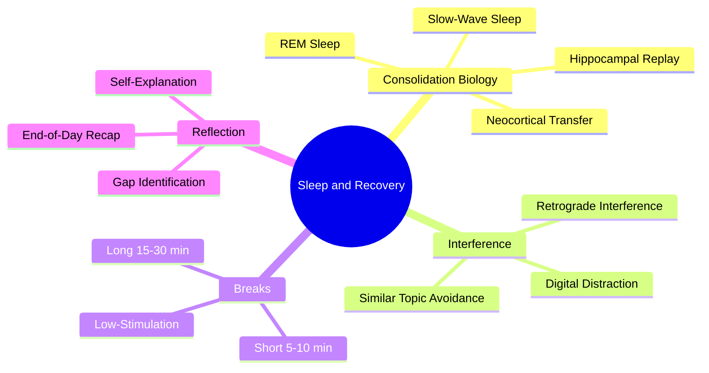

# 3.1 MOC - Sleep, Recovery and Consolidation

Learning does not happen while you study. **Learning happens while you sleep and while you rest.** Studying merely *encodes* information into a fragile, short-term state. Consolidation — the process that turns fragile traces into durable long-term memory — happens offline, during slow-wave sleep, REM sleep, and strategically timed restful breaks. If you study perfectly and then sleep poorly, you have wasted most of your effort.

This chapter covers the biology of consolidation and the practical protocols (breaks, boredom, reflection) that protect it.

## Mermaid Mind Map - Chapter 3

## Notes in This Chapter

- [[3.2 Sleep and Memory Consolidation]] — The biological mechanism: hippocampal replay, neocortical transfer, why sleep is non-negotiable.
- [[3.3 Retrograde Interference]] — Why studying similar topics back-to-back destroys the first topic's consolidation.
- [[3.4 Strategic Breaks]] — How to design 5-minute, 10-minute, and 30-minute breaks to maximize consolidation.
- [[3.5 Embracing Boredom and Scatter Focus]] — Why low-stimulation periods are a feature, not a bug.

## The Two Windows of Sleep

Sleep serves two distinct memory functions, and both must be present:

1. **Before learning** — Sleep prepares the hippocampus to accept new information. A sleep-deprived hippocampus has roughly 40% reduced capacity to encode new episodic memories (Yoo et al., 2007).
2. **After learning** — Sleep consolidates the day's learning by replaying hippocampal firing patterns and gradually transferring them to the neocortex for long-term storage.

Skipping either window is catastrophic. Cramming all night before an exam sacrifices both: you lose the consolidation window for yesterday's learning, and you impair today's encoding capacity.

## Cross-References

- The biological foundation is in [[1.2 The Science of Memory]].
- The "breaks" ingredient in [[1.4 The Six Critical Ingredients of Learning]] is operationalized here.
- Daily break scheduling is integrated into [[6.5 Breaks and Recovery]].
- The myth of "sleep hacking" via supplements is catalogued in [[7.2 Biohacking Myths]].

#moc #recovery #sleep #consolidation
