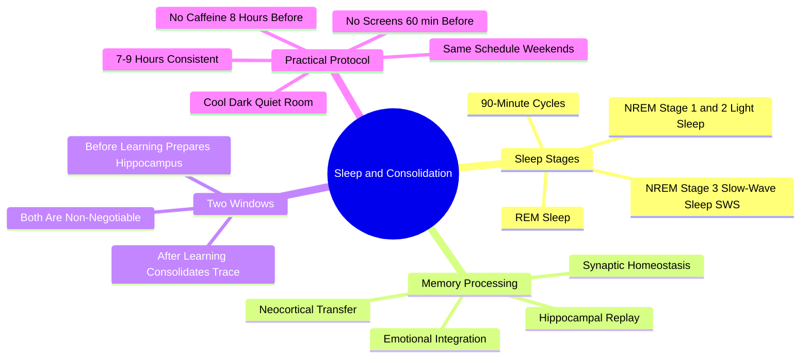

# 3.2 Sleep and Memory Consolidation

Sleep is not optional. It is the biological process during which the day's learning is converted from fragile short-term traces into durable long-term memory. No amount of technique, motivation, or caffeine can substitute for sleep. This note explains the neurobiology of sleep-dependent consolidation and the practical protocols that protect it.

## The Core Principle

Learning does not happen while you study. **Learning happens while you sleep.** Studying merely encodes information into a fragile, hippocampus-dependent short-term state. Consolidation — the process that turns fragile traces into stable neocortical memory — happens offline, predominantly during sleep.

If you study perfectly and then sleep poorly, you have wasted most of your effort.

## Sleep Architecture

Sleep is not a uniform state. It cycles through distinct stages every ~90 minutes:

### NREM Stage 1 (Light Sleep)

Brief transition from wakefulness to sleep. Lasts 1-5 minutes. Minimal role in consolidation.

### NREM Stage 2 (Light Sleep)

The largest portion of adult sleep (~50% of total sleep time). Characterized by sleep spindles — brief bursts of brain activity that have been linked to motor skill consolidation and memory integration.

### NREM Stage 3 (Slow-Wave Sleep, SWS)

Deep sleep, characterized by slow delta waves (0.5-4 Hz). SWS dominates the first half of the night and is the primary stage for **hippocampal replay** — the brain replays the day's hippocampal firing patterns at 10-20x speed, gradually transferring memories to the neocortex for long-term storage. SWS is essential for declarative memory consolidation (facts, events).

### REM Sleep

Rapid eye movement sleep. The brain is highly active (almost wake-like), but the body is paralyzed (to prevent acting out dreams). REM dominates the second half of the night and is the primary stage for:
- Emotional memory processing.
- Procedural skill consolidation (motor skills, complex sequences).
- Creative integration and novel connections.

### The 90-Minute Cycle

The brain cycles through NREM → REM every ~90 minutes, with SWS dominating early cycles and REM dominating later cycles. This means:
- Cutting sleep short sacrifices REM disproportionately (because REM is concentrated late in the night).
- Sleeping only 6 hours instead of 8 loses up to 60% of REM sleep.
- The "I'll catch up on sleep this weekend" strategy does not restore lost REM.

## The Two Windows of Sleep

Sleep serves two distinct memory functions, and **both must be present**:

### Window 1: Sleep *Before* Learning

Sleep prepares the hippocampus to accept new information. A sleep-deprived hippocampus has roughly **40% reduced capacity** to encode new episodic memories (Yoo et al., 2007). Pulling an all-nighter to study before an exam sacrifices this window — you arrive at the exam with a hippocampus that is biologically impaired at forming new memories, even if you "feel alert" from caffeine.

### Window 2: Sleep *After* Learning

Sleep consolidates the day's learning. Hippocampal replay during SWS transfers memories to the neocortex. Without post-learning sleep, the day's traces remain hippocampus-dependent and decay rapidly.

The practical implication: **both sleep the night before studying and sleep the night after studying matter.** Many students sacrifice sleep to study more, then sleep poorly because of stress. This sacrifices both windows simultaneously.

## The Mechanism: Hippocampal Replay

During SWS, the hippocampus replays the firing patterns of the day at 10-20x speed. If during the day a sequence of neurons fired A → B → C → D in response to a learning experience, during SWS those same neurons fire A → B → C → D again, but much faster.

This replay has two effects:

1. **Strengthening** — The synapses involved in the original experience are potentiated further (LTP reinforcement).
2. **Transfer** — The replay is "heard" by the neocortex, which gradually encodes the memory in distributed cortical networks. Over weeks, the memory becomes hippocampus-independent.

The hippocampus is excellent at fast encoding (it can bind a single experience in seconds) but poor at long-term storage. The neocortex is excellent at long-term storage but poor at fast encoding. Sleep is the mechanism that transfers information from the fast-but-fragile system to the slow-but-durable system.

## What Happens When You Skip Sleep

### Acute Sleep Deprivation (1 all-nighter)

- 40% reduction in hippocampal encoding capacity (Yoo et al., 2007).
- Impaired prefrontal cortex function (poor decision-making, reduced working memory).
- Reduced emotional regulation (amygdala hyperactivity).
- Impaired attention (vigilance decrement accelerates).
- Effectively, you are mildly intoxicated.

### Chronic Sleep Restriction (6 hours/night for 2 weeks)

Performance declines equivalent to 2 full all-nighters — but subjects *report feeling fine*. This is the most insidious aspect of chronic sleep restriction: the subjective feeling of adaptation masks objective cognitive decline. You stop noticing that you are impaired.

### Long-Term Sleep Deprivation

- Increased risk of Alzheimer's disease (sleep is the primary mechanism of amyloid-beta clearance).
- Reduced adult neurogenesis in the hippocampus.
- Increased risk of cardiovascular disease, diabetes, and depression.
- Cumulative impairment of cognitive function.

## The Practical Protocol

### Rule 1: Sleep 7-9 Hours, Consistently

The exact number varies by individual, but the range is 7-9 hours for adults. Determine yours by checking when you wake naturally without an alarm on a weekend (assuming you are not sleep-deprived).

Consistency matters as much as duration. Sleeping 8 hours Monday-Friday and 11 hours on weekends produces "social jetlag" — the circadian rhythm is constantly shifting. Aim for the same sleep and wake times every day, including weekends.

### Rule 2: Sleep Before Learning

Sleep the night *before* a study session. Do not pull an all-nighter to study — you will arrive at the study session with a hippocampus impaired at encoding.

### Rule 3: Sleep After Learning

Sleep the night *after* a study session. If you must choose between studying another hour and sleeping, sleep. The hour of study produces fragile traces; the sleep produces durable traces.

### Rule 4: No Screens 60 Minutes Before Bed

Blue light from screens suppresses melatonin production. Melatonin is the hormone that signals the body to prepare for sleep. Suppression delays sleep onset and reduces sleep quality.

If you must use a screen, use a blue-light filter (f.lux, Night Shift, etc.). But the filter is not a complete solution — the cognitive stimulation of screen content (especially social media) also delays sleep.

### Rule 5: No Caffeine Within 8 Hours of Bedtime

Caffeine has a half-life of 5-6 hours. A coffee at 4 PM still has 50% of its caffeine active at 9-10 PM. Caffeine works by blocking adenosine receptors — adenosine is the molecule that builds sleep pressure. By blocking adenosine, caffeine prevents you from feeling sleepy, but it does not clear adenosine. When the caffeine wears off, the accumulated adenosine produces a crash.

### Rule 6: Cool, Dark, Quiet

- **Cool:** 18-20°C (65-68°F). Body temperature needs to drop ~1°C to initiate sleep; a cool room facilitates this.
- **Dark:** Blackout curtains or a sleep mask. Even small amounts of light (LED indicators, streetlights through curtains) can disrupt sleep architecture.
- **Quiet:** Earplugs or a white-noise machine. Sudden noises during light sleep stages pull you out of consolidation.

### Rule 7: No Alcohol Within 3 Hours of Bedtime

Alcohol is a sedative — it helps you fall asleep — but it disrupts sleep architecture. Alcohol suppresses REM sleep in the first half of the night and produces fragmented, low-quality sleep in the second half. The result is "I slept 8 hours but feel exhausted."

### Rule 8: Consistent Bedtime Routine

A 30-60 minute pre-sleep routine signals the body to prepare for sleep. The routine should be low-stimulation: reading (physical book), light stretching, journaling, meditation. No work, no email, no social media.

## Naps

Short naps can supplement (not replace) nighttime sleep:

- **10-20 minute power nap** — Improves alertness and cognitive performance without entering deep sleep. No grogginess on waking.
- **60-90 minute full-cycle nap** — Includes one full SWS-REM cycle. Better for memory consolidation, but produces grogginess on waking (sleep inertia) for ~30 minutes.
- **30-60 minute nap** — AVOID. Wakes you from deep SWS without completing the cycle, producing maximum grogginess with minimal consolidation benefit.

## Cross-References

- The biology of memory is in [[1.2 The Science of Memory]].
- Sleep is one of the six ingredients in [[1.4 The Six Critical Ingredients of Learning]].
- Retrograde interference (studying similar topics after learning) disrupts consolidation; see [[3.3 Retrograde Interference]].
- Sleep myths (sleep hacking, polyphasic sleep) are debunked in [[7.2 Biohacking Myths]].
- Daily sleep integration is in [[6.7 Physical and Mental Optimization]].

#sleep #consolidation #memory #neuroscience #theory
