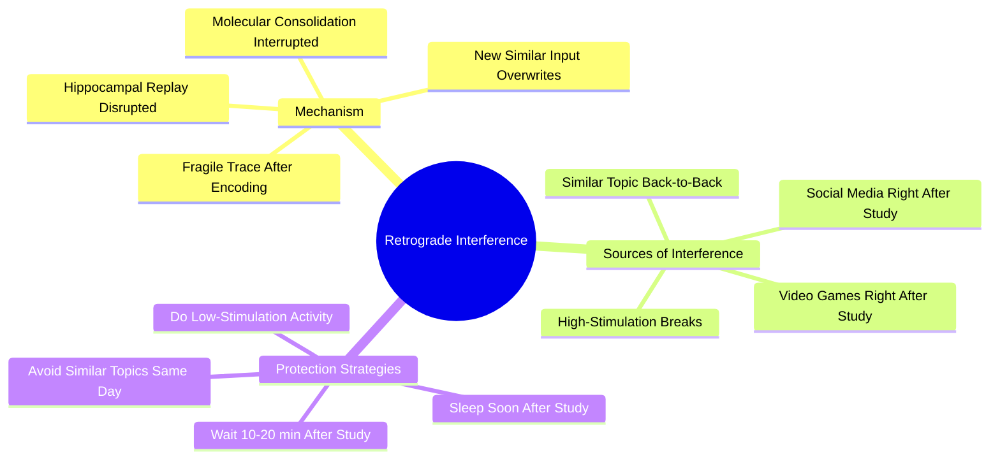

# 3.3 Retrograde Interference

Retrograde interference is the phenomenon where newly learned information disrupts the consolidation of previously learned information. It is one of the most underappreciated enemies of effective study. Even if you use every technique in this vault perfectly, studying the wrong material at the wrong time can erase the consolidation of yesterday's learning. This note explains the mechanism and how to design your study schedule to avoid it.

## The Core Principle

After you study, the memory trace is **fragile**. It takes 1-2 hours for the molecular consolidation to complete at the synaptic level, and several nights of sleep for systems-level consolidation to transfer the trace to the neocortex. During this fragile window, **new information that shares neural resources with the trace can overwrite or destabilize it.**

This is retrograde interference: new learning interferes with old learning.

## The Mechanism

Retrograde interference occurs through three mechanisms:

### Mechanism 1: Molecular Consolidation Interruption

Encoding a memory triggers a cascade of molecular events at the synapse — protein synthesis, receptor trafficking, structural changes to dendritic spines. This cascade takes 1-2 hours to complete. If you encode new, similar information during this window, the new cascade competes for the same molecular resources, and the original cascade is partially interrupted.

### Mechanism 2: Hippocampal Replay Disruption

During breaks and sleep, the hippocampus replays the day's firing patterns to consolidate them. If you flood the hippocampus with new, similar information immediately after studying, the replay process is disrupted. The original traces are not properly consolidated.

### Mechanism 3: Overwrite at the Synapse Level

Synapses that were just strengthened by learning are still labile. New, similar input can cause **long-term depression (LTD)** at those same synapses, partially erasing the original strengthening.

## What Counts as "Similar"?

Retrograde interference is strongest when the new information shares neural resources with the old. "Similar" means:

- **Topically similar:** Studying Spanish after studying Italian produces interference. Studying Spanish after studying calculus produces little.
- **Procedurally similar:** Practicing piano after practicing guitar produces interference. Practicing piano after going for a run produces little.
- **Modality similar:** Reading a long article after reading another long article produces interference (cognitive fatigue, not strictly retrograde, but similar effect). Reading after a coding session produces less.

## Sources of Interference

### Source 1: Studying Similar Topics Back-to-Back

The classic case. Studying Chapter 4 of a chemistry textbook immediately after Chapter 3 of the same textbook produces significant interference. The two chapters share schemas, vocabulary, and neural circuits.

### Source 2: Social Media Immediately After Study

Scrolling Instagram or TikTok after a study session floods the hippocampus with high-novelty, high-dopamine input. This is not "similar" in the topical sense, but it is similar in the modality sense (visual input, episodic encoding). The constant context-switching also produces attentional residue that disrupts consolidation.

### Source 3: Video Games Immediately After Study

Action video games produce strong episodic encoding (you remember the level, the enemies, the win). This competes with study material for hippocampal consolidation resources.

### Source 4: High-Stimulation Breaks

A "break" spent watching YouTube, listening to a podcast, or scrolling news is not a break for consolidation purposes. It is a competing encoding event.

### Source 5: Another Cognitively Demanding Task

Working on a complex coding problem after studying for an exam produces interference if the two tasks share executive resources (working memory, attention).

## Protection Strategies

### Strategy 1: Wait 10-20 Minutes After Studying

After a study session, take a 10-20 minute walk without input. No phone, no podcast, no music. Let the hippocampus begin consolidation without competing input. This is the most important protection strategy.

### Strategy 2: Do Low-Stimulation Activity

After studying, engage in low-stimulation activities:
- Walking
- Stretching
- Housework (dishes, laundry)
- Showering
- Staring out a window

These activities produce minimal new encoding and allow consolidation to proceed.

### Strategy 3: Avoid Similar Topics on the Same Day

If possible, do not study Chapter 4 of chemistry on the same day you studied Chapter 3. Wait at least one night of sleep between them. If you must study both on the same day, separate them by at least 4 hours and a sleep-supportive break.

### Strategy 4: Sleep Soon After Studying

Sleep is the most powerful consolidation window. If you can study in the evening and sleep shortly after, the day's learning consolidates overnight without interference. Conversely, studying in the morning and then filling the day with high-stimulation activity exposes the trace to a full day of interference before sleep.

### Strategy 5: Schedule "Quiet Hours" After Heavy Study

After a particularly intense study session (3+ hours of focused work), schedule 1-2 hours of low-stimulation activity. This is not laziness; it is the consolidation phase. Treating it as a feature, not a bug, requires a mindset shift.

### Strategy 6: Use Diffuse Mode Activities

The activities that protect against retrograde interference are the same activities that activate diffuse mode thinking (see [[1.5 Focus Mode vs Diffuse Mode]]). Walks, showers, household chores — these are not "wasted" time. They are when consolidation happens.

## Common Pitfalls

### Pitfall 1: "I'll Just Check My Phone for a Minute"

The most common failure mode. After studying, the brain is tired, and reaching for the phone feels like a break. But the high-novelty input competes for consolidation resources. The "minute" turns into 30 minutes of scrolling, and the trace is partially erased.

### Pitfall 2: Studying Multiple Subjects Back-to-Back

The default student strategy: study subject A for an hour, then subject B for an hour, then subject C. This produces maximum interference. Better: study subject A, take a low-stimulation break, study subject B (different topic), take a low-stimulation break, etc.

### Pitfall 3: Treating Social Media as a "Break"

Social media is not a break. It is high-stimulation, high-novelty encoding. It produces attentional residue and disrupts consolidation. See [[4.2 The Cost of Overstimulation]].

### Pitfall 4: Gaming After Studying

Many students unwind after studying with video games. The games produce strong episodic encoding that competes with study material. Better: study, take a walk, eat dinner, *then* game (with several hours of low-stimulation buffer between study and game).

## Daily Application

Integrate retrograde interference protection into your schedule:

1. **After every study session:** Take a 10-20 minute walk without input.
2. **After every 3+ hour session:** Schedule 1-2 hours of low-stimulation activity.
3. **Between subjects:** Use low-stimulation breaks (not phone scrolling).
4. **End the day with study, not entertainment:** If possible, study in the evening and sleep shortly after. The entertainment (games, social media) goes *before* the study session, not after.
5. **Plan tomorrow's subjects today:** Avoid studying similar topics back-to-back.

## Cross-References

- The mechanism is grounded in [[1.2 The Science of Memory]] (consolidation).
- The protection strategies overlap with [[3.4 Strategic Breaks]] and [[1.5 Focus Mode vs Diffuse Mode]].
- Daily integration is in [[6.5 Breaks and Recovery]].
- The "social media is not a break" principle is shared with [[4.2 The Cost of Overstimulation]].

#retrograde-interference #interference #consolidation #theory
