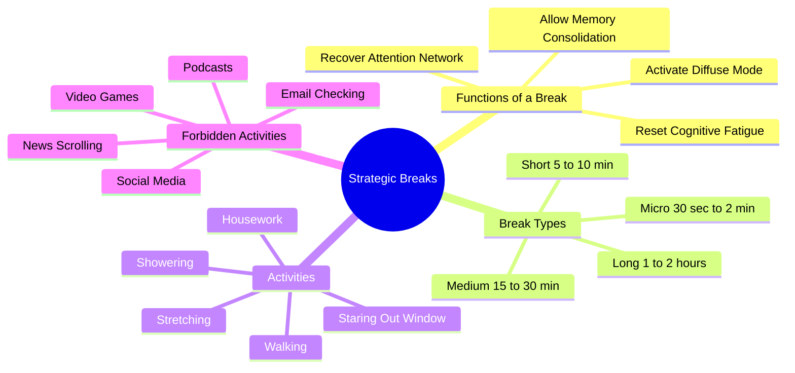

# 3.4 Strategic Breaks

A break is not the absence of work. A break is a *specific cognitive state* designed to recover attention and consolidate memory. Most students take breaks incorrectly — they spend them on social media, which disrupts consolidation and produces zero attention recovery. This note explains how to design breaks that actually work.

## The Core Principle

A break has two functions:

1. **Recover attention.** Vigilance decrement — the natural decline in attention quality over time — begins after 20-40 minutes of focused work. A break resets the attention network before performance degrades.
2. **Consolidate memory.** During low-stimulation breaks, the hippocampus begins to consolidate recently encoded information. The replay is fragile — high-novelty input disrupts it.

These two functions require the same kind of break: **low-stimulation, low-novelty, low-input.** A break spent on social media fails both functions. It does not recover attention (it adds to attentional fatigue) and it does not allow consolidation (it floods the hippocampus with competing input).

## The Four Break Lengths

### Micro-Break (30 seconds to 2 minutes)

Used during work, not between sessions. Look away from the screen, stretch your hands, blink several times, take 5 deep breaths. The goal is to relieve physical tension and eye strain without breaking the cognitive flow.

When to use: every 10-15 minutes during focused work.
What to do: physical reset only. No phone.

### Short Break (5-10 minutes)

Used between pomodoros or focused work blocks. Stand up, walk around the room, drink water, look out a window.

When to use: every 25-50 minutes (depending on your focus block length — see [[2.6 The Pomodoro Technique]]).
What to do: physical movement, hydration, eye relief.
What not to do: phone, email, social media, podcast.

### Medium Break (15-30 minutes)

Used after 2-4 focus blocks (~1-2 hours of work). Take a walk outside, do household chores, prepare a snack, take a shower.

When to use: every 90-120 minutes.
What to do: physical activity in a low-stimulation environment.
What not to do: anything with a screen.

### Long Break (1-2 hours)

Used after a half-day of focused work. Take a real meal, exercise, nap, or engage in a low-stimulation hobby.

When to use: every 4-6 hours.
What to do: substantial physical activity, meal, rest.
What not to do: high-stimulation entertainment (save it for after the day's study is complete).

## The Break Activity Hierarchy

From best to worst:

1. **Walking outside** — best. Combines physical movement, eye relaxation (distance gaze), fresh air, and low cognitive stimulation. The single highest-quality break activity.
2. **Walking inside** — good. Less restorative than outside (no distance gaze, no fresh air), but still effective.
3. **Stretching** — good. Relieves physical tension, maintains low cognitive load.
4. **Housework** (dishes, laundry, tidying) — good. Activates diffuse mode (see [[1.5 Focus Mode vs Diffuse Mode]]). Low cognitive load.
5. **Showering** — good. The combination of warm water, physical movement, and solitude produces strong diffuse-mode activation. Many insights arise here.
6. **Staring out a window** — adequate. Low stimulation, but no physical movement. Better than nothing.
7. **Sitting quietly** — adequate. Meditation-like. Low stimulation, but no physical reset.
8. **Conversation** — variable. Depends on the topic. Casual conversation is fine; deep conversation can be cognitively demanding.
9. **Reading a non-study book** — variable. Fiction is okay; non-fiction on a related topic produces interference.
10. **Listening to instrumental music** — variable. Acceptable if it is familiar and non-distracting. Avoid new music, which captures attention.
11. **Listening to a podcast** — bad. Spoken language captures attentional resources and disrupts consolidation.
12. **Checking email** — bad. Even "just checking" produces attention residue.
13. **Social media** — worst. High-novelty, high-dopamine input that disrupts consolidation and produces attentional fatigue.
14. **Video games** — worst. Strong episodic encoding that competes with study material.

## The Forbidden Activities

The following activities are NOT breaks, despite how they feel:

- **Social media scrolling** — produces dopamine spikes, attention residue, and consolidation disruption. The "relaxing" feeling is dopamine, not recovery.
- **Video games** — produce strong episodic encoding that competes with study material.
- **News scrolling** — same as social media.
- **Podcasts** — capture attentional resources needed for consolidation.
- **Email checking** — produces task-irrelevant thoughts that persist into the next focus block (attention residue).
- **YouTube** — combines all the problems of social media and podcasts.

These activities can be enjoyable and are fine in their own time — but they should not be interleaved with study. They belong at the end of the day, after the last study session and before the wind-down to sleep.

## Designing Your Break Schedule

A sample break schedule for a full study day:

| Time | Activity | Break Type |
|------|----------|------------|
| 07:30-08:00 | Study block 1 | — |
| 08:00-08:05 | Walk around room | Short |
| 08:05-08:30 | Study block 2 | — |
| 08:30-08:35 | Stretch, water | Short |
| 08:35-09:00 | Study block 3 | — |
| 09:00-09:05 | Stare out window | Short |
| 09:05-09:30 | Study block 4 | — |
| 09:30-10:00 | Walk outside | Medium |
| 10:00-10:30 | Study block 5 | — |
| 10:30-10:35 | Walk around room | Short |
| 10:35-11:00 | Study block 6 | — |
| 11:00-12:00 | Long break (meal, walk) | Long |
| 12:00-12:30 | Study block 7 | — |
| 12:30-12:35 | Stretch | Short |
| 12:35-13:00 | Study block 8 | — |
| 13:00-13:30 | Walk outside | Medium |
| 13:30-14:00 | Study block 9 | — |
| 14:00-14:05 | Stretch | Short |
| 14:05-14:30 | Study block 10 | — |
| 14:30-15:30 | Long break (exercise) | Long |
| 15:30-16:00 | Study block 11 | — |
| 16:00-16:05 | Walk | Short |
| 16:05-16:30 | Study block 12 | — |
| 16:30-17:00 | Walk outside, end of day | Medium |

This schedule includes ~6 hours of focused study, with strategic breaks throughout. Note the absence of any high-stimulation activity during the day.

## The Mindset Shift

The hardest part of strategic breaks is the mindset shift: **a break is not "doing nothing." It is an active recovery process.** Many students feel guilty for not "studying" during breaks and reach for their phones to feel productive. The guilt is misplaced. Strategic breaks are when consolidation happens. Skipping them or filling them with high-stimulation activity sabotages the study time.

Treat breaks with the same respect you treat study blocks. Schedule them. Protect them. Do not let them drift into distraction.

## Cross-References

- Breaks are one of the six ingredients in [[1.4 The Six Critical Ingredients of Learning]].
- The consolidation mechanism is in [[1.2 The Science of Memory]] and [[3.2 Sleep and Memory Consolidation]].
- The interference mechanism (why high-stimulation breaks are bad) is in [[3.3 Retrograde Interference]].
- The diffuse mode connection is in [[1.5 Focus Mode vs Diffuse Mode]].
- Daily break integration is in [[6.5 Breaks and Recovery]].
- The "social media is not a break" principle is shared with [[4.2 The Cost of Overstimulation]].

#breaks #recovery #consolidation #technique #science
