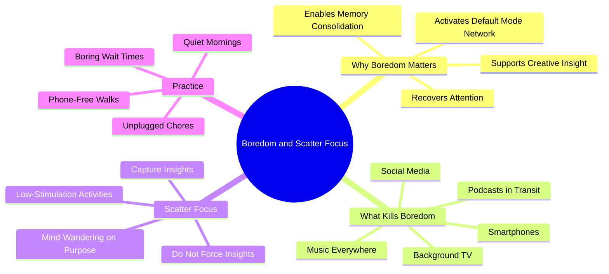

# 3.5 Embracing Boredom and Scatter Focus

Modern life has eliminated boredom. Every waiting moment — elevator rides, bus stops, checkout lines — is filled with smartphone stimulation. This is a cognitive catastrophe. Boredom is not the absence of activity; it is a specific cognitive state that supports creativity, memory consolidation, and attention recovery. This note explains why boredom matters and how to deliberately cultivate it.

## The Core Principle

Chris Bailey, in his TEDxManchester talk and his book *Hyperfocus*, makes a counterintuitive claim: **deliberately embracing boredom is one of the most powerful things you can do for your attention and creativity.** The claim is supported by research on the Default Mode Network (DMN) — the brain regions active during rest, mind-wandering, and self-generated thought.

## Why Boredom Matters

### Reason 1: DMN Activation

When you stop receiving external stimulation, the brain's Default Mode Network activates. The DMN (medial prefrontal cortex, posterior cingulate, angular gyrus) supports:
- Memory consolidation (integrating recent experiences with long-term schemas).
- Future planning (simulating future scenarios).
- Creative insight (making novel connections between distant concepts).
- Self-reflection (processing emotions and identity).

The DMN is *suppressed* during focused attention and *activated* during rest. If you never rest — if you fill every waiting moment with phone stimulation — the DMN never activates, and you lose these functions.

### Reason 2: Attention Recovery

Attention is a finite resource. Focused work depletes it; rest restores it. But "rest" filled with high-novelty stimulation (social media, video) does not restore attention — it continues to deplete it. Only low-stimulation rest (boredom) restores attention.

### Reason 3: Memory Consolidation

During low-stimulation periods, the hippocampus replays recently encoded information. This is the same mechanism as sleep-dependent consolidation, but it happens during waking rest too. Filling every break with phone stimulation disrupts this waking consolidation.

### Reason 4: Creative Insight

The "shower thought" phenomenon is real. Insights arise during low-stimulation activities (showers, walks, household chores) because the DMN is free to make novel connections. If you bring your phone into the shower (or listen to a podcast on every walk), you suppress the very mechanism that produces insight.

## What Killed Boredom

The smartphone is the primary culprit. Specifically:

- **Social media in transit** — every bus ride, every elevator, every walk filled with scrolling.
- **Podcasts in every quiet moment** — the cultural norm of "always be learning" has eliminated silence.
- **Background TV** — the always-on television in many homes.
- **Music everywhere** — earbuds in every context, even walking and chores.
- **Notification checks** — the constant pull to check for new messages.

The result: a generation of brains that never experience unstimulated time. The DMN is chronically suppressed. Memory consolidation, attention recovery, and creative insight all suffer.

## Scatter Focus

Chris Bailey calls the deliberate practice of mind-wandering **scatter focus**. It is the opposite of hyperfocus: instead of directing attention at a single task, you let attention wander freely across whatever arises.

### How to Practice Scatter Focus

1. **Choose a low-stimulation activity:** Walking, knitting, washing dishes, showering, gardening.
2. **Remove all input sources:** No phone, no podcast, no music, no companion (initially).
3. **Let your mind wander:** Do not direct your thoughts. Let them go where they go.
4. **Capture insights:** Keep a small notepad nearby. When an insight arises, write it down (briefly) and return to wandering.
5. **Do not force insights:** The point is not to "think hard about a problem." It is to let the DMN do its work without interference.

### When to Practice Scatter Focus

- After a study session (to consolidate).
- During walks (especially in nature).
- During household chores.
- In the shower.
- During commutes (without earbuds).
- During waiting times (in lines, in transit).

### The Adjustment Period

If you have been constantly stimulated for years, the first few sessions of scatter focus will feel uncomfortable. Your brain will reach for stimulation. You will feel bored, restless, anxious. This is withdrawal, not a sign that scatter focus doesn't work.

After about a week of practice, the discomfort fades. The brain rediscovers the capacity for self-generated thought. Insights begin to arise. Attention improves.

## Practical Implementation

### Implementation 1: Phone-Free Walks

Take a 15-30 minute walk every day without your phone. (If safety is a concern, carry your phone but keep it on airplane mode and in your pocket.) Let your mind wander. Bring a small notepad if you want to capture insights.

### Implementation 2: Unplugged Chores

Do dishes, laundry, cooking, and cleaning without earbuds. Let the activity be meditative.

### Implementation 3: Quiet Mornings

Spend the first 30 minutes of your morning without screens. Drink water, look out a window, stretch, journal. The morning is a particularly valuable time for scatter focus because the brain is rested and the DMN is fresh.

### Implementation 4: Boring Wait Times

When you find yourself waiting — in line, in transit, in a waiting room — resist the urge to pull out your phone. Let yourself be bored. The wait is a consolidation window.

### Implementation 5: One Screen-Free Day per Week

Choose one day per week to be screen-free (or as screen-free as possible). This is the Sabbath principle, applied secularly. The full day of low-stimulation rest produces a depth of DMN activation that shorter periods cannot match.

## Common Pitfalls

### Pitfall 1: Bringing the Phone "Just in Case"

The phone's mere presence is a distraction. Even if you do not look at it, your brain expends resources suppressing the urge to check. Leave the phone in another room during scatter focus sessions.

### Pitfall 2: Replacing Podcasts With "Educational" Content

The brain does not care whether the podcast is "educational." Spoken language captures attentional resources regardless of content. Scatter focus requires silence, not "better" content.

### Pitfall 3: Treating Scatter Focus as a "Thinking Technique"

Scatter focus is not the time to deliberately think about a problem. It is the time to let the DMN work without interference. Insights arise spontaneously; they cannot be forced.

### Pitfall 4: Not Capturing Insights

Insights from scatter focus are fragile — they evaporate within minutes if not recorded. Keep a notepad nearby.

### Pitfall 5: Giving Up During the Adjustment Period

The first week is uncomfortable. Many people quit during this period, concluding that scatter focus "doesn't work for them." Push through the adjustment period. The benefit comes after.

## Cross-References

- Scatter focus is a deliberate form of diffuse mode; see [[1.5 Focus Mode vs Diffuse Mode]].
- The DMN mechanism is the same one that supports sleep-dependent consolidation; see [[3.2 Sleep and Memory Consolidation]].
- Scatter focus periods also protect against retrograde interference; see [[3.3 Retrograde Interference]].
- The "constant stimulation degrades attention" evidence is in [[4.2 The Cost of Overstimulation]].
- Daily integration is in [[6.5 Breaks and Recovery]].

#boredom #scatter-focus #diffuse-mode #creativity #technique
