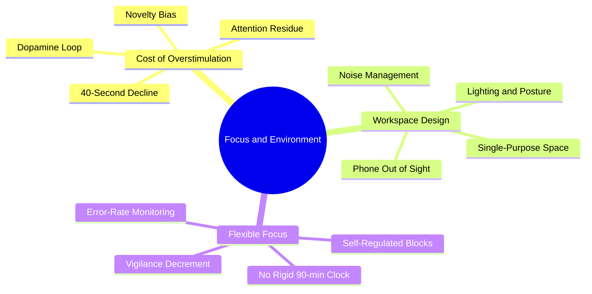

# 4.1 MOC - Focus and Environment

Focus is not a personality trait — it is an environmental and behavioral outcome. The single biggest predictor of how deeply you learn is not your IQ, your motivation, or your technique. It is **how many times your attention gets interrupted per hour.** Each interruption costs roughly 23 minutes of recovery time to return to deep focus (Mark, 2008). A single phone notification visible on a desk, even when ignored, measurably reduces working memory capacity.

This chapter covers the design of attention: the cost of overstimulation, the architecture of a distraction-free workspace, and the truth about flexible vs. rigid focus schedules.

## Mermaid Mind Map - Chapter 4

## Notes in This Chapter

- [[4.2 The Cost of Overstimulation]] — Why constant novelty degrades attention span, and the 40-second focus decline documented by Chris Bailey.
- [[4.3 Designing a Distraction-Free Workspace]] — Concrete workspace setup rules, including the "phone out of sight" rule.
- [[4.4 Flexible Focus vs Rigid Blocks]] — Why the 90-minute ultradian rhythm is a myth, and what to do instead.

## The Three Laws of Focus

If you internalize nothing else from this chapter, internalize these:

1. **Out of sight, out of mind.** A phone on your desk, even face-down, drains working memory. Put it in another room.
2. **Single-purpose spaces.** Your study space should be only for studying. If you also eat, scroll, and watch movies there, your brain will associate the space with distraction.
3. **Focus is dynamic, not clockwork.** Do not force yourself into rigid 90-minute blocks. Monitor your error rate and take a break when performance dips.

## Cross-References

- The "attention" ingredient in [[1.4 The Six Critical Ingredients of Learning]] is operationalized here.
- The Pomodoro Technique ([[2.6 The Pomodoro Technique]]) is a useful tool for managing focus, but it is a *behavioral* intervention, not a biological clock. Read [[4.4 Flexible Focus vs Rigid Blocks]] for the nuance.
- The myth of the rigid 90-minute ultradian cycle is debunked in [[7.2 Biohacking Myths]].
- Daily focus protocols are integrated into [[6.3 Active Learning Sessions]] and [[6.4 Productivity and Task Management]].

#moc #focus #attention #environment
