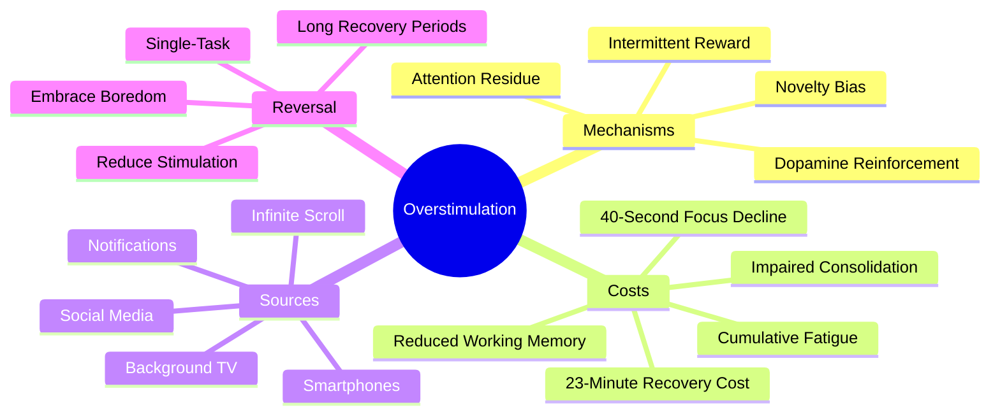

# 4.2 The Cost of Overstimulation

Modern digital life is a continuous assault on the attention system. Every notification, every refresh, every infinite scroll exploits a specific neural mechanism — the **novelty bias** — to capture attention. The cumulative cost is catastrophic: a generation of brains that have been trained to expect constant stimulation and that struggle to sustain focus for more than a few minutes. This note explains the mechanism and quantifies the cost.

## The Core Principle

Chris Bailey, in his TEDxManchester talk on focus, reports research showing that the average person can focus on a single task for only about **40 seconds** before being interrupted (by a notification, an internal urge to check, or a context switch). This is not a personality flaw; it is the predictable outcome of repeated exposure to high-novelty stimulation.

## The Mechanism: Novelty Bias

The brain has a built-in bias toward novelty. From an evolutionary perspective, this is adaptive: new things in the environment might be threats or opportunities, so attention is captured by them. The bias is mediated by dopamine release in the mesolimbic pathway — when you encounter something new, dopamine fires, and you feel a small reward.

Modern digital technology exploits this bias ruthlessly:

- **Social media feeds** — every scroll is a new piece of content. Every refresh is a slot machine pull.
- **Notifications** — every notification is a high-novelty event that captures attention involuntarily.
- **Infinite scroll** — eliminates the natural stopping cue (reaching the end of a page), encouraging continuous consumption.
- **Red badges** — the red notification badge is specifically engineered to trigger an "incompleteness" feeling that is relieved only by checking.

Each of these triggers a small dopamine release. Over time, the brain learns to expect this dopamine every few minutes, and the absence of stimulation feels uncomfortable.

## The Cost of Each Interruption

### Cost 1: 23 Minutes of Recovery

Gloria Mark's research (2008) found that the average interruption costs roughly **23 minutes** of recovery time to return to the same level of focused engagement on the original task. This is not 23 minutes of lost time; it is 23 minutes during which attention is degraded.

If you are interrupted 5 times per hour, you never reach the recovery window. The entire hour is spent in degraded attention.

### Cost 2: Attention Residue

Sophie Leroy's research (2009) introduced the concept of **attention residue**: when you switch from Task A to Task B, part of your attention remains stuck on Task A. Even if you "fully intend" to focus on Task B, your cognitive resources are partially allocated to thoughts about Task A.

This is why checking email "for just a minute" during a study session is so destructive: even after you close the email, your attention is partly on the email you read. The residue persists for 10-20 minutes.

### Cost 3: Working Memory Drain

A visible phone — even face-down, even ignored — measurably reduces working memory capacity (Ward et al., 2017). The brain expends resources suppressing the urge to check the phone, leaving less capacity for the actual task.

This is the "phone on the desk" problem. The phone does not need to buzz. It does not need to be looked at. Its mere presence degrades cognition.

### Cost 4: Impaired Consolidation

High-novelty stimulation immediately after a study session disrupts hippocampal consolidation (see [[3.3 Retrograde Interference]]). The phone scroll that feels like a "break" is actually a competing encoding event that partially overwrites the study material.

### Cost 5: Cumulative Fatigue

Each context switch produces a small cognitive cost. Over a day of constant switching — between work, email, social media, Slack, messages — the cumulative cost is severe. By evening, the brain is exhausted despite having done little focused work. This is "tired but didn't do anything" fatigue.

## The Smartphone Is the Primary Culprit

Of all the sources of overstimulation, the smartphone is the worst, because:

- It is always with you.
- It is always on.
- It is always receiving notifications.
- It is engineered to capture attention.
- Its use is intermittent and unpredictable (which maximizes dopamine reinforcement).

Jean Twenge's research on the generation that grew up with smartphones (iGen, 2017) documents a sharp increase in anxiety, depression, and sleep disruption, and a sharp decrease in sustained attention, beginning around 2012 — the year smartphone penetration crossed 50%.

## Reversing the Damage

The good news: attention is trainable. The bad news: it takes weeks of deliberate practice.

### Step 1: Remove the Phone From the Study Space

This is the single highest-impact intervention. The phone goes in another room — not face-down on the desk, not in a drawer, not on silent. **In another room.**

If you need the phone for time-sensitive communication, use a smartwatch with notifications limited to actual humans (not apps). Or check the phone only during scheduled breaks.

### Step 2: Disable All Non-Human Notifications

- Disable notifications for: social media, news, shopping, games, productivity apps.
- Enable notifications for: phone calls, texts from humans, calendar events.
- Disable badges for: everything except messaging apps.

The phone should not buzz unless a human is trying to reach you.

### Step 3: Single-Task

Stop multitasking. The brain cannot multitask; it can only switch rapidly, with residue costs at each switch. Do one thing at a time.

### Step 4: Schedule Distraction

Distraction is not the enemy; *unscheduled* distraction is. Use scheduled blocks (after dinner, after study) for social media and entertainment. Outside those blocks, the phone is in another room.

### Step 5: Reduce Stimulation During Breaks

Breaks are not the time to scroll. See [[3.4 Strategic Breaks]].

### Step 6: Embrace Boredom

Reclaim the capacity for unstimulated time. See [[3.5 Embracing Boredom and Scatter Focus]].

### Step 7: Long Recovery Periods

After extended periods of overstimulation (a heavy social media week, a long flight, a conference), schedule extended low-stimulation recovery. The brain needs longer to recover than it took to degrade.

## The Adjustment Period

If you have been constantly stimulated for years, the first few days of reduced stimulation will be uncomfortable:

- You will reach for the phone constantly.
- You will feel bored, anxious, restless.
- You will have trouble focusing on "boring" tasks.

This is withdrawal. It passes in 3-7 days. After the withdrawal, attention begins to recover. By 2-3 weeks, you will notice:

- Longer sustained focus.
- Better retention of studied material.
- More frequent insights.
- Reduced anxiety.
- Better sleep.

## Cross-References

- Overstimulation degrades the "Attention" ingredient in [[1.4 The Six Critical Ingredients of Learning]].
- The connection to consolidation disruption is in [[3.3 Retrograde Interference]].
- The strategy of embracing boredom is in [[3.5 Embracing Boredom and Scatter Focus]].
- The myth that "dopamine hacking" can fix attention problems is debunked in [[7.2 Biohacking Myths]].
- Practical workspace design (including phone management) is in [[4.3 Designing a Distraction-Free Workspace]].

#overstimulation #attention #dopamine #distraction #theory
