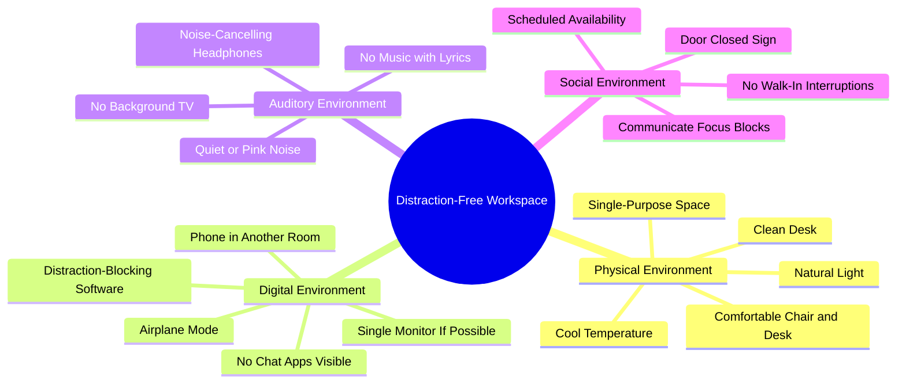

# 4.3 Designing a Distraction-Free Workspace

Your workspace is not neutral. Every element of its design either supports or sabotages focus. Most students study in environments that have been *optimized for distraction* — phones on desks, multiple monitors with chat apps visible, TVs on in the background, family members walking through. This note explains how to design a workspace that supports deep focus.

## The Core Principle

A workspace has three jobs:

1. **Reduce distractions** — minimize the stimuli that pull attention away from the task.
2. **Support the body** — provide physical comfort that allows sustained work without pain or fatigue.
3. **Provide context cues** — train the brain to associate the space with focused work, so entering the space triggers focus.

Most students optimize for the second job (a comfortable chair) and ignore the first and third. The result is a workspace that is comfortable but distracting.

## The Physical Environment

### Rule 1: Single-Purpose Space

The space where you study should be used *only* for studying. Not for eating, not for watching movies, not for gaming, not for socializing.

Why: context-dependent memory. The brain associates environmental cues with cognitive states. If you study in the same chair where you watch Netflix, the chair cues both "focus" and "relaxation," and the brain does neither well.

If you do not have a separate study space, use context cues to differentiate: a specific desk lamp that you turn on only for study, a specific playlist (instrumental) that you play only for study, a specific mug you use only for study water.

### Rule 2: Clean Desk

A cluttered desk provides constant low-level visual distraction. Every object on the desk is a potential attentional pull. Keep only what you need for the current task on the desk. Everything else goes in drawers, shelves, or another room.

The ideal desk contains:
- Your computer (if relevant).
- A notebook and pen.
- A glass of water.
- Nothing else.

### Rule 3: Comfortable Chair and Desk

You will spend thousands of hours in this chair. Invest in:
- A chair with adjustable height, lumbar support, and armrests.
- A desk at the correct height (forearms parallel to the floor when typing).
- A monitor at eye level (to prevent neck strain).

Physical discomfort is a distraction. If your back hurts after 30 minutes, you will not study for 90.

### Rule 4: Natural Light

Natural light supports circadian rhythm and mood. If possible, position the desk near a window. If not, use full-spectrum lighting that mimics daylight.

Avoid studying in dim light — it produces sleepiness. Avoid harsh fluorescent light — it produces headaches.

### Rule 5: Cool Temperature

A cool room (18-22°C / 65-72°F) supports alertness. A warm room produces sleepiness. If you cannot control the room temperature, dress in layers so you can cool yourself.

## The Digital Environment

### Rule 6: Phone in Another Room

The single most important rule. Not on the desk. Not in a drawer. Not in your pocket. **In another room.**

The phone's mere presence degrades working memory (Ward et al., 2017). Even face-down, even on silent, the brain expends resources suppressing the urge to check. Remove the phone and you reclaim those resources.

If you need the phone for time-sensitive communication:
- Use a smartwatch with notifications limited to phone calls and texts from specific people.
- Or check the phone only during scheduled breaks (every 90 minutes).

### Rule 7: Single Monitor (If Possible)

Multiple monitors increase the temptation to keep chat apps, email, or browsers visible. A single monitor forces you to commit to one task at a time.

If you must use multiple monitors (e.g., for coding with documentation visible), turn off all secondary monitors during pure study sessions. Use them only when actively cross-referencing.

### Rule 8: No Chat Apps Visible

Slack, Discord, Microsoft Teams, iMessage — all should be fully closed (not just minimized) during focus blocks. The red badge of a new message is a constant distraction.

If you must keep a messaging app open for work:
- Disable badges and notifications.
- Set status to "Do Not Disturb" or "Focusing."
- Check the app only during scheduled breaks.

### Rule 9: Distraction-Blocking Software

Use software to enforce focus:
- **Freedom** — blocks websites and apps across all your devices for a scheduled period.
- **Cold Turkey** — stricter blocker that is harder to bypass.
- **Forest** — gamified focus timer that grows a virtual tree while you focus; leaving the app kills the tree.
- **SelfControl** — free Mac app that blocks sites for a set period with no bypass.

The blocker should be configured *before* the focus session starts. Configuring it mid-session is itself a distraction.

### Rule 10: Airplane Mode

If you do not need internet for the current task, put your computer in airplane mode. This eliminates all online distractions at the network level.

## The Auditory Environment

### Rule 11: Quiet or Pink Noise

The ideal auditory environment is silent. If silence is not possible (noisy neighbors, family members, traffic), use:
- **Pink noise or brown noise** — constant, non-distracting background sound that masks intermittent noise.
- **White noise** — works but is harsher than pink/brown.
- **Noise-cancelling headphones** — block external noise without adding new input.

Avoid:
- **Music with lyrics** — the language processing system captures attention.
- **New music** — novelty captures attention.
- **Podcasts** — spoken language captures attention.

If you must listen to music, choose instrumental music you have heard many times (low novelty).

### Rule 12: No Background TV

The TV on in the background is a constant source of distraction. Even if you are not watching, the audio captures attention. Turn it off.

## The Social Environment

### Rule 13: Communicate Focus Blocks

If you live with others, communicate your focus schedule:
- "I will be studying from 7 AM to 11 AM. Please do not interrupt unless it's an emergency."
- Use a door sign: "Focus session in progress. Available at 11 AM."

This sets expectations and reduces the awkwardness of declining interruptions.

### Rule 14: Door Closed

If you have a door, close it. A closed door is a physical and social signal that you are not available.

If you do not have a door (open-plan office, shared bedroom), use noise-cancelling headphones as a visual signal that you are not available.

### Rule 15: No Walk-In Interruptions

Family members, partners, and roommates often interrupt for "quick questions." Each interruption costs ~23 minutes of focus recovery. Train the people around you to:
- Text instead of walking in (so you can address it during a break).
- Wait for the scheduled break unless it's an emergency.
- Group non-urgent questions into a single batch.

This requires upfront conversation. Have the conversation.

## The Workspace Audit

Audit your current workspace:

- [ ] Is the space used only for study?
- [ ] Is the desk clean?
- [ ] Is the chair comfortable?
- [ ] Is there natural light?
- [ ] Is the room cool?
- [ ] Is the phone in another room?
- [ ] Are messaging apps closed?
- [ ] Is distraction-blocking software installed and configured?
- [ ] Is the auditory environment quiet or pink noise?
- [ ] Is the TV off?
- [ ] Have you communicated your focus schedule to others?

If any answer is "no," that is a high-leverage change to make today.

## Cross-References

- The "why" behind these rules is in [[4.2 The Cost of Overstimulation]].
- The flexible alternative to rigid time blocks is in [[4.4 Flexible Focus vs Rigid Blocks]].
- The Pomodoro Technique ([[2.6 The Pomodoro Technique]]) is the time-management companion to this spatial design.
- Daily integration is in [[6.2 Preparation - Mind and Environment]].
- Specific software recommendations are in [[8.4 Focus and Distraction-Blocking Tools]].

#workspace #environment #distraction-free #technique
