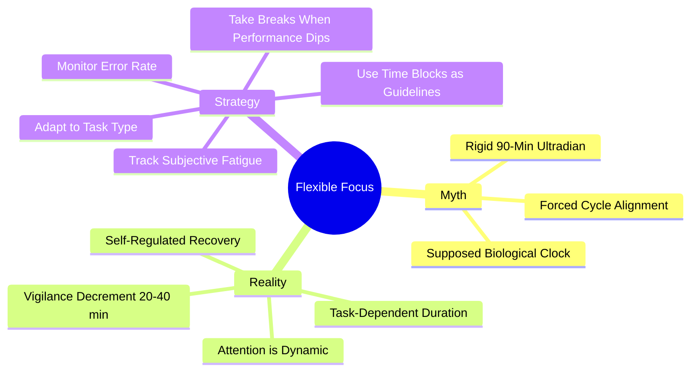

# 4.4 Flexible Focus vs Rigid Blocks

A common piece of "productivity advice" claims that the brain operates on strict 90-minute "ultradian rhythms" and that you must align your focus sessions with these cycles. This is **false** — the 90-minute waking ultradian rhythm is a myth (see [[7.2 Biohacking Myths]]). What works instead is **flexible, self-regulated focus**: work until you observe performance dipping, then take a break. This note explains why rigid blocks fail and how to implement flexible focus.

## The Core Principle

The "90-minute ultradian rhythm" claim is an over-extrapolation of Nathaniel Kleitman's **Basic Rest-Activity Cycle (BRAC)**. BRAC is a real, well-documented phenomenon — but only during *sleep*. The 90-to-120-minute cycles of NREM and REM sleep are robust. The scientific consensus does *not* support the existence of a rigid, identical 90-minute metabolic or cognitive cycle during *wakefulness*.

Waking human attention is highly elastic and dynamic. It is governed by task-induced motivation, executive control networks, task difficulty, and the accumulation of adenosine (sleep pressure) — not by a clockwork biological metronome.

## Why Rigid Blocks Fail

### Problem 1: Vigilance Decrement Varies by Task

The point at which attention degrades depends on the task:
- **Low-load tasks** (data entry, simple reading) — vigilance decrement begins in 20-40 minutes.
- **High-load tasks** (debugging, mathematical proofs, system design) — fatigue begins in 30-60 minutes, but the warmup time is also longer (10-15 minutes).
- **Flow-state tasks** (familiar coding, writing) — can sustain for 90+ minutes without fatigue.

Forcing all tasks into 90-minute blocks either cuts off flow (in flow-state tasks) or extends past fatigue (in low-load tasks).

### Problem 2: Forced Breaks Disrupt Flow

If you are deep in a coding flow state at minute 87 of a 90-minute block, the timer's interruption is destructive. You lose the cognitive context you have built up over the past hour. Reconstructing it after the break takes another 10-15 minutes.

A rigid block treats all minutes as equal. They are not.

### Problem 3: Forced Focus Extends Past Fatigue

If you are doing low-load work (e.g., reviewing flashcards, organizing notes), vigilance decrement hits at 20-40 minutes. Forcing yourself to continue to 90 minutes produces errors and shallow processing. The last 50 minutes are largely wasted.

### Problem 4: The Myth Provides False Confidence

Believing in a "biological clock" gives you permission to stop at 90 minutes regardless of whether you have actually accomplished anything. The myth becomes a justification for premature breaks.

## What Actually Governs Waking Attention

Waking attention is governed by:

1. **Task-induced motivation** — interesting tasks sustain attention longer than boring ones.
2. **Executive control network vs. Default Mode Network** — focused attention activates the executive network; mind-wandering activates the DMN. The two are anticorrelated but the switch is graded, not binary.
3. **Task difficulty** — high-difficulty tasks fatigue attention faster.
4. **Adenosine accumulation** — the molecule that builds sleep pressure throughout the day. Adenosine accumulates faster when cognitive effort is high.
5. **Glucose supply** — the brain consumes ~20% of the body's glucose. Low blood glucose impairs attention.
6. **Environmental distractions** — see [[4.2 The Cost of Overstimulation]].

None of these operates on a fixed 90-minute cycle.

## The Empirical Evidence

Empirical studies evaluating cognitive performance over extended periods show:

- **No consistent 1.5-hour cyclical pattern** in human focus.
- **Monotonic decline** due to vigilance decrement, which can begin in 20-40 minutes depending on cognitive load.
- **Recovery with brief breaks**, but the optimal break timing is task-dependent, not clock-dependent.

## The Strategy: Self-Regulated Flexible Focus

Instead of forcing rigid blocks, use this strategy:

### Strategy 1: Monitor Your Performance

The most reliable signal of attention fatigue is **performance degradation**:
- Reading the same paragraph three times without comprehension.
- Making small errors (typos, off-by-one errors in code, missing words).
- Mind-wandering that you have to actively suppress.
- Subjective feeling of "forcing" focus.

When you observe any of these, take a break. Do not wait for the timer.

### Strategy 2: Use Time Blocks as Guidelines, Not Rules

Set a *target* focus duration (e.g., 50 minutes) but be willing to:
- Extend it if you are in flow.
- Cut it short if you are clearly fatigued.

The target prevents the "default to 5 minutes" failure mode; the flexibility prevents the "force past fatigue" failure mode.

### Strategy 3: Adapt to Task Type

Match your focus block to the task:

| Task Type | Recommended Block | Why |
|-----------|-------------------|-----|
| Flashcard review | 20-30 minutes | Low cognitive load; vigilance decrement hits early. |
| Reading | 30-50 minutes | Medium load; comprehension degrades after ~50 min. |
| Coding (familiar) | 60-120 minutes | Long flow possible; warmup is short. |
| Coding (unfamiliar) | 30-60 minutes | High load; fatigue hits faster. |
| Writing | 60-90 minutes | Long warmup; protect flow. |
| Mathematical proofs | 30-60 minutes | Very high load; fatigue hits fast. |
| Administrative work | 25 minutes | Low load; use Pomodoro. |

### Strategy 4: Use External Anchors for Discipline

The risk of flexible focus is drift — "I'll take a break when I'm tired" becomes "I'll take a break now." Use external anchors:
- A Pomodoro timer (25 or 50 minutes) as a minimum, not a maximum.
- A commitment to complete a specific subtask before breaking.
- A specific daily total of focused hours (e.g., 4 hours).

### Strategy 5: Schedule "Soft" Breaks

Instead of rigid breaks at fixed times, schedule *availability windows*:
- "I am available to take a break anytime between minutes 25 and 60, depending on where I am in the task."
- "If I finish this section before minute 50, I'll take a break then."

This combines flexibility with structure.

### Strategy 6: Track Your Patterns

After 2-3 weeks of flexible focus, you will notice patterns:
- "I focus best for ~45 minutes on reading."
- "I can code for 90 minutes if I'm in flow."
- "After lunch, I can only sustain 25-minute blocks."

Use these patterns to inform future planning, but do not let them become rigid.

## The Hybrid Approach

Most learners benefit from a hybrid:

1. **Default to Pomodoro (25/5 or 50/10)** for tasks where you do not know your natural rhythm.
2. **Allow flow extension** when you are clearly in flow — silence the timer and continue until the flow breaks.
3. **Cut short** when fatigue hits early — do not force yourself to 25 minutes if you are clearly done at 15.
4. **Reserve deep work blocks (90+ minutes)** for tasks that benefit from long warmup (writing, system design).

## Common Pitfalls

### Pitfall 1: Using "Flexible" as an Excuse for Drift

The most common failure. "I'm being flexible" becomes "I'll take a break whenever I want." Use external anchors to prevent drift.

### Pitfall 2: Forcing Rigid Blocks Despite the Myth

The opposite failure. Believing the ultradian myth and forcing 90-minute blocks. Let performance be your guide.

### Pitfall 3: Ignoring Subjective Fatigue

You know when you are tired. Listen to that signal. Pushing through fatigue does not produce learning; it produces errors and shallow processing.

### Pitfall 4: Not Tracking Patterns

Without tracking, you cannot learn your own rhythms. Keep a simple log: task type, focus duration, performance, fatigue level. After 2-3 weeks, patterns will emerge.

## Cross-References

- The myth of the 90-minute ultradian rhythm is debunked in [[7.2 Biohacking Myths]].
- The Pomodoro Technique ([[2.6 The Pomodoro Technique]]) is the structured companion to flexible focus.
- The "Attention" ingredient in [[1.4 The Six Critical Ingredients of Learning]] is what flexible focus manages.
- Vigilance decrement is also why strategic breaks matter; see [[3.4 Strategic Breaks]].
- Daily integration is in [[6.3 Active Learning Sessions]].

#focus #flexibility #ultradian-myth #attention #theory
