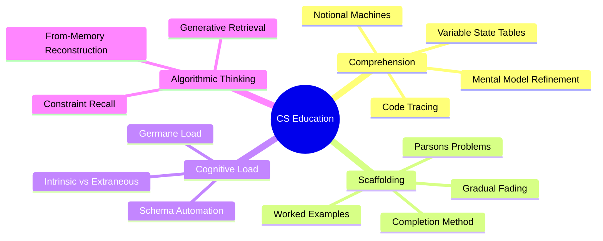

# 5.1 MOC - Computer Science Education Research

Studying computer science is fundamentally different from studying humanities or biology. It is not a task of rote memorization — it is a task of **mental model construction, state-space tracking, schema acquisition, and cognitive load management.** A student who watches 100 hours of programming tutorials but cannot trace a loop on paper has learned nothing.

This chapter covers the techniques that the Computer Science Education (CSEd) research community has validated over the past 30 years. These techniques are almost never taught in programming courses, and they are the single biggest reason why self-taught programmers plateau.

## Mermaid Mind Map - Chapter 5

## Notes in This Chapter

### Comprehension Before Production

- [[5.2 Code Comprehension and Tracing]] — Lister et al. (2004): you cannot write code you cannot trace.
- [[5.5 Notional Machines and Mental Models]] — Sorva (2013): make your internal model of the computer explicit.

### Scaffolding Techniques

- [[5.3 Worked Examples and the Completion Method]] — van Merriënboer & Paas (1990): study complete solutions, then fill in partial ones.
- [[5.4 Parsons Problems]] — Leinonen et al. (2022): rearrange scrambled code blocks instead of writing from scratch.

### Cognitive Architecture

- [[5.7 Cognitive Load Theory in Programming]] — Sweller's framework applied to programming: intrinsic vs. extraneous vs. germane load.

### Algorithmic Mastery

- [[5.6 Retrieval Practice for Algorithmic Thinking]] — Reconstruct algorithm signatures and base cases from memory.
- [[5.8 Evidence-Based CS Study Checklist]] — A printable summary of the chapter.

## The Brutal Truth About Self-Taught Programmers

The default path of self-taught programmers is:

1. Watch a tutorial.
2. Copy the code along with the instructor.
3. Try to build something similar from scratch.
4. Get stuck.
5. Search Stack Overflow until something works.
6. Repeat with a new tutorial.

This path produces a programmer who can ship simple features but cannot reason about complex systems, debug subtle bugs, or pass technical interviews. The CSEd techniques in this chapter exist because **they break that loop.**

## Cross-References

- The general technique of retrieval practice ([[2.2 Active Recall]]) is specialized for CS in [[5.6 Retrieval Practice for Algorithmic Thinking]].
- The integration of these techniques into a daily routine is shown in [[6.3 Active Learning Sessions]].
- Coding practice platforms (LeetCode, Exercism, Codewars) are reviewed in [[8.4 Focus Tools]].

#moc #cs-education #programming #technique
