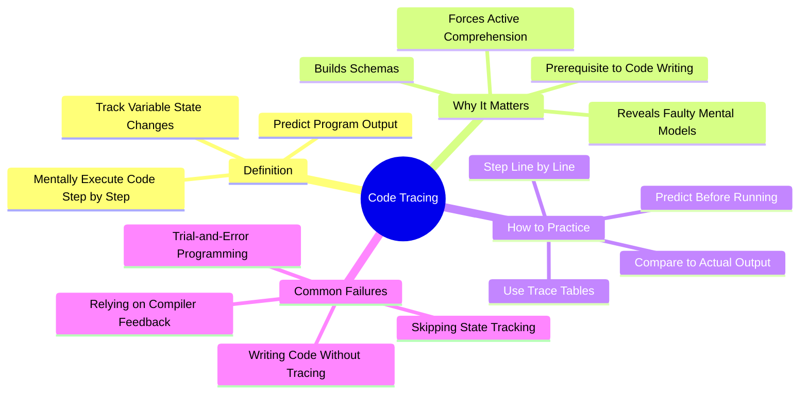

# 5.2 Code Comprehension and Tracing

The single most important finding in Computer Science Education (CSEd) research is this: **you cannot write code that you cannot trace.** For decades, CS instructors assigned programming tasks by opening a blank IDE and telling students to "write code." This produced a generation of students who could not solve even simple problems — not because they lacked programming talent, but because they had never learned to mentally execute code. This note explains the Lister et al. (2004) study and how to use tracing as the foundation of programming skill.

## The Core Principle

**Tracing** is the act of mentally executing a piece of code step-by-step, tracking the values of variables at each step, and predicting the program's output or behavior. It is the cognitive equivalent of being a CPU.

The naive model of programming: *learn the syntax → write code → debug until it works.*

The actual model: *learn to trace → understand the semantics → write code that you can already mentally execute → debug with comprehension.*

Most self-taught programmers skip the tracing step and go straight to writing code. They then spend years stuck in trial-and-error programming — fiddling with lines until the compiler stops complaining — without ever building the mental schemas that distinguish real programmers from code-typists.

## The Lister et al. (2004) Study

The landmark paper is *A Multi-National Study of Reading and Tracing Skills in Novice Programmers* by Lister, Adams, Fitzgerald, Fone, Hamer, Lindholm, McCartney, Moström, and Sanders (ACM SIGCSE 2004).

### What They Did

The researchers gave a multi-national test to hundreds of novice programming students. The test included:
- **Code reading questions** — "What is the value of variable X after this code executes?"
- **Code writing questions** — "Write code that does X."

### What They Found

A shocking percentage of students could not answer simple code reading questions. For example, given a simple `for` loop that increments a counter, many students could not correctly state the final value of the counter.

The researchers concluded:

> "Many students cannot write working code simply because they cannot accurately trace code. If you cannot trace a loop's state changes step-by-step on paper, you cannot write that loop."

The correlation between tracing ability and writing ability was very high. Students who could trace well could usually write. Students who could not trace could not write.

### Why This Matters

The finding overturns the default pedagogy. Most programming courses (and most self-taught programmers) focus on writing code from the start. The Lister study suggests this is malpractice. Tracing should come first, and writing should follow once tracing is mastered.

## The Cognitive Mechanism

### Mechanism 1: Tracing Builds the Notional Machine

Every programmer has an internal model of how the computer executes code — a "**notional machine**" (see [[5.5 Notional Machines and Mental Models]]). For most self-taught programmers, this model is faulty or incomplete. They may believe:
- Variables can hold multiple values simultaneously.
- Memory is cleaned up instantly.
- Loops execute all iterations "at once."
- Function calls are "replaced" by their return value with no side effects.

Tracing forces you to confront these misconceptions. When you trace a loop and realize the variable holds only one value at a time (the current one), your notional machine becomes accurate.

### Mechanism 2: Tracing Forces Active Comprehension

Reading code passively (scanning it, "getting the gist") produces an illusion of comprehension. Tracing forces active comprehension — you must process every line, every assignment, every conditional. There is no skimming.

### Mechanism 3: Tracing Builds Schemas

Schemas are mental patterns that represent common code structures (a counter loop, an accumulator, a search algorithm, a swap). Tracing many examples of each structure builds the schema, which then enables pattern recognition: "Oh, this is an accumulator pattern — I know what this does." Schema acquisition is the cognitive substrate of expert programming.

### Mechanism 4: Tracing Is a Prerequisite to Debugging

You cannot debug code you cannot trace. Debugging is the act of comparing the program's actual behavior to your predicted behavior and finding the discrepancy. If you cannot predict the behavior (i.e., trace), you cannot identify where the bug is.

## How to Practice Tracing

### Method 1: Trace Tables

A trace table is a paper-and-pencil tool for tracking program state. Format:

| Line | Variable 1 | Variable 2 | Variable 3 | Output |
|------|-----------|-----------|-----------|--------|
| 1    | 0         | -         | -         | -      |
| 2    | 0         | 5         | -         | -      |
| 3    | 0         | 5         | 0         | -      |
| 4    | 1         | 5         | 0         | -      |

Each row represents the state after a line executes. Empty cells mean the variable has not been assigned yet.

To use a trace table:
1. Write the code on the left side of the page.
2. Number each line.
3. Create columns for each variable.
4. Execute the code line by line, updating the table at each step.
5. Record any output produced.

### Method 2: Step-by-Step Mental Execution

For shorter code, trace mentally without paper. Say each step aloud:
- "Line 1: x is assigned 0."
- "Line 2: y is assigned 5."
- "Line 3: condition (x < y) is true (0 < 5), enter loop."
- "Line 4: x is incremented to 1."
- "Line 5: output x. Output is 1."
- "Line 6: end of loop, return to line 3."
- "Line 3: condition (x < y) is true (1 < 5), enter loop."
- ...

Speaking aloud is important — it forces you to commit to a prediction. Silent tracing allows you to skip steps without noticing.

### Method 3: Predict-Before-Running

For any code you write or read:
1. Predict the output (or final state) before running.
2. Write the prediction down.
3. Run the code.
4. Compare the actual output to your prediction.
5. If they differ, trace to find where your mental model diverged from reality.

This is the most valuable single habit in programming practice.

### Method 4: Use Python Tutor

Python Tutor (pythontutor.com) is a free online tool that visualizes code execution step-by-step, showing the state of variables, the call stack, and heap objects. It is the single best tool for learning to trace.

Workflow:
1. Paste your code (Python, Java, JavaScript, C, C++, or Ruby).
2. Click "Visualize Execution."
3. Step through the code, observing the state at each line.
4. Compare what you predicted to what the tool shows.

### Method 5: Trace Recursive Code

Recursion is the tracing skill that separates intermediate from advanced programmers. To trace recursive code:
1. Draw a call stack diagram.
2. Each recursive call is a new frame on the stack.
3. Track the parameters and local variables in each frame.
4. Track the return value as each frame completes.
5. Pop frames off the stack as they return.

Without a paper diagram, recursion is nearly impossible to trace. Use paper.

### Method 6: Trace Existing Code (Not Just Your Own)

Reading and tracing high-quality code written by others is one of the most underrated ways to improve. Pick a small library or framework (e.g., a single utility function from Lodash). Trace through it. Understand every line.

## Common Pitfalls

### Pitfall 1: Writing Code Without Tracing

The default failure mode. Students write code by typing, run it, get an error, change something, run again. This is trial-and-error programming. It produces no schemas, no comprehension, and no transferable skill.

### Pitfall 2: Skipping the Trace Table

"I can do it in my head" — for any code longer than 5 lines, you cannot. Use paper. The point is not the table; it is the act of writing the state down, which forces active comprehension.

### Pitfall 3: Tracing After the Bug Appears

Many students trace only when debugging. By then, they have already written code they do not understand. Trace *before* writing — predict what your code will do, then verify.

### Pitfall 4: Not Comparing to Actual Execution

If you trace but do not run the code, you cannot catch errors in your mental model. Always run the code and compare.

### Pitfall 5: Giving Up on Recursion

Recursion is hard. Many students give up and just "trust the recursion." Trust is not comprehension. Trace small recursive functions (factorial, Fibonacci, list length) until the call-stack model is intuitive.

## The Daily Tracing Protocol

Integrate tracing into every coding session:

1. **Before writing code:** Trace the algorithm on paper with a small example.
2. **While writing code:** Mentally trace each section as you write it.
3. **Before running code:** Predict the output.
4. **After running code:** Compare actual to predicted. If they differ, trace to find the divergence.
5. **When reading others' code:** Trace the unfamiliar sections.

This protocol is integrated into [[6.3 Active Learning Sessions]].

## Cross-References

- The notional machine concept is detailed in [[5.5 Notional Machines and Mental Models]].
- Tracing pairs naturally with [[5.3 Worked Examples and the Completion Method]] — trace the worked example, then complete the partial one.
- Tracing is the foundation for [[5.4 Parsons Problems]] (which require you to read code blocks).
- The general retrieval practice principle is in [[2.2 Active Recall]]; tracing is retrieval applied to code state.
- The CS-specific retrieval practice is in [[5.6 Retrieval Practice for Algorithmic Thinking]].

#cs-education #tracing #comprehension #code-reading #technique #science
