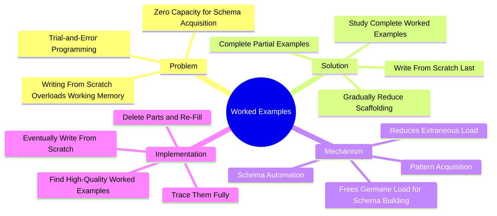

# 5.3 Worked Examples and the Completion Method

Trying to write complex programs from scratch as a novice overloads working memory. You are forced to simultaneously manage syntax, logic, memory allocation, and debugging — leaving zero cognitive capacity for actual learning. The seminal research by van Merriënboer & Paas (1990) demonstrated that **studying complete worked examples and gradually completing partial ones** produces dramatically better schema acquisition than writing code from scratch. This note explains the technique and how to implement it.

## The Core Principle

The naive model of learning to program: *read the syntax → write code from scratch → debug until it works.*

The actual model: *read the syntax → study worked examples → complete partial examples → gradually write more from scratch → eventually write independently.*

Each step in the actual model reduces cognitive load and increases schema acquisition. Skipping steps — going straight to "write from scratch" — is the dominant failure mode of self-taught programmers.

## The Cognitive Load Problem

The brain has a finite working memory capacity (~4 chunks, per Cowan 2001). Programming taxes working memory heavily:

- **Syntax** — what keywords, operators, and punctuation are required?
- **Semantics** — what does each line actually do?
- **Logic** — what algorithm are you implementing?
- **Memory model** — what is on the stack vs. the heap? What are the references?
- **Debugging** — why didn't that work? What do I change?
- **Problem decomposition** — how do I break this into smaller pieces?

For a novice, each of these is a separate conscious task. Together, they exceed working memory capacity. The result: cognitive overload, frustration, and shallow learning.

The solution: **reduce the load by providing the parts that are not the current focus of learning.**

## Van Merriënboer & Paas (1990)

The seminal paper is *Automation and Schema Acquisition in Learning Elementary Computer Programming: Implications for the Design of Practice* by Jeroen van Merriënboer and Fred Paas (1990).

### What They Did

The researchers compared two groups of novice programming students:

- **From-scratch group:** Asked to write complete programs from problem statements.
- **Completion group:** Given worked examples (complete solutions) and asked to study them, then given partial programs (with key parts missing) and asked to complete them.

### What They Found

The completion group:
- **Demonstrated significantly superior schema acquisition.**
- **Outperformed the from-scratch group on novel transfer tasks** (problems they had not seen before).
- **Reported lower cognitive load** during learning.

The from-scratch group:
- Spent more time but learned less.
- Developed fewer transferable schemas.
- Were more likely to engage in trial-and-error programming.

### Why This Matters

The default pedagogy — "write code from scratch" — is empirically inferior to "study examples, then complete partial examples." This is true even when the total time is held constant. The completion method produces more learning per unit time.

## The Cognitive Mechanism

### Mechanism 1: Reduced Extraneous Load

Cognitive Load Theory (see [[5.7 Cognitive Load Theory in Programming]]) distinguishes three types of cognitive load:

- **Intrinsic load** — the inherent difficulty of the material.
- **Extraneous load** — load imposed by poor instruction or task design.
- **Germane load** — load devoted to schema construction.

Writing from scratch imposes massive extraneous load (managing syntax, debugging, decomposition) that competes with germane load. Worked examples eliminate this extraneous load, freeing working memory for germane load.

### Mechanism 2: Pattern Exposure

Worked examples expose the learner to common code patterns: the counter loop, the accumulator, the search algorithm, the swap, the filter, the map. Each pattern is a schema. Seeing many examples of the same pattern builds the schema; the schema then enables recognition ("I've seen this before — this is an accumulator pattern").

### Mechanism 3: Schema Automation

Through repeated exposure, schemas become automated — they can be applied without conscious effort. This is the cognitive substrate of expert programming: the expert sees the pattern instantly, without reasoning through it. Automation requires exposure to many examples; it cannot be hurried by writing more code from scratch.

### Mechanism 4: Fading Scaffolding

The completion method naturally implements **fading**: the amount of support decreases over time. Early examples are fully worked; later examples have more missing parts; finally, the learner writes from scratch. This gradual fading keeps the learner in the zone of proximal development — challenged but not overwhelmed.

## How to Implement the Completion Method

### Step 1: Find High-Quality Worked Examples

For each new concept (loops, functions, recursion, classes, async), find 3-5 high-quality worked examples. Sources:

- Textbook example sections.
- Official documentation tutorials.
- High-quality blog posts (e.g., from established engineering blogs).
- Open-source code (for advanced learners).

The examples should be:
- **Complete** — fully working, not pseudocode.
- **Idiomatic** — using the language's conventions, not direct translations from another language.
- **Annotated** — with comments explaining *why*, not just *what*.
- **Varied** — showing different approaches to the same problem.

### Step 2: Trace the Examples Fully

For each worked example:
1. Read it through once for the gist.
2. Trace it line by line on paper (see [[5.2 Code Comprehension and Tracing]]).
3. Predict the output before running.
4. Run it. Compare to your prediction.
5. If they differ, trace to find the divergence.

Do not skip the tracing step. Reading without tracing produces the illusion of comprehension.

### Step 3: Modify the Examples

After understanding the example, modify it:
- Change a constant. Predict the new output. Run it.
- Add a feature. Predict. Run.
- Remove a feature. Predict. Run.
- Convert it to a different data structure.

Modification builds flexible schemas rather than rote memorization of one example.

### Step 4: Complete Partial Examples

Take a worked example and delete parts:
- Delete a single line. Try to restore it.
- Delete a function body (keep the signature). Implement it.
- Delete a loop body. Implement it.
- Delete the entire solution, keeping only the problem statement and the test cases.

Gradually increase the amount you delete. This is the heart of the completion method.

### Step 5: Write From Scratch

Only after you can complete partial examples confidently should you attempt to write from scratch. By this point:
- You have schemas for the common patterns.
- You have an accurate notional machine.
- You know what the code should look like before you write it.

Writing from scratch is now an act of *synthesis* (assembling known patterns), not an act of *discovery* (figuring out how to write code).

### Step 6: Use Parsons Problems as an Intermediate Step

Between "complete partial examples" and "write from scratch," insert Parsons Problems (see [[5.4 Parsons Problems]]): rearrange scrambled code blocks into the correct order. This isolates logical flow from syntax production.

## Common Pitfalls

### Pitfall 1: Skipping the Worked Examples

The most common failure. Students skip directly to writing code from scratch, believing "I learn by doing." The research shows the opposite: you learn by studying examples first, then doing.

### Pitfall 2: Reading Examples Without Tracing

Reading a worked example passively produces the illusion of comprehension. Always trace.

### Pitfall 3: Copying Examples Verbatim

Copying the example into your own editor and running it produces no learning. The value is in tracing, modifying, and completing — not in reproducing.

### Pitfall 4: Stuck in the Worked-Example Phase Forever

Some students get stuck studying examples and never progress to writing from scratch. The fading must continue. Once you can complete partial examples confidently, move to from-scratch.

### Pitfall 5: Choosing Poor Examples

Not all worked examples are good. Some are outdated, non-idiomatic, or just wrong. Choose examples from authoritative sources.

### Pitfall 6: Too Many Examples, Too Few Tracings

Studying 20 examples shallowly is worse than studying 5 examples deeply. Depth beats breadth.

## Daily Application

Integrate worked examples into every study session:

1. **Pick a concept** (e.g., "async/await in JavaScript").
2. **Find 3 worked examples** of increasing complexity.
3. **Trace each fully** (paper, predict, run, compare).
4. **Modify each** (change a constant, add a feature).
5. **Complete partial versions** (delete parts, restore them).
6. **Write a new example from scratch** using the same patterns.
7. **Solve 2-3 practice problems** that use the concept.

This protocol is integrated into [[6.3 Active Learning Sessions]].

## Cross-References

- The cognitive load framework is in [[5.7 Cognitive Load Theory in Programming]].
- Tracing is in [[5.2 Code Comprehension and Tracing]].
- Parsons Problems (intermediate step) are in [[5.4 Parsons Problems]].
- The general principle of scaffolding is shared with [[2.4 Pretesting and Hypercorrection]] (errors as learning signals).
- Daily integration is in [[6.3 Active Learning Sessions]].

#cs-education #worked-examples #completion-method #scaffolding #technique #science
