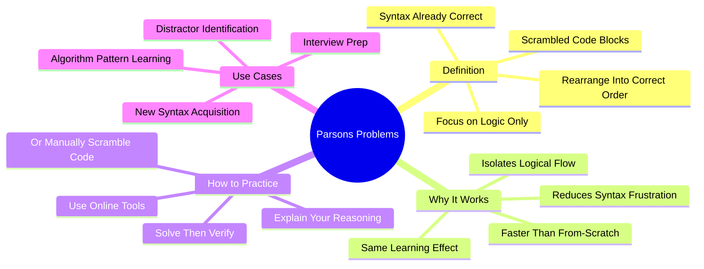

# 5.4 Parsons Problems

A Parsons Problem is a programming puzzle where you are given scrambled blocks of pre-written, syntactically correct code and must rearrange them into the correct logical sequence. The format isolates **logical flow** from **syntax production**, making it an excellent intermediate step between reading code and writing code. This note explains the Leinonen et al. (2022) research synthesis and how to use Parsons Problems effectively.

## The Core Principle

A Parsons Problem (named after Dale Parsons, who introduced them in 2006) presents:

- A problem statement ("Write a function that finds the maximum value in a list.")
- A set of code blocks, scrambled out of order, possibly with distractors (incorrect blocks).
- The instruction: rearrange the blocks into the correct order.

The blocks are syntactically correct (no missing semicolons, balanced brackets). The challenge is purely logical: which block goes where?

## Why Parsons Problems Work

### Reason 1: Isolation of Logical Flow

When you write code from scratch, you face two challenges simultaneously:

1. **Logical flow** — what should the code do, in what order?
2. **Syntax production** — how do you write each line correctly?

For a novice, syntax production is a major cognitive burden. Missing semicolons, mismatched brackets, and indentation errors constantly interrupt the logical reasoning. The compiler complains; you fix the syntax; you forget what you were thinking; you restart the logic.

Parsons Problems eliminate the syntax burden. The blocks are pre-written. Your only task is logical ordering. This frees all of your cognitive resources for the actual learning: understanding the algorithm's structure.

### Reason 2: Faster Than From-Scratch

Solving a Parsons Problem takes significantly less time than writing the equivalent code from scratch — typically 2-5x faster. This means you can solve many more problems in the same study time, accelerating schema acquisition.

### Reason 3: Equal Learning Effect

Despite taking less time, Parsons Problems produce the same (or better) learning effect as writing code from scratch. The Leinonen et al. (2022) review found that Parsons Problems are "just as effective for learning CS concepts as traditional code-writing exercises but take significantly less time and generate far less cognitive frustration."

This is a remarkable finding. Less time, equal learning. Why would you ever write from scratch when Parsons Problems work as well? Because you eventually need to write from scratch — but Parsons Problems are an excellent intermediate step.

### Reason 4: Distractor Identification

Many Parsons Problems include distractors — incorrect code blocks that look plausible. Identifying and rejecting distractors is itself a valuable skill. It forces you to articulate *why* a particular block is wrong, which deepens your understanding of the correct solution.

### Reason 5: Scaffolding for From-Scratch Writing

Parsons Problems occupy a sweet spot in the scaffolding hierarchy:

1. **Read worked examples** (passive + tracing).
2. **Solve Parsons Problems** (logic only, syntax provided).
3. **Complete partial examples** (syntax + some logic, rest provided).
4. **Write from scratch** (everything).

Solving Parsons Problems before attempting from-scratch writing dramatically improves success rates on the from-scratch attempt.

## The Leinonen et al. (2022) Review

The paper is *Parsons Problems and Beyond: Systematic Literature Review and Empirical Study Designs* by Leinonen, Hellas, and colleagues (ACM ITiCSE 2022).

### What They Did

The researchers conducted a systematic literature review of all Parsons Problem research from 2006 to 2022. They synthesized findings from dozens of studies across universities and age groups.

### What They Found

- **Effectiveness:** Parsons Problems are consistently as effective as code-writing exercises for learning CS concepts.
- **Efficiency:** Parsons Problems take significantly less time than equivalent code-writing exercises.
- **Affect:** Students report lower frustration and higher engagement with Parsons Problems.
- **Scaffolding:** Parsons Problems are most effective when used as a scaffold between reading and writing.

### Variations Tested

The review identified several variations:

- **With distractors vs. without distractors** — Distractors add difficulty and improve transfer.
- **With indentation provided vs. not** — Providing indentation reduces cognitive load; not providing it adds the additional skill of code formatting.
- **Pair programming Parsons Problems** — Two students solving together produces additional learning through dialogue.
- **Adaptive Parsons Problems** — Difficulty adjusts based on student performance (e.g., removing a distractor after a wrong attempt).

## How to Practice Parsons Problems

### Method 1: Use Online Tools

Several free tools provide Parsons Problems:

- **js-parsons** (js-parsons.org) — JavaScript-based Parsons Problems.
- **Python Principles** — Parsons-style problems in Python.
- **Runestone Academy** — Free textbooks with Parsons Problems embedded.
- **CS50 Sandbox** — Harvard's CS50 course includes Parsons Problems.
- **CodeHS** — Has Parsons Problem exercises.

### Method 2: Manually Scramble Code

For any worked example you have studied:

1. Copy the code into a text file.
2. Split it into logical blocks (one block per line or per logical unit).
3. Cut and paste to scramble the order.
4. Wait a day (so you forget the original order).
5. Try to restore the correct order.

This is more time-consuming than using online tools but lets you create Parsons Problems for any code you are studying.

### Method 3: Solve Then Verify

After solving a Parsons Problem:
1. Read through your solution and predict its behavior.
2. Run it (if the tool supports execution) or trace it on paper.
3. Compare to the correct solution.
4. If you got it wrong, identify which block was misplaced and why.

### Method 4: Explain Your Reasoning

After solving, explain aloud why you placed each block where you did. This forces you to articulate your logical reasoning, which deepens the schema. The articulation also exposes any blocks you placed correctly by luck.

### Method 5: Use Parsons Problems for Interview Prep

Technical interviews often include "write a function that..." questions. Before attempting from-scratch solutions in practice:

1. Find a similar problem with a worked solution.
2. Scramble the solution.
3. Solve it as a Parsons Problem.
4. Then attempt the from-scratch version of a related problem.

This builds the schema first, dramatically improving the from-scratch attempt.

## Common Pitfalls

### Pitfall 1: Skipping the Reasoning

Solving Parsons Problems by trial and error (moving blocks until they fit) produces no learning. The value is in the reasoning, not the solution. Always explain your reasoning, even (especially) when you are confident.

### Pitfall 2: Not Verifying

Solving without verifying (running or tracing) means you might be confidently wrong. Always verify.

### Pitfall 3: Treating Parsons Problems as the Only Technique

Parsons Problems are an intermediate technique. They do not replace:
- Tracing (which builds the notional machine).
- Worked examples (which provide pattern exposure).
- From-scratch writing (which is the eventual goal).

Use them as one component of a complete study system.

### Pitfall 4: Choosing Problems That Are Too Easy

If you solve every Parsons Problem on the first try in under a minute, the problems are too easy. Move to harder problems or add distractors.

### Pitfall 5: Choosing Problems That Are Too Hard

If you cannot solve the problem at all, you lack the prerequisite schema. Go back to worked examples and tracing before attempting Parsons Problems.

## Daily Application

Integrate Parsons Problems into your study routine:

1. **When learning a new language feature** (e.g., list comprehensions in Python) — solve 5-10 Parsons Problems using that feature before writing it from scratch.
2. **When learning a new algorithm pattern** (e.g., sliding window) — solve Parsons Problems before implementing from scratch.
3. **When preparing for coding interviews** — use Parsons Problems as a warm-up before from-scratch practice.
4. **When you have 10-15 minutes** — solve a Parsons Problem or two as a quick learning snack.

## Cross-References

- Tracing is the prerequisite skill; see [[5.2 Code Comprehension and Tracing]].
- Worked examples provide the source material; see [[5.3 Worked Examples and the Completion Method]].
- The cognitive load framework is in [[5.7 Cognitive Load Theory in Programming]].
- The general retrieval practice principle is in [[2.2 Active Recall]].
- Daily integration is in [[6.3 Active Learning Sessions]].

#cs-education #parsons-problems #scaffolding #technique #science
