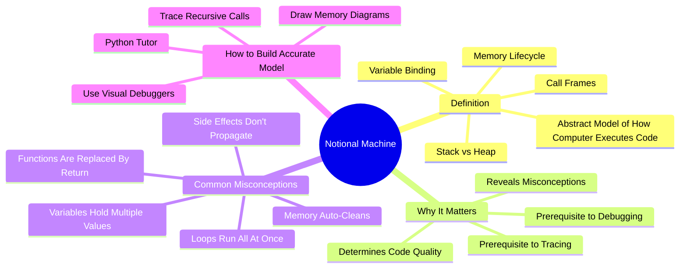

# 5.5 Notional Machines and Mental Models

Students struggle with programming not because they lack "logic," but because their internal model of how the computer executes programs is faulty or incomplete. Juha Sorva's research (2013) synthesized decades of work on this concept, calling the learner's internal model a "**notional machine**." This note explains what a notional machine is, why faulty ones cause programming failures, and how to build an accurate one.

## The Core Principle



A **notional machine** is an abstract, simplified model of how a computer executes programs of a particular kind. It is the mental model a programmer uses to predict what code will do.

Examples of notional machines:

- **The Python notional machine** — variables are name tags on objects; everything is an object; references are passed by assignment.
- **The C notional machine** — variables are memory locations with types; pointers hold addresses; the stack holds locals and the heap holds dynamic allocations.
- **The JavaScript notional machine** — variables are bindings; objects are passed by reference; the event loop processes the callback queue.
- **The Rust notional machine** — variables have ownership; references have lifetimes; the borrow checker enforces rules at compile time.

Each language has its own notional machine. Confusing notional machines (e.g., thinking Python variables work like C variables) is a major source of bugs.

## The Sorva (2013) Synthesis

The paper is *Notional Machines and Introductory Programming Education* by Juha Sorva (ACM TOCE, 2013).

### What Sorva Did

Synthesized decades of research on student misconceptions in programming. Identified the most common faulty notional machines and their causes.

### What Sorva Found

- **Misconceptions are universal.** The same misconceptions appear across countries, languages, and age groups.
- **Misconceptions are persistent.** They do not disappear on their own; they must be actively corrected through explicit instruction.
- **Misconceptions are hidden.** Students can write working code while holding faulty models — until they encounter a problem that exposes the model.
- **The notional machine must be taught explicitly.** Most courses assume students will infer it; they do not.

### The Key Insight

> "Making the notional machine explicit — using visual execution steps and program visualization tools — is crucial for correcting deep-seated misconceptions."

The notional machine should not be left implicit. It should be a topic of direct instruction, with visualizations that make the abstract concrete.

## Common Notional Machine Misconceptions

### Misconception 1: Variables Hold Multiple Values

Many beginners believe a variable can hold multiple values simultaneously:

```python
x = 5
x = 10
```

Faulty model: "x now holds both 5 and 10."

Accurate model: "x is a name that currently refers to 10. The previous binding to 5 is gone (unless something else still refers to it)."

This misconception causes bugs when students expect old values to be "remembered" by the variable.

### Misconception 2: Memory Auto-Cleans

Beginners often believe memory is automatically cleaned up the moment a variable goes out of scope, or that garbage collection is immediate.

Faulty model: "When the function returns, all its memory is freed instantly."

Accurate model: "When the function returns, its stack frame is popped (freeing locals), but heap-allocated objects persist until garbage collection runs (which may be later)."

This misconception causes confusion about references, closures, and memory leaks.

### Misconception 3: Loops Run All At Once

Beginners sometimes believe all iterations of a loop happen simultaneously:

```python
for i in range(3):
    print(i)
```

Faulty model: "The loop runs three times all at once, so the output is 0, 1, 2 in some order."

Accurate model: "The loop runs sequentially: iteration 1 (i=0, print 0), iteration 2 (i=1, print 1), iteration 3 (i=2, print 2)."

This misconception causes bugs in understanding state mutations across iterations.

### Misconception 4: Functions Are Replaced By Return Values

Beginners sometimes believe a function call is "replaced" by its return value with no side effects:

```python
def append_one(lst):
    lst.append(1)
    return lst

my_list = [1, 2, 3]
result = append_one(my_list)
```

Faulty model: "The function call is replaced by [1, 2, 3, 1]. my_list is unchanged."

Accurate model: "The function mutates my_list in place (now [1, 2, 3, 1]), and returns a reference to the same list. my_list and result refer to the same object."

This misconception causes severe bugs in languages with mutable data structures.

### Misconception 5: Side Effects Don't Propagate

Beginners often fail to anticipate that modifying an object passed to a function affects the original:

```python
def remove_first(lst):
    lst.pop(0)

my_list = [1, 2, 3]
remove_first(my_list)
```

Faulty model: "my_list is still [1, 2, 3]."

Accurate model: "my_list is now [2, 3]. The function modified it in place."

### Misconception 6: Equality Means Identity

Beginners confuse `==` (value equality) with `is` (reference identity):

```python
a = [1, 2, 3]
b = [1, 2, 3]
a == b  # True
a is b  # False
```

Faulty model: "If two lists have the same contents, they are the same list."

Accurate model: "Two lists can have the same contents without being the same object in memory."

### Misconception 7: References vs. Values

The single most persistent misconception. Beginners struggle with the difference between passing by value (a copy is made) and passing by reference (the same object is shared).

In Python, Java, JavaScript: variables hold references to objects; assignments and parameter passing share the reference, not the object.

In C: variables hold values directly; parameter passing copies the value.

In C++: it depends on whether you use `&` (reference) or not (value).

## How to Build an Accurate Notional Machine

### Strategy 1: Use Visual Debuggers

Visual debuggers show you the actual state of memory at each step:

- **Python Tutor** (pythontutor.com) — Visualizes Python, Java, JavaScript, C, C++, Ruby. Shows stack frames, heap objects, references. The single best tool for building an accurate notional machine.
- **GDB with GUI** (e.g., gdbgui, DDD) — For C/C++.
- **Chrome DevTools** — For JavaScript, especially the Memory and Sources tabs.
- **Java Visualizer** — For Java.

Workflow:
1. Write or paste code.
2. Step through it in the visual debugger.
3. Watch the state change at each line.
4. Predict each state before stepping.

### Strategy 2: Draw Memory Diagrams

For any non-trivial code, draw the memory layout on paper:

- Stack frames as boxes.
- Heap objects as circles.
- References as arrows.
- Variable bindings as labels.

Drawing forces you to commit to a model. Verifying against the visual debugger corrects errors.

### Strategy 3: Trace Recursive Calls with a Call Stack Diagram

For recursion, draw a vertical stack of frames, each with its own parameters and local variables. As each call returns, cross out the frame and write the return value.

This is the only way to understand recursion. Without the diagram, recursion is magic.

### Strategy 4: Compare Notional Machines Across Languages

When learning a new language, explicitly compare its notional machine to languages you know:

- "In Python, variables are name tags. In C, variables are boxes."
- "In Python, lists are mutable. In Haskell, lists are immutable."
- "In Java, primitive types are passed by value; objects are passed by reference."
- "In Rust, ownership is tracked at compile time; in C, it is the programmer's responsibility."

Explicit comparison prevents cross-language confusion.

### Strategy 5: Practice Deliberate Misconception Hunting

When you encounter a bug, ask: "What faulty notional machine did I have that caused me to write this bug?" Write down the misconception. This converts bugs into learning opportunities.

### Strategy 6: Read About Language Semantics

Each language has a specification or canonical reference that describes its semantics. Read it for the languages you use:

- Python: *Fluent Python* by Luciano Ramalho.
- JavaScript: *You Don't Know JS* by Kyle Simpson.
- C: *The C Programming Language* by Kernighan and Ritchie.
- Rust: *The Rust Programming Language* (the "Book").

These sources explicitly describe the notional machine.

## Common Pitfalls

### Pitfall 1: Treating the Computer as a Black Box

Many students treat the computer as an opaque box: "I write code, it does something, I hope it's what I wanted." This is the absence of a notional machine. Every programmer needs an internal model of execution.

### Pitfall 2: Inferring the Notional Machine From Syntax

Students try to infer the notional machine by observing what code does. This works for simple cases but fails catastrophically for edge cases (mutability, references, closures). The notional machine must be learned explicitly.

### Pitfall 3: Confusing Languages' Notional Machines

Using Python with C-style mental models (or vice versa) produces persistent bugs. Each language has its own notional machine; learn it explicitly.

### Pitfall 4: Skipping Visualization

Reading about the notional machine is not enough. You must see it in action. Use Python Tutor or a visual debugger every time you encounter a new concept.

### Pitfall 5: Believing That Working Code Implies a Correct Model

You can write working code with a faulty notional machine — until you cannot. Bugs in non-trivial code (closures, async, references) almost always trace back to a faulty model. Build the model deliberately.

## Cross-References

- Tracing is the technique that builds the notional machine; see [[5.2 Code Comprehension and Tracing]].
- The Feynman Technique ([[2.5 The Feynman Technique]]) applied to the notional machine is an excellent test: can you explain how the computer executes a program, in plain language?
- Cognitive load theory explains why faulty models overload working memory; see [[5.7 Cognitive Load Theory in Programming]].
- Daily integration is in [[6.3 Active Learning Sessions]].

#cs-education #notional-machine #mental-model #theory #science
